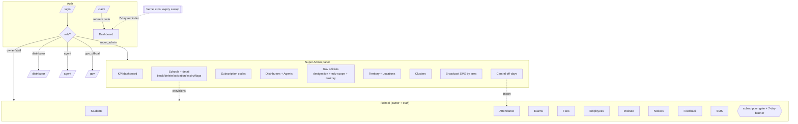
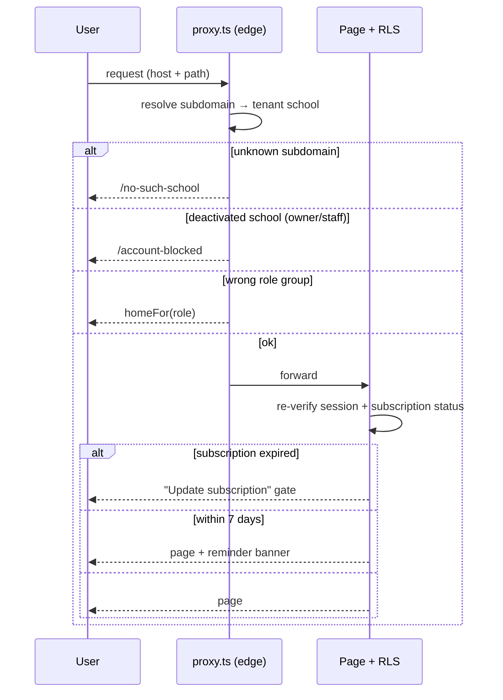

# Amar School — Multi-Tenant School LMS

A multi-tenant school management platform for Bangladeshi institutions, plus a
vendor/licensing **Super Admin** panel. Each school runs on its own subdomain
with branded login; a central super-admin provisions schools, manages
subscriptions, territories, government officials, and broadcast SMS.

Bangla-first, bilingual (bn/en) throughout.

## Tech stack

- **Next.js 16 (App Router)** — server components, server actions. This is a
  breaking-change Next version; read `web/node_modules/next/dist/docs/` before
  writing framework code (see `web/AGENTS.md`).
- **Supabase** (Postgres + Auth + Storage) — Row-Level Security is the
  authority; application-layer guards give clean errors.
- **Tailwind CSS v4** (ADR 0006 rewrite).
- **Vitest** — pure logic in `tests/unit`, live-DB suites in `tests/integration`.
- **Vercel** — hosting + cron jobs (`web/vercel.json`).

Everything lives under `web/`.

## Roles, route groups & test credentials

One app, role-based routing (ADR 0003). After login, `postLoginDestination`
sends each role to its home group; `proxy.ts` + RLS enforce access.

| Role | Home group | Purpose | Demo login |
| --- | --- | --- | --- |
| `super_admin` | `/super-admin` | Vendor panel: schools, subscriptions, distributors, agents, gov officials, territories, workflows, notifications, SMS commerce, invoices, settlements, accounting, audit, off-days | `demo.super@amarschool.test` / `DemoSuper#2026` |
| `school_owner` | `/school` | Full school management (all modules) | `demo.owner@amarschool.test` / `DemoOwner#2026` |
| `staff_user` | `/school` | School management, limited to granted screens. No class attachment, so no reach into any Student (ADR 0018) | `demo.staff@amarschool.test` / `DemoStaff#2026` |
| `staff_user` | `/school` | Class Teacher of **Eight / Day - A** — the same role plus a class attachment: their own class's questions, leave, corrections, and `/school/my-classes` | `demo.teacher@amarschool.test` / `DemoTeacher#2026` |
| `distributor` | `/distributor` | Subscription-code sales, assigned territory, CRM pipeline, onboarding, wallet (renamed from `dealer`, #271) | `demo.distributor@amarschool.test` / `DemoDist#2026` |
| `agent` | `/agent` | Field agent under a distributor: assigned tasks (dashboard, task list, mark-done) | `demo.agent@amarschool.test` / `DemoAgent#2026` |
| `gov_official` | `/gov` | Read oversight scoped to designation + territory | created by super-admin (no seeded demo) |
| `student` | `/student` | Their own school life: routine, notices, tasks, materials, results, attendance, fees, exam schedule, leave. Requests and their own work only — never edits a school record | `s0022@adarshamodelschool.students.invalid` / `DemoStudent#2026` |

Every school-side role above belongs to the same School — **Azgara Hazi Altaf Ali
High School And College**, subdomain `adarshamodelschool` — so one login of each
kind sees the same data from its own side. Hasibul Islam (S0022) is in Karim
Sir's class, and Fatema Begum teaches periods in that class *without* being its
Class Teacher, which is the Subject Teacher case ADR 0018 turns on.

Demo logins are seeded by migrations (`0054` school owner/staff, `0066`
super-admin, `0110` distributor/agent + partner/financial/workflow sample data,
`0151` class teacher + student + a published routine) and are throwaway demo
accounts — change freely. An owner with no profile yet claims a pre-created
school at `/claim` with a super-admin activation code.

A Student's address is derived, never chosen —
`<student_no>@<schools.student_login_domain>.students.invalid`, lowercased. The
School's login domain has to be set before any address exists. A Student also
signs in **at their School's subdomain** (`adarshamodelschool.staging.edumebd.com/login`);
the apex login bounces them to it rather than signing them in. Owner and staff
logins work from either.

### Test fixtures

Separate from the demo school, in `Test School A`, seeded by
`web/supabase/seed-test.sql` and `web/supabase/e2e-seed.sql`. All of them use the
password `test-password-123!`:

| Account | Role |
| --- | --- |
| `super@test.local` | `super_admin` |
| `owner-a@test.local` | `school_owner` |
| `staff-a1@test.local`, `staff-e2e@test.local` | `staff_user`, no grants |
| `teacher-e2e@test.local` | `staff_user` granted attendance, classes, exams, notices, students |
| `dealer-e2e@test.local` | `distributor` |
| `agent-e2e@test.local` | `agent` |
| `gov-e2e@test.local` | `gov_official` |
| `s9001@test-a.students.invalid` | `student` |

`Test School A` has no subdomain, which makes it the one to use against a preview
deployment: a login on the demo school bounces to its own subdomain, and a
preview host has no certificate for that.

## Project structure

```
web/
├── app/                      # App Router routes
│   ├── login/  claim/  reset-password/  auth/   # auth + owner onboarding
│   ├── account-blocked/  no-such-school/         # gate / branded 404
│   ├── school/               # /school/* — owner + staff app
│   │   ├── layout.tsx        # SchoolShell + subscription gate/banner (#169)
│   │   ├── students/ attendance/ exams/ classes/ fees/ employees/
│   │   ├── institute/ notices/ feedback/ sms/ activity/ subscription/
│   ├── super-admin/          # /super-admin/* — vendor panel
│   │   ├── layout.tsx        # SuperAdminShell (sidebar + topbar)
│   │   ├── page.tsx          # KPI dashboard
│   │   ├── schools/[id]/     # school detail: block/delete/activation/expiry/flags
│   │   ├── codes/ partners/ agents/ gov-officials/ locations/ clusters/ sms/ off-days/
│   │   ├── workflows/ notifications/ sms-commerce/ invoices/ settlements/ accounting/
│   │   ├── audit-log/ role-permissions/ module-config/ subscription-config/ coupons/
│   ├── distributor/  agent/  gov/   # distributor (CRM/wallet), agent (tasks), gov landings
│   └── api/                  # route handlers + Vercel crons
│       ├── sms/absence/          # daily absence SMS
│       └── subscription/expiry-sweep/  # daily 7-day expiry reminder (#163)
├── components/               # shells, cards, primitives, print pieces
├── lib/                      # domain logic (pure where possible → unit-tested)
│   ├── auth/                 # routing, require-role, post-login, tenant-host
│   ├── school/  super-admin/ # per-domain seams (context, dashboard, ...)
│   ├── sms/  cron/  subscription.ts  i18n.ts  locations.ts  ...
│   ├── supabase/             # server + client clients
│   └── ...
├── supabase/migrations/      # 76 SQL migrations (RLS-first)
├── tests/{unit,integration}/
├── proxy.ts                  # edge auth gate + subdomain→tenant routing
└── vercel.json               # region + cron schedules
```

## Project map



## Page flow (auth + tenancy)



## Local development

```bash
cd web
npm install
cp .env.example .env.local     # fill Supabase URL + anon key, CRON_SECRET, RECONCILE_SECRET
npm run dev                    # http://localhost:3000
npm run lint
npx vitest run tests/unit      # pure logic (no DB)
npx vitest run                 # full suite (integration needs a live Supabase)
```

Migrations live in `web/supabase/migrations/` (applied to the shared Supabase
project). Subdomain routing keys off `NEXT_PUBLIC_ROOT_DOMAIN` (`localhost` in
dev).

## Conventions

- **RLS is the authority.** Server actions add `requireSuperAdmin` /
  `requireSchoolMember`-style guards for clean errors, never as the only gate.
- **Deep seams.** Domain logic is extracted into pure, unit-tested modules under
  `lib/*` (e.g. `lib/super-admin/dashboard`, `lib/subscription`); routes stay thin.
- **Shared auth context.** `getSchoolContext` / `getSuperAdminContext` are
  `cache()`-wrapped so a layout and its pages share one auth lookup.
- Wayfinder maps drive feature work; see `web/AGENTS.md` for the build loop.
