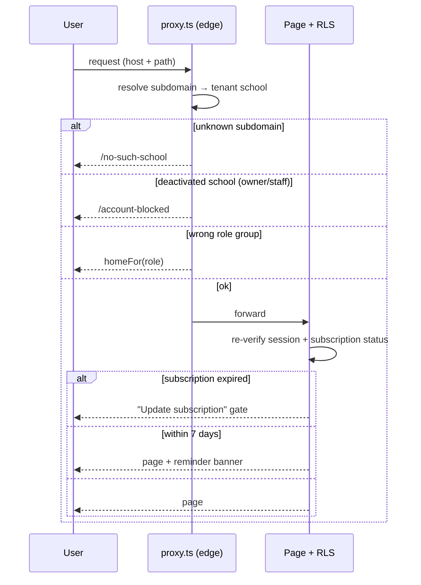

# Amar School — Multi-Tenant School LMS

A multi-tenant school management platform for Bangladeshi institutions, plus a
vendor/licensing **Super Admin** panel. Each school runs on its own subdomain
with branded login; a central super-admin provisions schools, manages
subscriptions, territories, government officials, and broadcast SMS.

Students have their own logins and their own portal at `/student/*` (map #434):
routine, notices, homework and submissions, study material, results, exam
schedule and admit card, attendance, leave requests, fees, questions to their
class teacher, and profile correction requests — all read-only against school
records, since a Student only ever creates requests and their own work.

Bangla-first, bilingual (bn/en) throughout.

## Tech stack

- **Next.js 16 (App Router)** — server components, server actions. This is a
  breaking-change Next version; read `web/node_modules/next/dist/docs/` before
  writing framework code (see `web/AGENTS.md`).
- **Supabase** (Postgres + Auth + Storage) — Row-Level Security is the
  authority; application-layer guards give clean errors.
- **Tailwind CSS v4** (ADR 0006 rewrite).
- **Vitest** — pure logic in `tests/unit`, live-DB suites in `tests/integration`.
- **Vercel** — hosting + cron jobs (`web/vercel.json`).

Everything lives under `web/`.

## Roles, route groups & test credentials

One app, role-based routing (ADR 0003). After login, `postLoginDestination`
sends each role to its home group; `proxy.ts` + RLS enforce access.

| Role | Home group | Purpose | Demo login |
| --- | --- | --- | --- |
| `super_admin` | `/super-admin` | Vendor panel: schools, subscriptions, distributors, agents, gov officials, territories, workflows, notifications, SMS commerce, invoices, settlements, accounting, audit, off-days | `demo.super@amarschool.test` / `DemoSuper#2026` |
| `school_owner` | `/school` | Full school management (all modules) | `demo.owner@amarschool.test` / `DemoOwner#2026` |
| `staff_user` | `/school` | School management, limited to granted screens | `demo.staff@amarschool.test` / `DemoStaff#2026` |
| `distributor` | `/distributor` | Subscription-code sales, assigned territory, CRM pipeline, onboarding, wallet (renamed from `dealer`, #271) | `demo.distributor@amarschool.test` / `DemoDist#2026` |
| `agent` | `/agent` | Field agent under a distributor: assigned tasks (dashboard, task list, mark-done) | `demo.agent@amarschool.test` / `DemoAgent#2026` |
| `gov_official` | `/gov` | Read oversight scoped to designation + territory | created by super-admin (no seeded demo) |
| `student` | `/student` | Their own school life: routine, notices, homework, material, results, exams, attendance, leave, fees, questions, profile requests (map #434) | `s0022@adarshamodelschool.students.invalid` / `DemoStudent#2026` |

A Student's login address is derived, not chosen: `<student_no>@<school
subdomain>.students.invalid` — RFC 2606, non-routable, so no mail is ever sent
to it. The School Owner creates and resets the password from the student's
profile; there is no self-service reset, because the address has no inbox.

**Class Teacher** is not a role. It is a `classes.class_teacher_id` pointing at
an `employees` row, so an ordinary Staff User login sees `/school/my-classes`
and the questions inbox for the classes they hold (ADR 0017: a Grant decides
which screens, a class attachment decides which students). The demo school's
class teacher is `demo.teacher@amarschool.test` / `DemoTeacher#2026` — class
teacher of the same class the demo student sits in, so the two see each other.

Demo logins are seeded by migrations (`0054` school owner/staff, `0066`
super-admin, `0110` distributor/agent + partner/financial/workflow sample data,
`0151` class teacher + student + a published routine on the demo school) and are
throwaway demo accounts — change freely. An owner with no
profile yet claims a pre-created school at `/claim` with a super-admin activation
code.

## Project structure

```
web/
├── app/                      # App Router routes
│   ├── login/  claim/  reset-password/  auth/   # auth + owner onboarding
│   ├── account-blocked/  no-such-school/         # gate / branded 404
│   ├── school/               # /school/* — owner + staff app
│   │   ├── layout.tsx        # SchoolShell + subscription gate/banner (#169)
│   │   ├── students/ attendance/ exams/ classes/ fees/ employees/
│   │   ├── institute/ notices/ feedback/ sms/ activity/ subscription/
│   │   ├── my-classes/       # class teacher's own classes (#443)
│   │   ├── questions/ corrections/ approvals/   # the student-request hub
│   ├── student/              # /student/* — the Student portal (map #434)
│   │   ├── layout.tsx        # AppShell, student nav, own notification inbox
│   │   ├── routine/ notices/ tasks/ materials/ results/ exams/
│   │   ├── attendance/ leave/ fees/ questions/ profile/
│   │   └── */print/          # browser-native printing, ADR 0007
│   ├── super-admin/          # /super-admin/* — vendor panel
│   │   ├── layout.tsx        # SuperAdminShell (sidebar + topbar)
│   │   ├── page.tsx          # KPI dashboard
│   │   ├── schools/[id]/     # school detail: block/delete/activation/expiry/flags
│   │   ├── codes/ partners/ agents/ gov-officials/ locations/ clusters/ sms/ off-days/
│   │   ├── workflows/ notifications/ sms-commerce/ invoices/ settlements/ accounting/
│   │   ├── audit-log/ role-permissions/ module-config/ subscription-config/ coupons/
│   ├── distributor/  agent/  gov/   # distributor (CRM/wallet), agent (tasks), gov landings
│   └── api/                  # route handlers + Vercel crons
│       ├── sms/absence/          # daily absence SMS
│       └── subscription/expiry-sweep/  # daily 7-day expiry reminder (#163)
├── components/               # shells, cards, primitives, print pieces
├── lib/                      # domain logic (pure where possible → unit-tested)
│   ├── auth/                 # routing, require-role, post-login, tenant-host
│   ├── school/  super-admin/ # per-domain seams (context, dashboard, ...)
│   ├── student/              # student context, routine, fees, attendance, tasks
│   ├── engines/              # policy, workflow, events, audit, notification (ADR 0008)
│   ├── sms/  cron/  subscription.ts  i18n.ts  locations.ts  ...
│   ├── supabase/             # server + client clients
│   └── ...
├── supabase/migrations/      # 154 SQL migrations (RLS-first), 0001-0159
├── tests/{unit,integration}/
├── proxy.ts                  # edge auth gate + subdomain→tenant routing
└── vercel.json               # region + cron schedules
```

## Project map

```mermaid
graph TD
  subgraph Auth
    Login[/login/] --> PostLogin{role?}
    Claim[/claim/] -->|redeem code| Owner
  end
  PostLogin -->|super_admin| SA
  PostLogin -->|owner/staff| SchoolApp
  PostLogin -->|distributor| Distributor[/distributor/]
  PostLogin -->|agent| Agent[/agent/]
  PostLogin -->|gov_official| Gov[/gov/]
  PostLogin -->|student| StudentApp

  subgraph SA[Super Admin panel]
    Dash[KPI dashboard]
    Schools[Schools + detail\nblock/delete/activation/expiry/flags]
    Codes[Subscription codes]
    Dealers[Distributors + Agents]
    GovOff[Gov officials\ndesignation + edu-scope + territory]
    Terr[Territory + Locations]
    Clusters[Clusters]
    SMS[Broadcast SMS by area]
    Off[Central off-days]
  end

  subgraph SchoolApp["/school (owner + staff)"]
    Owner[Dashboard]
    Students & Attendance & Exams & Fees & Employees
    Institute & Notices & Feedback & SchoolSMS[SMS]
    Gate{{subscription gate + 7-day banner}}
  end

  subgraph StudentApp["/student (the student's own school life)"]
    Home[Today + Tomorrow\nnotices, fees due]
    SRoutine[Routine] & SNotices[Notices] & SHomework[Homework + submissions]
    SMaterial[Study material] & SResults[Results] & SExams[Exam schedule\n+ admit card]
    SAtt[Attendance] & SLeave[Leave requests] & SFees[Fees]
    SAsk[Questions to the class teacher]
    SCorrections[Profile correction requests]
  end

  Schools -.provisions.-> SchoolApp
  Off -.import.-> Attendance
  Cron[[Vercel cron: expiry sweep]] -.7-day reminder.-> Owner
  SchoolApp -.publishes.-> StudentApp
  SAsk -.class teacher inbox.-> SchoolApp
  SCorrections -.owner applies.-> Students
```



## Page flow (auth + tenancy)



## Local development

```bash
cd web
npm install
cp .env.example .env.local     # fill Supabase URL + anon key, CRON_SECRET, RECONCILE_SECRET
npm run dev                    # http://localhost:3000
npm run lint
npm run typecheck              # tsc --noEmit
npm run test:unit              # pure logic (no DB)
npm test                       # full suite (integration needs a live Supabase)
npm run test:e2e               # Playwright
```

Migrations live in `web/supabase/migrations/` (applied to the shared Supabase
project). Subdomain routing keys off `NEXT_PUBLIC_ROOT_DOMAIN` (`localhost` in
dev).

## Conventions

- **RLS is the authority.** Server actions add `requireSuperAdmin` /
  `requireSchoolMember`-style guards for clean errors, never as the only gate.
- **Deep seams.** Domain logic is extracted into pure, unit-tested modules under
  `lib/*` (e.g. `lib/super-admin/dashboard`, `lib/subscription`); routes stay thin.
- **Shared auth context.** `getSchoolContext` / `getSuperAdminContext` /
  `getStudentContext` are `cache()`-wrapped so a layout and its pages share one
  auth lookup.
- **A Student never edits a school record.** Everything school-owned is
  read-only to them; the complete set of things they may create is a question, a
  leave request, a correction request, a homework upload and a task tick. Their
  own row is read through the `student_self` definer view, so fields like
  `guardian_nid` are absent rather than merely unselected (#438).
- **`app_current_school_id()` is null for a Student.** That is the seam keeping
  ~200 legacy policies denying them by default; student access is granted
  explicitly through `app_current_student_id()` and definer views, and a
  table-driven default-deny suite guards it.
- Wayfinder maps drive feature work; see `web/AGENTS.md` for the build loop.
