# Machine Attendance Device Agent — Architecture & Implementation Plan

## Status

**Architecture Baseline v1.1**

### Project status (2026-10-06)

Status update only. The architecture is unchanged.

| Item | Status |
|---|---|
| Phase 1A — TIMY TM52GPRS / official TIMY SDK POC | **ACCEPTED BY OWNER** (2026-10-06). Report: `k40-poc/docs/machine_attendance_timmy_poc_report.md` (POC workspace, outside this repository). Recorded limitations are not Phase 2 blockers |
| Phase 1B — ZKTeco K40 POC | unchanged: blocked until a K40 bench unit exists |
| Phase 2 — Normalized driver contract | **ACCEPTED** (2026-10-06). Separate `attendance-agent` repository, initial commit `87e2aa9` |
| Phase 3 — Database/domain migrations | authorized by owner; first slice (reconciliation / School-local day foundation) in progress |
| OD-1 | **RESOLVED** — direct device integration through the Windows Agent approved |
| OD-13 | **RESOLVED** — the Agent lives in the separate `attendance-agent` repository |
| OD-17 | **OPEN** — the TIMY SDK redistribution/runtime licence is required before the TIMY production runtime ships |

Original planning note: this document authorized no production implementation by itself; phases start as recorded above.

This document was written on 2026-10-04 against branch `staging` at commit `4e6f955`
("feat(attendance): Machine Attendance — machine setup and fast RFID enrollment").
No production file, migration, configuration, package or SDK was added or changed
while producing it. It is the only file this work created.

Revision 2 (2026-10-04): per-device identity resolution, required School-local
attendance day, local-only device communication keys, legacy-ID alias persistence,
and archive-not-delete device lifecycle. Architecture otherwise unchanged.

Revision 3 (2026-10-04): enrollment links kept as permanent, non-overlapping
episodes; Agent-generated credential with retry-safe activation; fallback event
key built on the immutable cloud `machine_id`.

Baseline v1.0 (2026-10-04, final consistency pass): one Windows Service per Agent
installation; stable credential prefix across rotation; server-authoritative UTC
conversion; `attendance_reconcile_dates` queue as the reconciliation schedule.

Baseline v1.1 (2026-10-05, execution-order amendment): the first **active** physical
target changes from the ZKTeco K40 to the TIMY TM52GPRS, because the TM52GPRS is the
hardware currently on the bench and no K40 is available. ZKTeco/K40 stays an approved,
planned target: all K40 analysis, SDK/pyzk research, licensing notes and the §25 test plan
are kept. **Only the implementation/validation order changes.** The multi-vendor
Agent/cloud architecture, the driver contract, the database design and every other
v1.0 decision are unchanged. The generic Agent phases now depend on "at least one
accepted real-device POC" rather than on the K40 specifically ([§28](#28-implementation-phases)).

## First Hardware Target

**Current first active hardware target:** TIMY TM52GPRS (bench unit available now; see [§10.1](#101-tm52gprs-bench-evidence)).

**Next ZKTeco hardware target:** ZKTeco K40, when a bench unit becomes available (Phase 1B).

The long-term goal is unchanged: multi-vendor ZKTeco + TIMY support.

## Long-Term Hardware Goal

Support multiple ZKTeco and Timmy/TIMY attendance-device families through
a stable Windows Attendance Agent and replaceable device drivers.

## Preferred Agent Direction

Modern .NET Worker Service as Agent Core, with device communication
isolated behind normalized driver interfaces. Legacy/vendor SDK runtime
requirements must not leak into cloud/domain architecture.

---

## Table of contents

1. [How to read this document (labels)](#1-how-to-read-this-document-labels)
2. [Executive summary](#2-executive-summary)
3. [Existing system — what the repository actually contains](#3-existing-system--what-the-repository-actually-contains)
4. [`machine_enroll_infos` deep analysis](#4-machine_enroll_infos-deep-analysis)
5. [Gaps between the existing system and the target](#5-gaps-between-the-existing-system-and-the-target)
6. [Target architecture](#6-target-architecture)
7. [Driver Architecture Decision](#driver-architecture-decision)
8. [Device driver contract and normalized models](#8-device-driver-contract-and-normalized-models)
9. [ZKTeco K40 — first ZKTeco driver analysis](#9-zkteco-k40--first-zkteco-driver-analysis)
10. [Timmy / TIMY support strategy](#10-timmy--timy-support-strategy)
11. [Driver selection, compatibility catalog and fallback](#11-driver-selection-compatibility-catalog-and-fallback)
12. [Agent Core design](#12-agent-core-design)
13. [Identity model and Machine User ID strategy](#13-identity-model-and-machine-user-id-strategy)
14. [Enrollment and provisioning (students and employees)](#14-enrollment-and-provisioning-students-and-employees)
15. [Attendance pipeline, raw events and idempotency](#15-attendance-pipeline-raw-events-and-idempotency)
16. [Command processing](#16-command-processing)
17. [Reconciliation, existing-machine import and device replacement](#17-reconciliation-existing-machine-import-and-device-replacement)
18. [Security](#18-security)
19. [Recovery behavior](#19-recovery-behavior)
20. [Logging and observability](#20-logging-and-observability)
21. [Database migration plan](#21-database-migration-plan)
22. [API plan](#22-api-plan)
23. [UI plan](#23-ui-plan)
24. [Device compatibility matrix](#24-device-compatibility-matrix)
25. [K40 hardware validation plan](#25-k40-hardware-validation-plan)
26. [Timmy validation plan](#26-timmy-validation-plan)
27. [Known Integration Risks](#known-integration-risks)
28. [Implementation phases](#28-implementation-phases)
29. [Owner decisions required](#29-owner-decisions-required)
30. [Non-goals](#30-non-goals)
31. [Final review checklist](#31-final-review-checklist)
32. [Sources](#32-sources)

---

## 1. How to read this document (labels)

| Label | Meaning |
|---|---|
| **EXISTING** | Present in the repository today. Always cited with an exact file / table / function / route / component. |
| **VERIFIED BY REPOSITORY** | Claim checked by reading the cited file during this review. |
| **PROPOSED** | New design. Nothing of it exists yet. |
| **VERIFIED BY VENDOR/SDK** | Backed by a vendor page, the official SDK, or the pyzk repository (see [Sources](#32-sources)). |
| **REQUIRES MIGRATION** | Needs a future Supabase migration. None was created. |
| **REQUIRES K40 TEST** | Must be confirmed on a physical K40 before it is relied on. |
| **REQUIRES TIMMY MODEL TEST** | Must be confirmed on a specific physical Timmy model. |
| **REQUIRES OWNER DECISION** | A business / legal / product choice the owner must make. Collected in [§29](#29-owner-decisions-required). |
| **LIMITATION** | Known constraint we accept or design around. |
| **RISK** | Something that can go wrong; mitigation given. |
| **BLOCKER** | Must be resolved before the named phase can start. |

Anything not labelled VERIFIED is an assumption or a design proposal and must be read as such.

---

## 2. Executive summary

**What exists today (VERIFIED BY REPOSITORY).** The web app already has:

- a raw tap staging table `attendance_events` and a daily reconciliation job `reconcile_attendance` that collapses a person's taps into one `attendance_records` row per day (earliest = entry, latest = exit);
- a per-School token-gated ingest endpoint `POST /api/attendance/ingest/[schoolId]` (ADR 0001 "dual-path ingest");
- `machine_enroll_infos` — one row per enrolled person, holding their numeric Machine ID (`unique_id`), `type` (student/employee) and optional RFID card;
- `attendance_machines` — a configuration-only list of a School's devices (vendor ZKTeco/Timmy, model, serial, location, shift scope);
- Attendance → Machine Attendance UI with three tabs (Machine Setup, Student RFID Enrollment, Employee Enrollment) where "Enroll Students/Employees" and "Download Windows Service" currently show an "Upcoming" notice.

**What does not exist.** No Agent, no device communication, no Agent identity, no command queue, no per-device enrollment state, no attendance idempotency, and — critically — the ingest/reconcile pipeline resolves people **only by RFID card number**, while a ZKTeco attendance log identifies the person by **machine user ID (PIN)**, not by card. Fingerprint punches carry no card at all.

**Recommendation.**

1. **Agent host:** one generic C# / modern .NET (LTS) Worker Service installed as a Windows Service, x64, identical for every School; School association only through one-time activation.
2. **Driver model:** a first-class `IAttendanceDeviceDriver` contract inside the Agent. Drivers are selected per device from an Agent-shipped compatibility catalog.
3. **Process isolation (rule):** a native, COM, bitness-constrained or crash-prone vendor SDK runs in an isolated bridge process; a safe pure-managed .NET driver may run in-process; an HTTP API uses a normal managed HTTP adapter unless isolation is otherwise justified. Which side a vendor lands on is decided from its actual SDK package, never assumed. For the ZKTeco path, the Standalone SDK (`zkemkeeper`, a COM component, commonly deployed 32-bit) runs in a separate `ZktecoSdkBridge.exe` child process spoken to over **stdin/stdout JSON-RPC**. A managed, pure-C# protocol driver (if built) runs in-process. This is the "Option 4, minimal form" in the [decision section](#driver-architecture-decision).
4. **First K40 driver:** ZKTeco Standalone SDK via the x86 bridge — PRIMARY PRODUCTION DRIVER CANDIDATE **for ZKTeco**, not a guaranteed final choice. Decided only after the Phase 1B K40 proof of concept.
5. **K40 fallback:** a managed C# implementation of the classic ZK TCP/UDP 4370 protocol, using pyzk **as a behavioral reference and test oracle only** (pyzk is GPL-2.0; see licensing risk). pyzk is used for the proof of concept and for hardware test scripts; it is **not** shipped in the production installer unless a proven compatibility gap justifies a Python bridge and the owner accepts the licensing review.
6. **Timmy:** no Timmy driver is built until a specific Timmy model is in hand and probed. Architecture reserves three driver families (ZK-compatible, Timmy vendor SDK, Timmy HTTP/cloud). Nothing in the cloud or database is Timmy-specific. Since v1.1 the first Timmy model is in hand: the **TIMY TM52GPRS**. It is the current first active target, and its bench evidence points provisionally to the `timmy-sdk-<family>` path ([§10.1](#101-tm52gprs-bench-evidence)).
7. **Cloud:** new Agent-facing route handlers under `web/app/api/agent/v1/*` that call `SECURITY DEFINER` RPCs — the same "no service-role key" convention the repository already uses everywhere (VERIFIED BY REPOSITORY: no `SERVICE_ROLE` reference exists in `web/`).
8. **Data:** extend, don't replace. Keep `machine_enroll_infos` as the person-level machine identity; extend `attendance_machines` (network/driver metadata, `enabled`, `archived_at` — activated devices are archived, never hard-deleted); extend `attendance_events` with device, machine-user-ID, School-local attendance date and an idempotency key; add Agent, activation-code, command, per-device-enrollment and legacy-ID-alias tables.
9. **Identity resolution:** an Agent-originated punch resolves **only** through `(machine_id, machine_user_id)` → the `attendance_machine_enrollments` episode whose link window contains the punch (episodes are permanent history, never reopened, never overlapping) → `machine_enroll_infos` → person, or through a bounded legacy alias for that same device. It never resolves by a bare `(school_id, unique_id)` lookup that bypasses the per-device mapping. Card-number resolution remains only for the existing/legacy RFID ingest path.
10. **Attendance day:** the attendance date of every event is derived in the School/device configured time zone (default `Asia/Dhaka`), not as a UTC day. Device local time, normalized UTC time and cloud received time are all kept. This is a required part of the machine-attendance implementation, not a later improvement.
11. **Device credentials:** the K40/Timmy communication key is stored **only on the Agent PC**, protected with Windows DPAPI. The cloud stores IP/port/driver/metadata and a "credential configured" flag, never the key, and the Agent cloud config contract does not carry it.
12. **Immediate next step (v1.1):** development is not waiting for a K40. The immediate hardware work is:
    1. obtain the official TIMY SDK/API that applies to the TM52GPRS;
    2. run a safe read-only SDK POC (Phase 1A);
    3. if read-only succeeds, run the approved write and attendance validation;
    4. use that evidence to establish the first production device driver;
    5. validate the K40 separately when it is available (Phase 1B).

    OD-1 (PRD non-goal) is still required before Phase 2. The ZKTeco licensing and pyzk decisions (OD-3, OD-4) are still required before the ZKTeco driver ships, but they no longer block starting the generic Agent contract once the TM52GPRS POC provides the required hardware evidence. No production code before an accepted real-device POC.

---

## 3. Existing system — what the repository actually contains

Every row below is **EXISTING** and **VERIFIED BY REPOSITORY** unless stated otherwise.

### 3.1 Platform, tenancy and auth

| Concept | Where | Finding |
|---|---|---|
| Stack | `web/` (Next.js app router, `web/AGENTS.md`), Supabase Postgres, Vercel (`web/vercel.json`, region `sin1`) | `web/AGENTS.md` warns the Next.js version has breaking changes vs. common knowledge; route handlers live in `web/app/api/**/route.ts`. |
| Layering | `web/AGENTS.md`, ADR `docs/adr/0008-layered-ddd-engines.md` | Presentation → API (thin route handlers / server actions) → Application → Domain → Infrastructure. "No business logic in components or route handlers." Engines in `web/lib/engines/{audit,events,feature,financial,notification,policy,workflow}`. |
| Tenant (School) | table `public.schools`; ADR `docs/adr/0002-shared-schema-multi-tenancy.md` | Shared schema; every tenant row carries `school_id`. RLS uses `public.app_current_school_id()`. |
| Roles | `public.app_current_role()` (e.g. `school_owner`, `staff_user`, `super_admin`), `web/lib/auth/routing.ts`, `web/proxy.ts` | `proxy.ts` is an optimistic route gate; "Pages and RLS re-verify". |
| Screen grants | `public.app_module_granted(p_module)` in `web/supabase/migrations/0136_staff_screen_grants_rls.sql`; `staff_permissions` table; ADR 0017/0020 | School Owner always granted; Staff User only if `staff_permissions.screen_key` matches. Machine tables use `app_module_granted('attendance')`. |
| Privileged writes without a session | `public.vendor_secrets` (0017), `ingest_attendance_events`, `reconcile_attendance`, `record_audit` (`web/supabase/migrations/0078_audit_log.sql`), `domain_events` (`0077_domain_events.sql`) | Pattern: `SECURITY DEFINER` RPC + secret/token check, called with the **anon** key. No service-role key anywhere in `web/`. |
| Audit | `public.audit_log`, RPC `record_audit`, `web/lib/engines/audit/engine.ts` | Append-only, supports `dedupeKey`. Reusable for Agent activation/revocation/device changes. |
| Domain events | `public.domain_events` outbox (0077), `web/lib/engines/events/*`, cron `/api/events/drain` | At-least-once; consumers idempotent on event id. Candidate carrier for "enrollment changed" → command creation. |
| Crons | `web/vercel.json` | `/api/attendance/reconcile` at `30 12 * * *` (UTC, i.e. 18:30 Asia/Dhaka). |
| Time zone | `web/lib/school-time.ts` (`SCHOOL_TIME_ZONE = 'Asia/Dhaka'`), `web/lib/attendance.ts` comment "Devices must send UTC timestamps", reconcile SQL comment "single-timezone assumption" | Attendance math is UTC-day based today; this plan replaces that with a School-local attendance day ([§15.2.1](#1521-school-local-attendance-day)). See [risk](#clock-and-timezone-differences). |

### 3.2 People

| Concept | Where | Finding |
|---|---|---|
| Students | `public.students` (`full_name`, `archived_at` from 0032, `unique_id bigint` from 0211) | `unique_id` = Machine ID. |
| Employees | `public.employees` (`archived_at` from 0046, `unique_id bigint`, `category`) and the view `public.employee_card` (0136, re-created in `0213_attendance_machines.sql` to add `unique_id`) | Attendance-grant staff read employees only through `employee_card`. |
| Machine ID | `web/supabase/migrations/0211_machine_enroll_infos.sql` §1–4; glossary "Machine ID" in `CONTEXT.md` | Plain positive integer, **one sequence `machine_unique_id_seq` shared by students and employees, globally unique across all Schools**, auto-assigned by triggers `assign_student_unique_id` / `assign_employee_unique_id` (caller-supplied values are refused), immutable (`*_unique_id_immutable` triggers), range check `1..99999999`. Rationale in the migration: "A ZKTeco User ID must be numeric". |

### 3.3 Attendance domain

| Concept | Where | Finding |
|---|---|---|
| Raw taps | table `public.attendance_events` (`web/supabase/migrations/0017_rfid_attendance.sql`) | Columns: `id`, `school_id`, `card_number text not null`, `tapped_at timestamptz not null`, `processed bool`, `created_at`. **No device id, no machine user id, no uniqueness / idempotency key.** Partial index `attendance_events_school_day_idx (school_id, tapped_at) where not processed`. |
| Ingest RPC | `public.ingest_attendance_events(school uuid, token uuid, events jsonb)` — last defined in `web/supabase/migrations/0020_rfid_card_same_school.sql` | Checks `schools.ingest_token`; max 5000 events; inserts `card_number` + `safe_timestamptz(tapped_at)`; silently skips rows with no card or bad timestamp. **Duplicates are inserted again** (route test `web/tests/integration/attendance-ingest-route.test.ts` sends a duplicate and asserts `ingested = 5`). |
| Ingest route | `web/app/api/attendance/ingest/[schoolId]/route.ts` | Header `x-ingest-token`; accepts a single `{card_number, tapped_at}` or `{events: [...]}`; UUID shape checks; anon-key client. |
| Ingest token | `schools.ingest_token uuid` (0017) | One shared secret per School, stored in plaintext; **no rotation RPC or UI found** (`grep ingest_token` finds only 0017/0020). Not installation-specific, not revocable per Agent. |
| Reconciliation | `public.reconcile_attendance(job_secret, target_date)` — current body in `0211_machine_enroll_infos.sql` §7; route `web/app/api/attendance/reconcile/route.ts` | Runs only for `schools.automatic_attendance_enabled` (0047). Resolves taps by **`machine_enroll_infos.rfid_card_number = attendance_events.card_number`**. Merges with any existing `attendance_records` row; marks only resolved events `processed` (0018). Day boundary is `target_date::timestamptz` (UTC). Route defaults `date` to today in UTC. |
| Final attendance | `public.attendance_records` (0017; `marked_by`/`marked_at` added in `0170_attendance_says_who_marked_it.sql`) | Unique `(person_type, person_id, att_date)`; statuses `present/on_time/late_entry/exit_early/late_exit_early`. Manual marking also writes here. |
| Employee status | `web/lib/attendance.ts` `employeeStatus`, `web/lib/grace.ts`; ADR 0030 | Office Time retired; employees currently always resolve to `present` (no expected window). |
| Glossary | `CONTEXT.md` "Attendance Event", "Machine ID", "Machine Enrollment", "Attendance Machine" | Attendance Machine entry says: "Configuration only: nothing talks to a device yet; the future Windows sync service will read these rows". |
| Architecture docs | `docs/adr/0001-dual-path-attendance-machine-ingest.md`, `docs/ARCHITECTURE.md` §5, `docs/PRD.md` §3 | ADR 0001 already anticipates "a small local bridge agent ... polling the LAN device". **PRD §3 Non-goals says "Live SDK integration with attendance hardware. No requirement to talk to a proprietary vendor SDK"** — see owner decision OD-1. `docs/ARCHITECTURE.md` §5 says RFID assignment is "a simple form ... no live SDK dependency". |

### 3.4 Machine Attendance (issue #675)

| Concept | Where | Finding |
|---|---|---|
| Devices | table `public.attendance_machines` (`web/supabase/migrations/0213_attendance_machines.sql`) | `machine_type in ('zkteco','timmy')`, `model`, `serial_number` (unique per School), `location`, `shift_scope none/all/shift`, `shift`, `note`, timestamps. RLS: School + `app_module_granted('attendance')`; super admin all. **No IP, port, comm key, driver, agent, status, capability or firmware columns.** |
| Enrollment | table `public.machine_enroll_infos` (0211) | See [§4](#4-machine_enroll_infos-deep-analysis). |
| Domain rules | `web/lib/machine-attendance.ts` | `MACHINE_TYPES`, `parseMachineInput`, `parseRfid` (cards stay strings, leading zeros kept, max 64, no internal whitespace), `filterEmployeesByShift`. |
| Persistence | `web/lib/machine-enrollment-store.ts` | `enrollmentInfo`, `saveRfidEntries` (upsert on `unique_id`), clearing a **student** card **deletes** the enrollment row; clearing an **employee** card keeps the row with `rfid_card_number = null`. `listMachines/createMachine/updateMachine/deleteMachine`. |
| Server actions | `web/app/school/attendance/machine/actions.ts` | `saveMachineAction`, `deleteMachineAction`, `saveRfidEntriesAction` (max 50 per batch). RLS is the authority. |
| Client queue | `web/lib/rfid-save-queue.ts`, `web/app/school/attendance/machine/rfid-queue-client.ts`, `rfid-entry-table.tsx` | Coalesces per person, retries requests with backoff, never retries a DB answer. |
| Screens | `web/app/school/attendance/machine/page.tsx` + `machine-setup.tsx` (Machine Setup), `students/page.tsx`, `employees/page.tsx`, `machine-ui.tsx` (`EnrollButton`, `DownloadServiceButton`, `UpcomingNotice`), `page-header.tsx` | "Enroll" opens a machine picker then "Upcoming"; "Download Windows Service" shows "Upcoming". |
| Navigation | `web/lib/attendance-nav.ts` `ATTENDANCE_MACHINE_TABS`, group `machine`; `web/lib/school-nav.ts` sidebar entry `attendanceGroupHref('machine')` | Target navigation **Attendance → Machine Attendance → {Machine Setup, Student RFID Enrollment, Employee Enrollment} already exists.** |
| Strings | `web/lib/i18n.ts` keys `machine.*`, `attendance.tabMachineSetup` etc. | Bangla-primary, bilingual (ADR 0004). |
| Tests | `web/tests/integration/machine-attendance.test.ts`, `machine-enroll-infos.test.ts`, `attendance-ingest-route.test.ts`, `rfid-attendance.test.ts`; unit `web/tests/unit/machine-attendance.test.ts`, `machine-ui.test.tsx`, `rfid-save-queue.test.ts`; helper `web/tests/helpers/machine-enroll.ts` | Reference patterns for future tests. |
| Known infra issue | commit `bb09e9e` message | "The HTTP 429 itself comes from Vercel's edge challenge ... needs a Firewall change in the Vercel dashboard (refs #674)". Directly relevant to a non-browser Agent calling Vercel. |

---

## 4. `machine_enroll_infos` deep analysis

Source: `web/supabase/migrations/0211_machine_enroll_infos.sql` §5, RLS §5, backfill §6, reconcile §7; writers in `web/lib/machine-enrollment-store.ts`. **VERIFIED BY REPOSITORY.**

### 4.1 Column-by-column

| Column | Existing meaning | Still useful? | Device-specific? | Student/employee-specific? | Migration needed? |
|---|---|---|---|---|---|
| `id uuid pk` | Row identity | Yes — target of a future per-device FK | No | No | No |
| `school_id uuid not null` (default `app_current_school_id()`) | Tenant | Yes | No | No | No |
| `unique_id bigint not null`, **globally unique** (`machine_enroll_infos_unique_id_key`) | The person's Machine ID, pinned to the person's own `unique_id` by composite FK | Yes — this **is** the `machine_user_id` sent to every device | **No** — the same value is used on every device | Both (shared sequence) | No |
| `type text check in ('student','employee')` | Which kind of person; enforced against `student_id`/`employee_id` | Yes — becomes `entity_type` | No | Discriminator | No |
| `student_id uuid` / `employee_id uuid` | Direct person reference; composite FKs `(school_id, student_id, unique_id) → students(school_id, id, unique_id)` and same for employees, `on delete cascade` | Yes — becomes `entity_id` | No | Yes | No |
| `rfid_card_number text`, unique per School (`machine_enroll_infos_rfid_card_number_key`) | The only RFID store; used by `reconcile_attendance` to resolve taps | Yes | **No** — a card is the person's, not the device's | Both | No (format note: devices may store cards as integers; see [RFID risk](#rfid-format-differences)) |
| `created_at timestamptz` | Insert time | Yes | No | No | Consider `updated_at` (REQUIRES MIGRATION, low risk) to drive "re-provision changed people" |

### 4.2 What it can and cannot represent

| Required concept | Representable today? | Notes |
|---|---|---|
| `entity_type` STUDENT/EMPLOYEE | **Yes** — `type` | |
| `entity_id` | **Yes** — `student_id` / `employee_id` | |
| `machine_user_id` | **Yes** — `unique_id` | Person-level value, the same on all devices. It is *what to provision*, not on its own *how to resolve*: Agent punches resolve through the per-device row (below). |
| RFID | **Yes** — `rfid_card_number` | |
| `device_id` | **No** | `unique (unique_id)` allows exactly **one row per person** for the whole platform, so the table cannot hold one row per (person, device). |
| `machine_internal_uid` (ZK `UID`, a per-device slot index) | **No** | Device-specific by nature. |
| Enrollment status (pending / provisioned / failed / removed) | **No** | Device-specific by nature. |
| Fingerprint enrolled? | **No** | Device-specific; templates are never stored in cloud for MVP. |

### 4.3 Recommendation

- **Keep `machine_enroll_infos` unchanged in meaning**: it is the person-level *desired identity* ("this person is enrolled for machine attendance as Machine ID N with card C"). Do **not** replace it.
- **Add a per-device child table** (PROPOSED, REQUIRES MIGRATION), working name `attendance_machine_enrollments`, holding one row per **enrollment episode** of a person on a device: `(machine_id, machine_user_id)`, desired/actual state, the device's internal UID and the **link window** (`linked_at` / `unlinked_at`) during which that device user ID means that person on that device. Closed episodes are kept forever and never reopened; re-enrolling creates a new episode ([§21.2](#212-new-tables)). This table — not `machine_enroll_infos` alone — is what Agent-originated attendance resolves through ([§15.2](#152-is-attendance_events-suitable-as-the-raw-machine-store)). See [§21](#21-database-migration-plan).
- **Behavior change required (REQUIRES OWNER DECISION OD-6):** today clearing a student's card **deletes** the `machine_enroll_infos` row (`saveOne` in `machine-enrollment-store.ts`). Once devices hold the user, deleting the cloud row must also queue removal from every device it was provisioned to. The per-device rows must therefore **not** silently cascade away; they should move to `desired_state = 'absent'` and stay until the Agent confirms removal. Also decide whether a student may be fingerprint-only (today a student enrollment exists only to carry a card).
- **Archived people:** `students.archived_at` / `employees.archived_at` exist; there is no rule yet for removing an archived person from devices. Proposed default: archive ⇒ desired state `absent` on all devices, with an explicit confirmation step in UI (REQUIRES OWNER DECISION OD-7).

---

## 5. Gaps between the existing system and the target

| # | Gap | Severity | Resolution |
|---|---|---|---|
| G1 | Reconcile resolves people **only by card number**; ZK logs carry user ID (PIN), fingerprint punches carry no card | **BLOCKER** for Phase 8 | Add `machine_id` + `machine_user_id` to `attendance_events`; Agent-originated events resolve through `(machine_id, machine_user_id)` → `attendance_machine_enrollments` (link window) → `machine_enroll_infos` → person, then through a bounded legacy alias for the same device; never by bare `(school_id, unique_id)`. Card resolution stays only for the legacy ingest-token path. REQUIRES MIGRATION. |
| G2 | No idempotency on `attendance_events` | **BLOCKER** for Phase 8 | `event_key` + unique index + `on conflict do nothing`. REQUIRES MIGRATION. |
| G3 | No device attribution on events; devices can be hard-deleted (`deleteMachine` in `web/lib/machine-enrollment-store.ts`) | High | `machine_id` FK (nullable for legacy rows, `on delete restrict`) + `device_serial` snapshot; activated/used devices are archived (`archived_at`) or disabled (`enabled = false`), never hard-deleted, so historic attendance keeps its physical device. |
| G4 | Shared per-School plaintext `ingest_token`, no rotation | High for Agent | Agent does **not** use it. New per-installation Agent credential. Keep ingest token only for ADR 0001 path 1 (device push). |
| G5 | No Agent identity, activation, heartbeat, command queue | Required | New tables + RPCs + routes. |
| G6 | `attendance_machines` lacks network/driver/status/capabilities | Required | Extend + separate health table. |
| G7 | No per-device enrollment state | Required | `attendance_machine_enrollments`. |
| G8 | UTC-day reconciliation (`target_date::timestamptz`, route default = UTC today); devices store local wall-clock time | **BLOCKER** for Phase 8 | Required change: the Agent uploads device local time, and the server converts it to UTC with `attendance_machines.time_zone`. The cloud stores device local time, UTC event time and received time, and derives `attendance_date` in the School/device time zone. `reconcile_attendance` runs per `(school_id, attendance_date)` pair drained from the `attendance_reconcile_dates` queue, which every ingest fills, instead of one global UTC "today". REQUIRES MIGRATION. |
| G9 | PRD non-goal "Live SDK integration" | **BLOCKER (governance)** | Owner decision OD-1, then update PRD/ADR (new ADR "Windows Attendance Agent with device drivers" superseding the bridge-agent half of ADR 0001's wording). |
| G10 | Vercel edge challenge 429 for non-browser callers (#674) | **BLOCKER** for Phase 6 in production | Firewall rule / bypass for `/api/agent/*` in Vercel dashboard. |
| G11 | No model for device user IDs that predate the Agent (legacy desktop app enrollments) | Medium (Phase 11) | `attendance_machine_user_aliases` with bounded validity windows per device ([§17.2](#172-existing-machine-import)). REQUIRES MIGRATION. |
| G12 | No place for device communication keys | Required | Local-only on the Agent PC (DPAPI); cloud stores only `credential_configured` ([§18.2](#182-two-unrelated-secret-classes)). |

---

## 6. Target architecture

### 6.1 Complete multi-vendor architecture

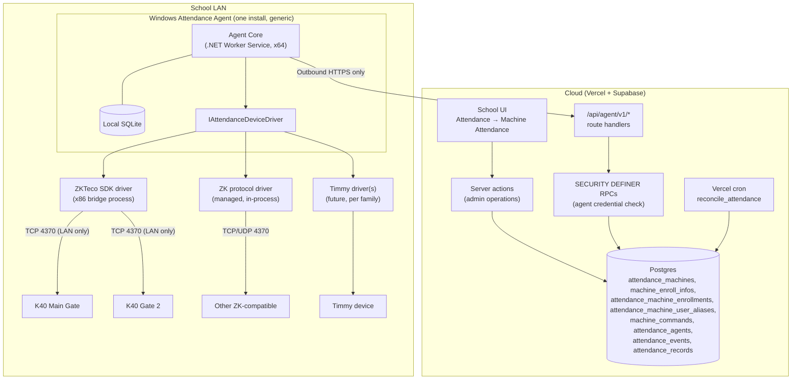

No inbound connection to the School is ever required. Port 4370 never leaves the LAN.

### 6.2 Agent Core + Device Drivers

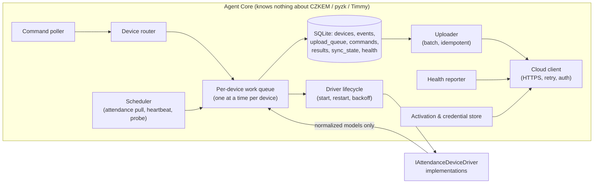

---

## Driver Architecture Decision

### Options compared

- **Option 1** — .NET Agent directly using `zkemkeeper` only (COM in the service process).
- **Option 2** — Python pyzk Agent only (Python service, pyzk everywhere).
- **Option 3** — .NET Agent + in-process driver interfaces (every driver, including COM SDKs, loaded inside the service).
- **Option 4** — .NET Agent + isolated driver bridge processes (driver contract inside the Agent; vendor SDK drivers in child processes).

| Criterion | Option 1: .NET + zkemkeeper only | Option 2: Python pyzk only | Option 3: .NET + in-process drivers | Option 4: .NET + isolated bridges |
|---|---|---|---|---|
| K40 compatibility | Good if the official SDK supports the K40's firmware (REQUIRES K40 TEST) | pyzk lists a K40/ID (Ver 6.60, platform JZ4725_TFT) as tested (VERIFIED BY VENDOR/SDK — pyzk README); other K40 firmware unknown | Same as whichever driver is used | Same as whichever driver is used; can run both side by side |
| Other ZKTeco | Only devices the Standalone SDK supports (classic "black & white"/TFT). Push-only/newer ZKTeco platforms may not be | Classic ZK protocol devices only; README lists one "not working" device (iClock260) | Good | Good |
| Timmy | None | Only Timmy models that happen to speak ZK protocol | Possible, but Timmy SDK runtime constraints leak into the service process | Best — each Timmy SDK family in its own bridge with its own bitness/runtime |
| Windows deployment | COM registration (`regsvr32`, admin), SDK DLL set | Bundled Python runtime (PyInstaller) | COM registration inside one service | COM registration (or registration-free COM, REQUIRES K40 TEST) for the bridge only |
| x86/x64 | Service forced to x86 if the SDK is 32-bit | Either | Service forced to the **lowest common bitness** of all SDKs | Service x64; each bridge its own bitness |
| Stability / SDK crashes | A native crash or COM hang kills the whole Agent (uploads, other devices) | Pure Python, fewer native crashes; socket-level bugs possible | Same as Option 1, multiplied by every SDK loaded | Crash contained to one bridge; Agent marks device degraded and restarts the bridge |
| Offline reliability | Fine (local SQLite possible) | Fine | Fine | Fine |
| Maintainability | Vendor types leak everywhere unless wrapped | Python service + Windows service tooling is less idiomatic | Good if the contract is enforced | Good; slight IPC contract overhead |
| Installer complexity | Medium | Medium (Python runtime, AV false positives for PyInstaller EXEs are common) | Medium | Medium-plus (one extra EXE per SDK family) |
| Future expansion | Poor | Poor for non-ZK hardware | Medium — breaks down at the first SDK with conflicting bitness/runtime | Best |
| Licensing | Depends on ZKTeco SDK redistribution terms (REQUIRES OWNER DECISION) | **pyzk is GPL-2.0** (VERIFIED BY VENDOR/SDK — LICENSE.txt). Distributing it in the product needs legal review | Mixed | Mixed; isolation keeps GPL code (if ever used) a separate program, which **may** help but is not a legal conclusion |
| Debugging | Simple | Simple | Simple | Harder (two processes); mitigated by structured logs with correlation ids and a "run bridge standalone" CLI mode |

### Is process isolation justified for the MVP?

Yes, as a **conditional rule** applied per vendor SDK, in its minimal form:

| Driver kind | Placement |
|---|---|
| Native / COM / bitness-constrained / crash-prone vendor SDK | Isolated bridge process |
| Safe pure-managed .NET driver (e.g. a C# protocol implementation) | May run in-process |
| HTTP API | Normal managed HTTP adapter, in-process, unless isolation is otherwise justified |

- **Justified for the ZKTeco path** because its SDK is a COM component that is commonly deployed as a 32-bit component (the widely documented install procedure copies the DLLs into `SysWOW64` and registers with the 32-bit `regsvr32` on 64-bit Windows — VERIFIED BY VENDOR/SDK community documentation; exact bitness of the downloaded SDK version REQUIRES K40 TEST). Loading it in-process would force the whole Agent to x86 and let a COM hang or native fault stop attendance uploads for every device. Since v1.1 the first active target is the TIMY TM52GPRS, whose official SDK has **not yet been inspected**; whether its production adapter needs a bridge is decided in Phase 1A from the actual SDK runtime, bitness, dependencies and stability — not assumed here.
- **Not justified now:** a generic plug-in loader, gRPC, dynamic driver download, or one bridge per device. One bridge **per SDK family**, multiplexing that family's devices, is enough.

### Recommendation for this project

**Option 4 in minimal form ("hybrid"):**

1. The driver contract (`IAttendanceDeviceDriver`) lives in the Agent and is the only thing Agent Core calls.
2. Two adapter kinds implement it:
   - **In-process managed driver** — e.g. a pure C# ZK protocol driver. No native code, x64, runs inside the service.
   - **Bridge proxy driver** — a thin in-process class that implements the same interface by forwarding each call to a child process (`ZktecoSdkBridge.exe` for the future K40 path; any other vendor bridge — e.g. an illustrative `TimmyXxxBridge.exe` — only if that vendor's SDK meets the isolation rule above).
3. **IPC: JSON-RPC over the child's stdin/stdout** (line- or length-delimited JSON; StreamJsonRpc or a small hand-rolled framing). Reasons: no listening socket or named pipe for another local process to connect to; the parent owns the child's lifetime; trivial to supervise; no extra ports for antivirus/firewall prompts. Logs go to stderr and are forwarded into the Agent log with the device/command correlation ids. Named pipes are the next step for bridges only if one bridge ever has to be shared across processes (not foreseen). (The Administrators-only local admin pipe in [§18.3](#183-windows-protection) is a different channel, between the config tool and the service.) Local HTTP/gRPC are rejected as unnecessary attack surface.
4. Each bridge call carries a timeout. A hung call ⇒ the Agent kills and restarts the bridge, marks the device `degraded`, and retries **read** operations; **write** operations are retried only through the idempotent desired-state path (see [§16](#16-command-processing)).
5. The bridge runs COM on a dedicated STA thread (COM SDKs of this kind typically expect single-threaded apartment usage; REQUIRES K40 TEST).

This choice does **not** commit production architecture to `zkemkeeper` or to pyzk: either can be swapped behind the contract without touching Agent Core, cloud APIs or the database.

### Optional isolated driver process architecture

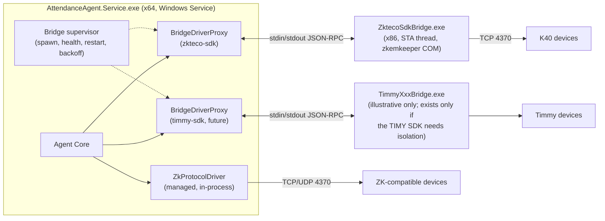

---

## 8. Device driver contract and normalized models

All names are PROPOSED and illustrative; final signatures are Phase 2 work.

### 8.1 Contract

```text
interface IAttendanceDeviceDriver
  DriverKey            e.g. "zkteco-sdk", "zk-protocol", "timmy-<family>"
  DriverVersion

  ProbeAsync(endpoint, credentials, ct)          -> ProbeResult (reachable?, identity, platform, firmware, serial)
  ConnectAsync(device, ct) / DisconnectAsync(ct)
  GetDeviceInfoAsync(ct)                         -> DeviceInfo
  GetCapabilitiesAsync(ct)                       -> DeviceCapabilities
  GetStorageInfoAsync(ct)                        -> DeviceStorageInfo (users, cards, fingers, records, capacities if known)
  GetDeviceTimeAsync(ct) / SetDeviceTimeAsync(utcNow, deviceTimeZone, ct)

  GetUsersAsync(ct)                              -> IReadOnlyList<DeviceUser>
  UpsertUserAsync(DesiredDeviceUser, ct)         -> UpsertResult (created/updated/unchanged, internalUid)
  DeleteUserAsync(machineUserId, ct)             -> DeleteResult (deleted/notPresent)
  SetCardAsync(machineUserId, card|null, ct)     (may be folded into UpsertUserAsync)

  GetAttendanceAsync(since?, ct)                 -> IAsyncEnumerable<DeviceAttendanceEvent>
  StartFingerprintEnrollmentAsync(machineUserId, fingerIndex, ct) -> EnrollmentSession (status polled)
  GetEnrollmentStatusAsync(sessionId, ct)
```

Rules:

- No vendor type, COM object, error code or byte buffer crosses this boundary. Vendor error codes are mapped to a normalized `DeviceErrorClass` (`Unreachable`, `AuthFailed`, `Timeout`, `Busy`, `NotSupported`, `CapacityFull`, `InvalidData`, `VendorError`) plus a `vendorDetail` string for diagnostics.
- Every operation not supported by a device returns `NotSupported` rather than throwing an unknown error; Agent Core consults capabilities **before** calling.
- Drivers must be safe to call repeatedly with the same desired state (idempotent upsert / delete).
- Drivers handle any device "disable while writing / re-enable after" protocol themselves and must re-enable in a `finally` path. A device left disabled is a user-visible outage at the gate.

### 8.2 Normalized capabilities

```text
DeviceCapabilities
  CanReadUsers, CanWriteUsers, CanDeleteUsers
  CanReadRfid, CanWriteRfid
  CanReadFingerprintTemplates, CanWriteFingerprintTemplates, CanStartFingerprintEnrollment
  CanEnrollFace (future, false for MVP)
  CanReadAttendance, CanLiveCapture
  CanReadDeviceTime, CanSetDeviceTime
  CanReadCapacity
  MaxMachineUserIdDigits (from PIN width when the device reports it)
  MaxNameLength, NameEncoding (e.g. "ascii", "utf8", "gb2312"…; REQUIRES K40 TEST)
  SupportsUnicodeNames
```

Capabilities are **reported by the driver after probe**, then intersected with the compatibility catalog's "verified" flags. The cloud stores the result per device and the UI adapts (e.g. hides "Enroll fingerprint" when false).

### 8.3 Normalized models

```text
DeviceInfo        { manufacturer, model, deviceName, serialNumber, firmwareVersion, platform, mac, pinWidth, driverKey }
DeviceUser        { machineUserId (string, exactly as on the device), internalUid?, name?, card?, privilege, hasFingerprint?, raw? }
DesiredDeviceUser { machineUserId, name (sanitized for device), card?, privilege = "user" }
DeviceAttendanceEvent
  { machineUserId, internalUid?, deviceLocalTime (authoritative), deviceTimeZone? (check only), eventTimeUtc? (check only), status?, punch?, verificationMode?, deviceRecordId?, rawMetadata? }
```

The `credentials` passed to `ProbeAsync`/`ConnectAsync` come only from the Agent's local DPAPI-protected store ([§18.2](#182-two-unrelated-secret-classes)); they never come from a cloud command or the cloud config.

`deviceLocalTime` (the wall-clock time stored on the device) is the authoritative input. **The server is authoritative for UTC conversion:** the ingest RPC computes `tapped_at` from `device_local_time` and `attendance_machines.time_zone`. The Agent may also send `deviceTimeZone` (IANA name, e.g. `Asia/Dhaka`) and an `eventTimeUtc` it computed itself, but these are validation/diagnostic fields only, never stored as the authoritative time. An event whose `deviceTimeZone` or `eventTimeUtc` disagrees with the server's own conversion is rejected (`TIME_MISMATCH`), which usually means a stale Agent config. The cloud adds its own received time on insert. `machineUserId` is carried as the exact string the device returned (no padding or trimming) so that legacy, non-`unique_id` device IDs can still be matched against aliases.

---

## 9. ZKTeco K40 — first ZKTeco driver analysis

Since Baseline v1.1 the K40 is the **next ZKTeco** target (Phase 1B), not the first active device. Everything in this section stays valid and applies when the K40 bench unit is available.

### 9.1 What is known

- Communication: school LAN, TCP/IP, port **4370** by default (pyzk default port 4370 — VERIFIED BY VENDOR/SDK; the K40's configured port and TCP vs UDP REQUIRES K40 TEST).
- pyzk's README lists **"K40/ID — Firmware Ver 6.60 May 25 2018 — Platform JZ4725_TFT"** among tested devices (VERIFIED BY VENDOR/SDK). Other K40 hardware/firmware revisions are not covered by that statement.
- K40 is commonly sold in fingerprint + RFID ("/ID") variants; which variant each School owns matters for `CanReadRfid/CanWriteRfid` (REQUIRES K40 TEST).

### 9.2 K40 Path A — ZKTeco Standalone SDK (`zkemkeeper` / `CZKEM`)

**Label: PRIMARY PRODUCTION DRIVER CANDIDATE — not a guaranteed final choice.**

- Form: Windows COM component (`zkemkeeper.dll` plus companion native DLLs). Common documented deployment: copy SDK DLLs to `System32` (32-bit Windows) or `SysWOW64` (64-bit Windows) and register with the matching `regsvr32` as administrator (VERIFIED BY VENDOR/SDK community documentation; must be re-checked against the SDK version actually downloaded from ZKTeco).
- Capability areas to verify against the SDK manual that ships with the downloaded SDK — **no method signatures are asserted here**: connect by network; read all users; set user info (name, privilege, password, enabled); set card number for a user; read general attendance log; enable/disable device; start online fingerprint enrollment; read device info (serial, firmware, platform, MAC); get/set device time; delete a user; read status/capacity counters; real-time event registration. Commonly cited method families in community material include `Connect_Net`, `SSR_GetAllUserInfo`, `SSR_SetUserInfo`, `SetStrCardNumber`, `ReadGeneralLogData`/`SSR_GetGeneralLogData`, `EnableDevice`, `StartEnrollEx`, `GetSerialNumber`, `GetDeviceTime`/`SetDeviceTime`, `SSR_DeleteEnrollData`, `GetDeviceStatus`, `RegEvent`. **REQUIRES K40 TEST and SDK-manual confirmation for every one of them, including which "SSR_" vs non-SSR variant the K40 firmware accepts.**
- Operational risks: COM registration (admin rights, installer must register/unregister cleanly); 32-bit vs 64-bit SDK builds; native dependency DLL set; SDK-version differences in behavior; firmware differences; STA threading; COM hangs on network loss; antivirus flags on unsigned vendor DLLs; redistribution license (REQUIRES OWNER DECISION OD-3).
- Mitigation: isolate in `ZktecoSdkBridge.exe` (x86 if needed); evaluate **registration-free COM** (side-by-side manifest next to the bridge EXE) to avoid machine-wide `regsvr32` — REQUIRES K40 TEST.

### 9.3 K40 Path B — native ZK protocol / pyzk reference

pyzk (`fananimi/pyzk`) implements the classic ZK protocol directly over TCP/UDP. Its documented API (VERIFIED BY VENDOR/SDK, README):

- `ZK(ip, port=4370, timeout=5, password=0, force_udp=False, ommit_ping=False)`, `connect()`, `disconnect()`
- `disable_device()`, `enable_device()`
- `get_users()`, `set_user(uid, name, privilege, password, group_id, user_id, card)`, `delete_user(uid | user_id)`
- `get_attendance()`, `clear_attendance()`, `live_capture()`
- `get_time()`, `set_time()`, `read_sizes()`
- `get_firmware_version()`, `get_serialnumber()`, `get_platform()`, `get_device_name()`, `get_mac()`, `get_pin_width()`
- `get_templates()`, `get_user_template(uid, temp_id)`, `save_user_template(user, fingers)`, `enroll_user(...)` — README notes enroll "doesn't work with some tcp ZK8 devices"
- maintenance: `restart()`, `poweroff()`, `clear_data()` (README: erases all users, attendance and fingerprints), `free_data()`

Evaluation of pyzk's possible roles:

| Role | Verdict |
|---|---|
| 1. POC / testing tool | **Yes.** Fastest way to probe a K40, dump users/attendance, and cross-check the SDK driver's results. Run from a developer laptop only. |
| 2. Protocol reference for a C# driver | **Yes, with care.** Use public behavior (packet flows observed on the wire, command semantics, pyzk's documented behavior) and ZKTeco's own protocol documentation if obtainable. Do **not** translate pyzk source line-by-line into the proprietary Agent: pyzk is GPL-2.0, and a close port may be a derivative work (REQUIRES OWNER DECISION OD-4, legal review). pyzk can serve as a **test oracle**: same device, same operation, compare normalized outputs. |
| 3. Optional Python driver bridge | **Only if** Phase 1/13 proves a device that neither the SDK nor the managed protocol driver can handle and pyzk can. Then: PyInstaller-built `PyzkBridge.exe` speaking the same stdin/stdout JSON-RPC, as a separate program; installer size grows (tens of MB); AV false positives on PyInstaller binaries are common; GPL distribution obligations apply (source offer etc.) — legal review first. |
| 4. Fallback driver for compatible devices | Achieved through the **managed C# protocol driver** (role 2), not by shipping pyzk. |

### 9.4 K40 / ZK identity model

These identifiers must never be conflated:

| Identifier | Scope | Who assigns | Our mapping |
|---|---|---|---|
| **UID** (internal slot index; small integer, per device) | One device | Device / driver | `attendance_machine_enrollments.machine_internal_uid` (informational; never used as a cross-device key) |
| **user_id / PIN** (string of digits, width limited by device "PIN width") | One device, but we make it equal everywhere | We do | `machine_enroll_infos.unique_id` = `students.unique_id` / `employees.unique_id`; recorded per device as `attendance_machine_enrollments.machine_user_id` |
| **LMS person identity** (uuid) | Platform | LMS | `machine_enroll_infos.student_id` / `employee_id` |
| **Card number** | School | Physical card | `machine_enroll_infos.rfid_card_number` |
| **Per-device link (enrollment episode)** | One (device, user_id, person) assignment over one time window; a pair may have many historical episodes, never overlapping | Cloud, when the Agent confirms the user on the device (or an admin links an imported user) | `attendance_machine_enrollments (machine_id, machine_user_id, linked_at, unlinked_at)` — one row per episode |
| **Legacy device user ID** | One device, bounded dates | Admin, during existing-machine import | `attendance_machine_user_aliases` ([§17.2](#172-existing-machine-import)) |

Agent-originated attendance logs resolve through the **device that produced them plus the user_id/PIN** that device returned — `(machine_id, machine_user_id)` → the `attendance_machine_enrollments` episode whose link window contains the event time (at most one can, because windows never overlap) → `machine_enroll_infos` → person (the row also keeps its own person reference, so history still resolves after a `machine_enroll_infos` row is removed). Never through the UID slot (slots change on factory reset or re-enrollment), never by a bare `(school_id, unique_id)` lookup that skips the per-device mapping (a device user that we did not provision — e.g. one created manually at the keypad with a number that happens to equal someone's Machine ID — must not be attributed to that person), and not by card (fingerprint punches have none; card resolution is kept only for the legacy ingest-token path). A punch that matches no link window and no alias stays unprocessed and is reported as "unknown device user" for reconciliation.

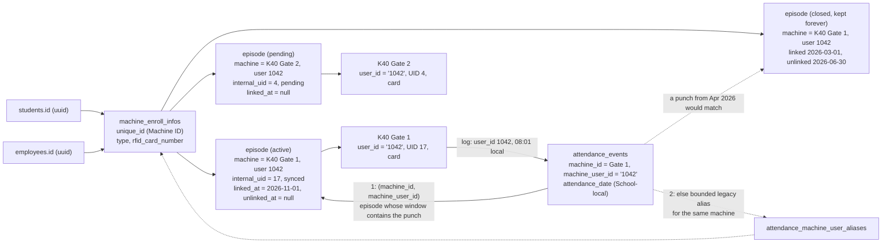

---

## 10. Timmy / TIMY support strategy

What is known (VERIFIED BY VENDOR/SDK, vendor web pages — thin evidence):

- Timmy (Shenzhen Timmy / "TIMY", sites `timyteco.net`, `sztimmy.net`) sells fingerprint, card, palm and face terminals; product pages for e.g. TM-F662 state "standard TCP/IP and USB" communication.
- Its download pages list desktop "Attendance Access System" software (versions 6.58–6.98, one marked "Support all models"), a "Software Development Kit (SDK)" category, and a cloud platform ("globalyunatt", `global.yunatt.com/timy`).
- No public, authoritative statement was found that Timmy devices do or do not speak the ZKTeco protocol. **This document states neither "all Timmy devices use ZK protocol" nor "no Timmy device uses it".**

Strategy:

1. Reserve three driver families, built only when a real model demands them:
   - `timmy-zk-compatible` — reuse of the managed ZK protocol driver (or ZKTeco SDK bridge) for Timmy models that probe as ZK-compatible. Same code, separate catalog entry and separately verified capabilities.
   - `timmy-sdk-<family>` — official Timmy SDK/API behind an adapter whose placement follows the isolation rule: a bridge process if the SDK is native/COM/bitness-constrained/crash-prone, in-process if it is safe managed code, a managed HTTP adapter if it is an HTTP API.
   - `timmy-http` / `timmy-cloud` — for devices that only push to an HTTP/cloud endpoint. Note this may be an **ADMS-like push** model; it would land through the ADR 0001 path 1 style ingest or an Agent-hosted LAN listener — designed only when a model requires it.
2. Selection is **never by logo**: onboarding captures manufacturer, model, firmware, serial, reported platform, protocol, port, and the driver that succeeded.
3. No cloud, database or UI code names a Timmy SDK. `attendance_machines.machine_type = 'timmy'` stays a manufacturer label only.

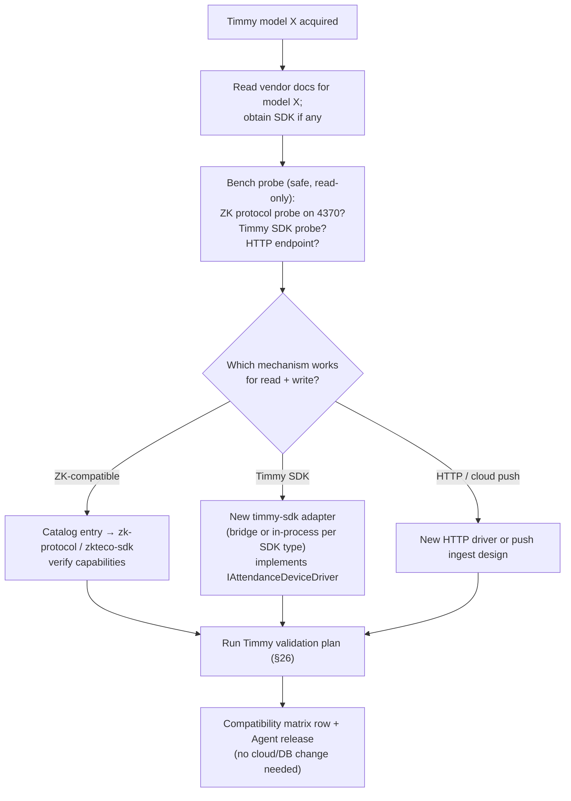

### 10.1 TM52GPRS bench evidence

**Scope:** this evidence applies only to the one physical TIMY TM52GPRS bench unit, in its current configuration, as tested on 2026-10-05. It is not a statement about other TM52 units, other firmware or other Timmy models. Source: the separate Timmy POC report in the POC workspace (`k40-poc/docs/machine_attendance_timmy_poc_report.md`, outside this repository).

| Item | Measured on this unit |
|---|---|
| Manufacturer / brand | TIMY / Timmy |
| Model | TM52GPRS |
| Reachability | reachable on the bench LAN |
| Configured TCP communication port | **5005** (TCP 5005 accepts connections) |
| TCP 4370 | accepted a socket connection during the earlier probe, but classic ZK communication did not succeed |
| pyzk / classic ZK, TCP | **failed.** The unit replied to pyzk's connect request with `5a a5 01 00 00 00 00 01`, which pyzk rejected as an invalid classic-ZK TCP packet |
| pyzk / classic ZK, UDP | **failed** (timed out) |
| ZKTeco Standalone SDK `Connect_Net` | **failed** in both tested bitnesses (x86 and x64) |
| TIMY SDK / API | **NOT TESTED** |
| Writes / destructive operations | none attempted |
| Firmware, serial, other identity fields | pending — to be collected from the device and the TIMY SDK |

Measured statement: **the tested TM52GPRS unit, in its current configuration, did not successfully communicate through pyzk/classic-ZK or the ZKTeco Standalone SDK.** This document does not claim that the TM52 model, or Timmy devices in general, cannot use the ZK protocol, nor that every Timmy device uses port 5005.

Current classification for this unit:

| Path | State |
|---|---|
| `timmy-zk-compatible` (classic ZK / pyzk reference) | failed on the tested configuration |
| ZKTeco Standalone SDK bridge | failed on the tested configuration |
| `timmy-sdk-<family>` (official TIMY SDK/API) | **NOT TESTED** — leading candidate, pending SDK confirmation |
| `timmy-http` / `timmy-cloud` | not evaluated |
| Production driver | **UNDECIDED** |

The three-family strategy above stays unchanged. The TM52GPRS currently points **provisionally** toward `timmy-sdk-<family>`. The family name, bridge executable name, DLL names and API names stay PROPOSED/unknown until the official SDK package is in hand; none are assumed here.

---

## 11. Driver selection, compatibility catalog and fallback

### 11.1 Where the catalog lives

**Recommendation: in the Agent release (versioned JSON embedded in the Agent), mirrored as the human-readable matrix in this repository (`docs/`), not in the database for MVP.**

- The Agent is the only component that selects drivers, and a driver change always ships with an Agent release, so catalog and driver code version together.
- The cloud only needs the *outcome* per device (driver used, verified capabilities), which the Agent reports and the cloud stores on the device row.
- A database table (`device_driver_compatibility`) becomes worthwhile only if Super Admin needs to override driver choice without an Agent release. Deferred (REQUIRES OWNER DECISION OD-9).

Catalog entry (PROPOSED):

```text
{ manufacturer, model, platformPattern?, firmwarePattern?,
  preferredDriver, fallbackDrivers[], verifiedCapabilities{}, testedFirmware[], knownIssues[], verifiedOn (date) }
```

### 11.2 Selection algorithm

1. Admin adds the device in the cloud UI: manufacturer, model, serial, IP, port, time zone, Agent, driver = **Auto (recommended)** or an explicit driver. If the device has a communication key, it is entered **on the Agent PC** with the local Agent configuration tool (never in the browser); the Agent reports back only `credential_configured = true/false`.
2. Agent receives a `PROBE_DEVICE` command.
3. If Auto: look up the catalog by manufacturer + model. Try **only** the preferred driver, then the catalog's listed fallbacks, in order. **Never** sweep every protocol at a device not in the catalog; unknown models require an explicit driver choice by the admin.
4. Probe is **read-only**: connect, read identity (serial/firmware/platform/PIN width), read counts, disconnect. No disable-device, no writes.
5. Probe result verifies the typed serial number matches the device's serial (prevents provisioning the wrong box after an IP change). Mismatch ⇒ status `serial_mismatch`, no writes allowed until resolved. A device row's serial is **immutable once a probe has verified it**: a different physical device is always a new `attendance_machines` row ([§17.3](#173-k40-replacement)), never an edit of the old one. A device that needs a key the Agent does not have ⇒ status `credential_required`.
6. The successful driver is **pinned** on the device (`driver_key`). From then on every operation uses the pinned driver.

### 11.3 Fallback rules

| Operation class | Fallback allowed? |
|---|---|
| Probe, read device info, read time | Yes — catalog-listed fallbacks in order |
| Read attendance, read users | Yes, but only to drivers marked verified for that model's attendance/user read; results are tagged with the driver used |
| Write user / card, delete user, set time, fingerprint enrollment | **No silent fallback.** Only the pinned driver. Changing the pinned driver is an explicit admin action that triggers a fresh probe + read-only reconciliation before any write. |

### 11.4 Device registration / probe flow

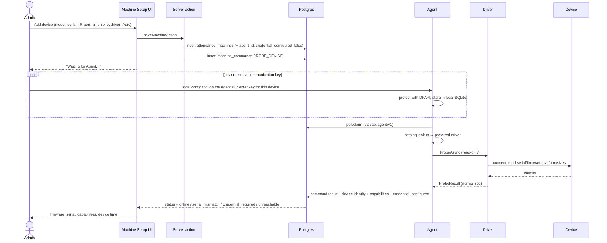

---

## 12. Agent Core design

### 12.1 Technology (PROPOSED)

- C#, current .NET LTS, `Microsoft.Extensions.Hosting` Worker Service with `BackgroundService` loops, installed as a Windows Service (`UseWindowsService`), automatic (delayed) start, recovery actions "restart service".
- Dependency injection, `ILogger` structured logging (file sink with rotation + Windows Event Log for errors), `IOptions` configuration, `HttpClient` via `IHttpClientFactory` with retry/backoff, `Microsoft.Data.Sqlite` (WAL mode).
- Self-contained publish (no machine-wide .NET install required), x64.
- **One generic installer** (`AttendanceAgentSetup.exe` / MSI) for every institute. No per-School build; no embedded School credential. School association happens only at activation.
- A small **local Agent configuration tool** (installed with the service, runs elevated on the Agent PC) is the only place an operator enters the activation code and device communication keys. It hands them to the running service over a local channel restricted to local Administrators ([§18.3](#183-windows-protection)); the service protects them with DPAPI. This tool never talks to devices or the cloud itself.

### 12.2 Responsibilities split

| Agent Core owns | Drivers own |
|---|---|
| activation, cloud credential, HTTPS | sockets / COM / SDK sessions |
| command polling, claiming, result reporting | vendor command mapping |
| device registry (from cloud config) | vendor error mapping |
| scheduling, per-device work queue | device enable/disable around writes |
| SQLite, retries, dedup, upload queue | name/card encoding for the device |
| heartbeat, health, logging, versioning | parsing raw attendance records |
| driver lifecycle (spawn, restart, backoff) | — |

### 12.3 Multiple devices per Agent

One Agent PC serves every device on its LAN: e.g. K40 Main Gate, K40 Gate 2, Timmy Office. Each device has `device_id` (= `attendance_machines.id`), pinned driver, endpoint, configuration, capabilities, sync state and health. **One Windows Service per Agent installation (one Windows PC), never one per device.** One Agent normally manages multiple devices on its reachable LAN, and one School may have multiple Agent installations for separate campuses/LANs. Each device is assigned to exactly one Agent (`attendance_machines.agent_id`). Devices with `enabled = false` or `archived_at` set are excluded from the Agent's config: no pulls, no commands. A disabled device keeps its local DPAPI-protected key (it is expected back); an archived device's key is wiped locally. Local event history is kept under the normal retention rule in both cases.

### 12.4 Device-level concurrency

- One **serial work queue per physical device**. Attendance download, user upsert, fingerprint enrollment, reconciliation reads and time sync for the same physical device never overlap.
- Different devices run concurrently (bounded parallelism, e.g. 4).
- Priority inside a device queue: interactive commands (probe, test connection, fingerprint enrollment) > provisioning > scheduled attendance pull > reconciliation reads.
- Long operations (full user read on a full device) yield between chunks where the driver allows, so an interactive command is not starved for minutes.

### 12.5 Local SQLite (requirements only)

| Concept | Purpose |
|---|---|
| `settings` | Agent id, cloud base URL, protected credential reference, config version |
| `devices` | Cached cloud device config (no secrets) + pinned driver + **DPAPI-protected communication key** entered locally (the only copy anywhere; never uploaded) |
| `attendance_events` | Every event read from devices, keyed by `event_key` (unique); `uploaded_at` null until cloud acknowledges |
| `upload_queue` | Batches in flight (batch id, event keys, attempts) |
| `commands` | Claimed commands persisted **before** execution (id, type, payload, state) |
| `command_results` | Results awaiting acknowledgment by the cloud |
| `sync_state` | Per device: last successful pull time, last seen record count/watermark, last error |
| `driver_health` | Per device/driver: consecutive failures, last restart, degraded flag |

Durability: WAL; event insert committed before the next device read; uploaded events retained for a configurable period (e.g. 30–90 days) to allow re-upload after cloud data loss, then pruned.

### 12.6 Agent updates

- MVP: admin downloads and runs the newer installer (in-place upgrade preserving `%ProgramData%` state).
- Later (Phase 15): an update check against a cloud manifest (version, URL, SHA-256, minimum compatible schema), Authenticode-signed packages, signature + hash verified before install, staged rollout per School, automatic rollback if the new service fails health within N minutes. Updates never run mid-command: the Agent drains device queues first.

### 12.7 Command polling

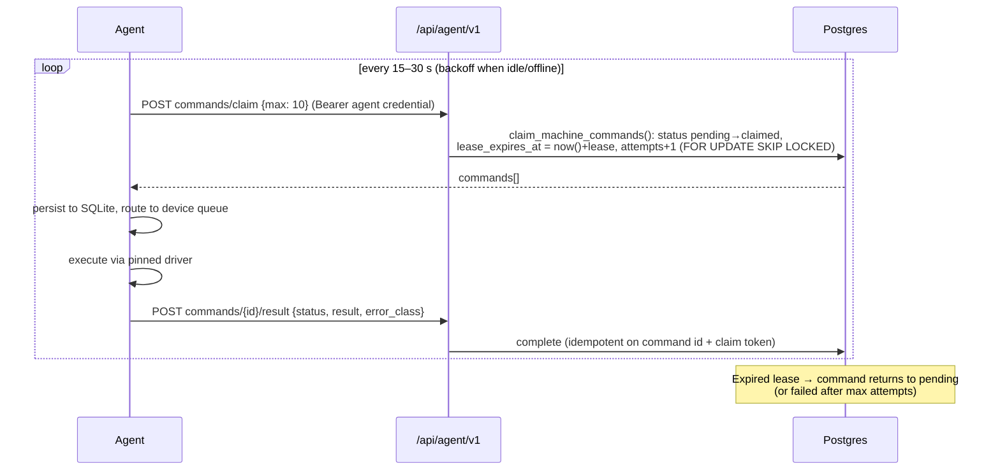

---

## 13. Identity model and Machine User ID strategy

### Options

| Option | Description | Pros | Cons |
|---|---|---|---|
| **A** | `machine_user_id = existing unique_id` | **Already implemented** (0211); numeric; immutable; students + employees cannot collide (shared sequence); same on every device; survives device replacement; already shown in the UI as "Machine ID" | Platform-global sequence grows with every School's admissions, so values get larger over time; 8-digit ceiling (`1..99999999`) |
| B | Separate per-School `machine_user_id` | Smaller numbers per School | New column, new uniqueness rules, renumbering of the IDs 0211 just established, and per-School collisions between students and employees would have to be re-guarded. (Resolution itself would still work, because Agent events always carry `machine_id` and resolve through the per-device mapping.) |
| C | Institute-wide numeric attendance ID | Smallest numbers | Same as B, plus migration of all existing enrollments |

### Recommendation

**Option A — keep `unique_id` as the machine user ID.** It is exactly what the repository already decided and enforces.

Constraints to verify:

- **PIN width.** ZK devices advertise a PIN width (pyzk exposes `get_pin_width()`); older firmware may allow fewer digits than 8. The Agent must read PIN width at probe and the cloud must refuse to provision a person whose `unique_id` has more digits than the device allows (error `MACHINE_ID_TOO_WIDE`, never truncation). **REQUIRES K40 TEST** (expected: K40 TFT firmware accepts at least 8–9 digits; not assumed).
- **Timmy constraints** unknown — REQUIRES TIMMY MODEL TEST.
- **Leading zeros:** send the plain decimal string, no padding.
- **Device replacement / multiple devices:** same ID everywhere; the new device gets its own `attendance_machine_enrollments` rows with the same `machine_user_id`.
- **Uniqueness is necessary but not sufficient for resolution.** Even though `unique_id` is globally unique, an Agent event is attributed to a person only through that device's enrollment row (link window), so a keypad-created device user that happens to reuse a number is never silently attributed.
- **Existing device users** created before the Agent (legacy desktop app IDs) will not match — handled by [existing-machine import](#172-existing-machine-import) and `attendance_machine_user_aliases`, never by renumbering LMS people.

`attendance_machine_enrollments.machine_user_id` stores the ID **as held on that device** (normally `unique_id` as a decimal string). If the owner ever needs narrower IDs for a device family whose PIN width is too small, that column can carry a device-specific value for that device only, and resolution keeps working unchanged because it already goes through the per-device row — not a platform-wide change (REQUIRES OWNER DECISION OD-8, only if testing shows it is needed). This forward-looking override is distinct from legacy aliases, which only map **historic** punches of IDs the LMS never provisioned.

---

## 14. Enrollment and provisioning (students and employees)

### 14.1 Principle

One device-neutral provisioning engine; students and employees differ only in entity type, source roster and eligibility rules. The cloud never sends `zkemkeeper` or Timmy fields.

Desired state per (person, device):

```text
PROVISION_PERSON payload (device-neutral)
  { machineId (device), machineUserId: "1042", entityType: "student"|"employee",
    displayName: "…", card: "0004581234" | null, privilege: "user",
    enrollmentRowId, desiredVersion }
REMOVE_PERSON payload
  { machineId, machineUserId, enrollmentRowId }
```

The driver maps it to CZKEM calls, ZK protocol packets or a Timmy API.

### 14.2 Student RFID enrollment flow

Target: Attendance → Machine Attendance → Student RFID Enrollment → Enroll Students (EXISTING screen `web/app/school/attendance/machine/students/page.tsx`; the button `EnrollButton` in `machine-ui.tsx` is EXISTING and currently shows "Upcoming").

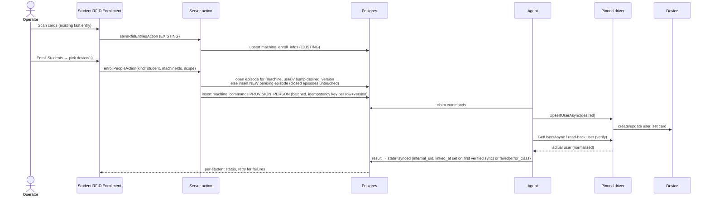

Episode rules for every enrollment flow (students and employees):

- A card or name change for someone already on the device updates the **same open episode** (`desired_version` + 1); the device user ID → person link has not changed.
- A person removed from a device (removal confirmed by the Agent) has their episode closed: `unlinked_at` = confirmation time, `sync_state = 'removed'`. Until the Agent confirms removal the episode stays active, because the person can still punch on that device.
- Enrolling the same person on the same device again later creates a **new** episode (`linked_at` set on its first verified sync). The closed episode is never reopened, so a punch from the gap between the two windows does not resolve.
- A pending episode that is cancelled before it was ever linked is closed with `sync_state = 'cancelled'`, `unlinked_at` = cancellation time and `linked_at` left null. It never matches any punch.

Students are never created here; eligibility = an existing, non-archived student with a `machine_enroll_infos` row (plus card, unless OD-6 allows fingerprint-only students).

### 14.3 Employee enrollment flow

Same engine. Source = `employee_card` roster (EXISTING view), eligibility = non-archived employee with a `machine_enroll_infos` row (card optional — EXISTING behavior keeps employees enrolled without a card).

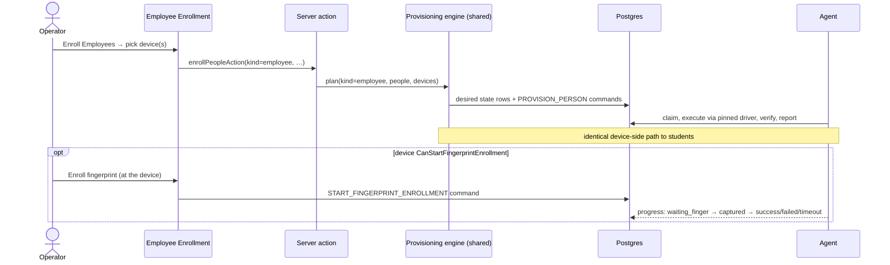

### 14.4 Fingerprint enrollment

- Capability-gated (`CanStartFingerprintEnrollment`); the person must already exist on the device.
- Capture happens physically at the device sensor; the UI shows status from command progress.
- Templates are **not** read, uploaded or stored in the cloud in MVP. Copying templates between devices (`CanReadFingerprintTemplates` + `CanWriteFingerprintTemplates`) is a later, separately approved feature with its own privacy review (biometric data).
- K40: test both the SDK path and pyzk's `enroll_user` as reference. README warns pyzk enroll fails on some TCP ZK8 devices. REQUIRES K40 TEST.

### 14.5 Face devices

Not an MVP requirement (no face requirement exists in the repository). `CanEnrollFace` is reserved in capabilities; template formats are never normalized across vendors.

---

## 15. Attendance pipeline, raw events and idempotency

### 15.1 Pipeline

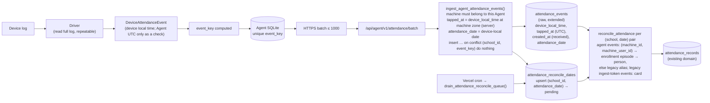

### 15.2 Is `attendance_events` suitable as the raw machine store?

**Yes, with extension (REQUIRES MIGRATION).** It already is the raw, pre-domain staging table ("Attendance Event" in `CONTEXT.md`), and `reconcile_attendance` already separates raw punches from final attendance (earliest = entry, latest = exit). Creating a parallel `machine_attendance_events` table would duplicate that stage and force a second reconciliation path. Proposed new columns:

| Column | Type | Purpose |
|---|---|---|
| `card_number` | make **nullable** | Fingerprint punches have no card; still required for `source = 'ingest_token'` |
| `machine_user_id` | `text null` | Device user ID / PIN **exactly as the device returned it** (normally `unique_id` as a decimal string; legacy IDs may differ or have leading zeros) |
| `machine_id` | `uuid null` FK `attendance_machines(id) on delete restrict` | Physical device that produced the punch; required for `source = 'agent'`. `restrict` because used devices are archived, never deleted ([§17.4](#174-physical-device-lifecycle)) |
| `device_serial` | `text null` | Physical device serial snapshot at ingest (diagnostics only — **not** an event-key input) |
| `agent_id` | `uuid null` FK `attendance_agents(id) on delete restrict` | Source installation (Agents are revoked, never deleted) |
| `source` | `text not null default 'ingest_token'` check in (`ingest_token`,`agent`) | Path |
| `event_key` | `text null` | Idempotency key |
| `device_local_time` | `timestamp without time zone null` | Wall-clock time as stored on the device — the **authoritative** time input for Agent events (required when `source = 'agent'`) |
| `device_time_zone` | `text null` | The machine's configured zone (`attendance_machines.time_zone`) that the server used for conversion, snapshotted per event |
| `tapped_at` | EXISTING `timestamptz not null` | Normalized UTC event time. For Agent events **computed server-side** by the ingest RPC as `device_local_time at time zone attendance_machines.time_zone`; never taken from the Agent |
| `created_at` | EXISTING `timestamptz default now()` | **Cloud received time** — kept as is and documented as such |
| `attendance_date` | `date not null` (after backfill) | School-local attendance day ([§15.2.1](#1521-school-local-attendance-day)) |
| `verify_mode`, `punch_state` | `smallint null` | Diagnostics only |
| `raw` | `jsonb null` | Optional vendor fields for diagnostics (size-limited, no biometrics) |

Constraints: `check (source <> 'agent' or (machine_id is not null and machine_user_id is not null and event_key is not null and device_local_time is not null and device_time_zone is not null))`; `check (source <> 'ingest_token' or card_number is not null)`. Unique index `(school_id, event_key) where event_key is not null`. Index `(school_id, attendance_date) where not processed` (replaces the UTC-range index for reconciliation).

`reconcile_attendance` change — resolution order (the `resolved` CTE):

1. **Agent events** (`source = 'agent'`): join `attendance_machine_enrollments ame on ame.machine_id = e.machine_id and ame.machine_user_id = e.machine_user_id and ame.linked_at is not null and e.tapped_at >= ame.linked_at and (ame.unlinked_at is null or e.tapped_at < ame.unlinked_at)` — the one episode whose window contains the punch (the no-overlap constraint guarantees at most one; closed historical episodes keep resolving their own period) — then `machine_enroll_infos` (via `ame.enroll_info_id` / person columns) → person.
2. Otherwise, for Agent events only: `attendance_machine_user_aliases` on the **same `machine_id`** and `machine_user_id = legacy_machine_user_id`, `tapped_at` within `[valid_from, valid_until)` → person.
3. **Legacy ingest-token events** (`source = 'ingest_token'`): EXISTING card join on `machine_enroll_infos.rfid_card_number`, unchanged.

There is deliberately **no** direct `(school_id, unique_id)` join: it would bypass the per-device mapping. Unresolved events stay `processed = false` (EXISTING 0018 behavior) and appear as "unknown device users" in reconciliation. Final attendance business rules (entry/exit/statuses, grace, `automatic_attendance_enabled`) are otherwise **unchanged** — the Agent never writes `attendance_records`.

#### 15.2.1 School-local attendance day

Required for the machine-attendance implementation (not deferred):

- **Time zone source.** Each `attendance_machines` row has `time_zone` (IANA, default = the School's time zone). The School's time zone becomes a column `schools.time_zone text not null default 'Asia/Dhaka'` (REQUIRES MIGRATION), replacing reliance on the `SCHOOL_TIME_ZONE` constant in `web/lib/school-time.ts` for attendance (the constant remains the default value and the TS fallback).
- **Three times are kept per event:** `device_local_time` (+ the `device_time_zone` used), normalized UTC `tapped_at`, and cloud received time `created_at`.
- **Server-authoritative UTC conversion (Agent events).** The ingest RPC reads the machine's configured `attendance_machines.time_zone` and computes `tapped_at = device_local_time at time zone <machine zone>`. It stores that zone in `device_time_zone`. Any Agent-supplied `deviceTimeZone`/`eventTimeUtc` is checked against this result, and a mismatch rejects the event (`TIME_MISMATCH`, usually a stale Agent config: the Agent refreshes config and retries). Agent-supplied UTC is never stored as the authoritative value. For zones with daylight saving, an ambiguous or non-existent local time is rejected rather than guessed; `Asia/Dhaka` has none.
- **`attendance_date`** is computed by the ingest RPC: for Agent events, `device_local_time::date` (the device's own calendar day in its configured zone, consistent with the server-computed `tapped_at`); for legacy ingest-token events, `(tapped_at at time zone schools.time_zone)::date`. Existing rows are backfilled the same way.
- **Reconciliation** selects `where school_id = <pair school> and attendance_date = <pair date>` instead of the UTC range `tapped_at >= target_date::timestamptz …`. Which pairs to reconcile comes from the queue below, not from a global "today" date.
- **Reconciliation queue — `attendance_reconcile_dates (school_id, attendance_date)` is the scheduling source of truth.**
  - *Enqueue:* every ingest RPC, Agent and legacy ingest-token alike, idempotently upserts one row for every distinct `(school_id, attendance_date)` in the batch: `insert … on conflict (school_id, attendance_date) do update set status = 'pending', requested_at = now()`. Late uploads, days-old offline backlogs and re-sent batches are covered the same way, even when every event in the batch was a duplicate. Creating or changing a legacy alias, and re-enabling `automatic_attendance_enabled`, enqueue the affected pairs too.
  - *Current date:* there is no separate "seed today" step. A School's current-date pair is enqueued by its first punch of the day, and every later punch that day re-marks it `pending`. A School with no punches on a day has nothing to reconcile, the same as today, where an empty day produces no `attendance_records`.
  - *Drain:* the cron (EXISTING schedule `30 12 * * *` UTC = 18:30 Asia/Dhaka; it can run more often, because draining is idempotent) calls a definer RPC `drain_attendance_reconcile_queue(job_secret, max_pairs)`. It claims pending pairs with `for update skip locked` and records `claimed_at`, then reconciles each pair with the per-pair form of `reconcile_attendance`. A pair is marked `done` only if no newer `requested_at` arrived after its `claimed_at`, so a punch landing mid-run leaves it `pending` for the next drain. Pairs for Schools with `automatic_attendance_enabled = false` are marked `skipped`.
  - *Manual backfill:* `?date=YYYY-MM-DD` (optionally `&school=`) on the reconcile route enqueues those pairs; it no longer runs a global date directly.
  - Existing merge semantics (`least`/`greatest` with the existing `attendance_records` row) make re-reconciling a pair safe.
- Employee status windows (`web/lib/attendance.ts` `employeeStatus`, which interprets `HH:MM` as UTC) are currently inert because Office Time was retired (ADR 0030); any future expected-window feature must use the same School-local time zone. Noted, not changed by this plan.

### 15.3 Idempotency

Priority:

1. Vendor-stable record id if the driver can provide one that survives re-reads and device restarts (unknown for K40 — REQUIRES K40 TEST).
2. Otherwise deterministic fingerprint over the **immutable cloud `machine_id`**: `sha256(machine_id | machine_user_id | device_local_time (second precision) | punch_state | verify_mode)`. The Agent computes it from the `machine_id` in its cloud config; the ingest RPC recomputes and rejects a mismatching key.

Notes:

- **Why `machine_id` and not the serial:** under the archive-not-delete lifecycle ([§17.4](#174-physical-device-lifecycle)) one `attendance_machines` row represents one physical device for its whole life. Its `id` never changes: not on IP/port edits, Agent re-activation or reassignment, disable/enable, or archive/restore. A used row can never be hard-deleted and re-created, and the per-School serial uniqueness (including archived rows) stops a second row for the same hardware. Re-downloading the same log therefore always yields the same keys. **Replacement hardware gets a new row and a new `machine_id`**, so old and new devices' keys never collide. The `machine_id` value comes from the cloud and does not depend on whatever the firmware reports as a serial, which can be blank, reformatted or changed on mainboard repair.
- `device_serial` stays on each event only as a diagnostic snapshot of what the device reported at ingest time.
- Collision risk: two genuine punches by the same person, on the same device, in the same second, with the same state collapse to one. Acceptable — reconciliation collapses them anyway.
- False non-collision risk: if a firmware re-reads time with different precision or the device clock is changed **after** recording — the stored record time does not change, so keys are stable. A device **factory reset** re-numbers internal UIDs but those are not in the key.
- Enforced in **both** SQLite (unique `event_key`) and Postgres (unique index). Database-level idempotency is mandatory; the SQLite check only saves bandwidth.
- Batch upload response returns `{accepted, duplicates}` so the Agent can mark all keys in a batch uploaded even when some were already present.

### 15.4 Do not clear device logs

Normal sync is **read full log (or since watermark if the driver supports it) + dedup + local persistence + cloud idempotency**. No driver performs "download then clear" as normal sync. Log cleanup (capacity management) is a separate, explicit, admin-initiated maintenance command (`CLEAR_DEVICE_LOGS`) that the Agent only executes if every event on the device older than the cut-off has been acknowledged by the cloud. Not part of MVP.

### 15.5 Offline operation

```mermaid
sequenceDiagram
  participant Dev as Device
  participant Agent
  participant SQL as SQLite
  participant Cloud
  Note over Agent,Cloud: Internet down
  loop every N minutes
    Agent->>Dev: read attendance (LAN)
    Dev-->>Agent: events
    Agent->>SQL: insert (unique event_key)
    Agent-xCloud: upload fails → backoff (cap e.g. 15 min)
  end
  Note over Agent,Cloud: Internet restored
  Agent->>Cloud: heartbeat succeeds
  loop until queue empty
    Agent->>SQL: oldest un-uploaded batch
    Agent->>Cloud: POST batch
    Cloud-->>Agent: accepted / duplicates
    Agent->>SQL: mark uploaded
  end
  Cloud->>Cloud: tapped_at from device_local_time + machine zone (server);<br/>attendance_date per event; upsert every (school, date) pair<br/>into attendance_reconcile_dates as pending
  Note over Cloud: Next cron drain reconciles every pending pair,<br/>including past dates (merge-safe)
```

**Existing behavior being replaced:** today `reconcile_attendance` runs once a day for one global **UTC** date (`web/app/api/attendance/reconcile/route.ts`), so events uploaded after that date's run remain `processed = false` until someone re-runs with `?date=`. The required change in [§15.2.1](#1521-school-local-attendance-day) (School-local `attendance_date` + the `attendance_reconcile_dates` queue) is part of Phase 3/8, not optional.

---

## 16. Command processing

- Outbound HTTPS only; no inbound port, no router forwarding.
- Command types (PROPOSED): `PROBE_DEVICE`, `TEST_CONNECTION`, `READ_DEVICE_INFO`, `SYNC_TIME`, `PROVISION_PERSON`, `REMOVE_PERSON`, `READ_USERS` (for reconciliation/import), `PULL_ATTENDANCE_NOW`, `START_FINGERPRINT_ENROLLMENT`, `REFRESH_CONFIG`.
- Lifecycle: `pending → claimed → running → succeeded | failed | cancelled | expired`. Lease-based claim; expired leases return to `pending` up to `max_attempts`.
- **Idempotency:** each command has a cloud `id` and an `idempotency_key` (e.g. `provision:{enrollment_row_id}:{desired_version}`) unique per School, so a double click or a retried server action does not create duplicates. Results are accepted once per `(command id, claim token)`; a late result from an expired claim is recorded as stale.
- **Write commands are desired-state, not imperative.** Re-executing `PROVISION_PERSON` after a crash re-applies the same state (upsert), so "did the first attempt reach the device?" does not matter. `REMOVE_PERSON` of an absent user is success (`notPresent`).
- Agent persists a claimed command in SQLite before executing, so a crash mid-command resumes or reports it after restart.
- "Test Connection" is an ordinary `TEST_CONNECTION` command: browser → cloud → Agent → driver → device → result → cloud → browser. **The browser never connects to a LAN IP.** UI polls the command row (or uses Supabase realtime if adopted later).

---

## 17. Reconciliation, existing-machine import and device replacement

### 17.1 Device reconciliation

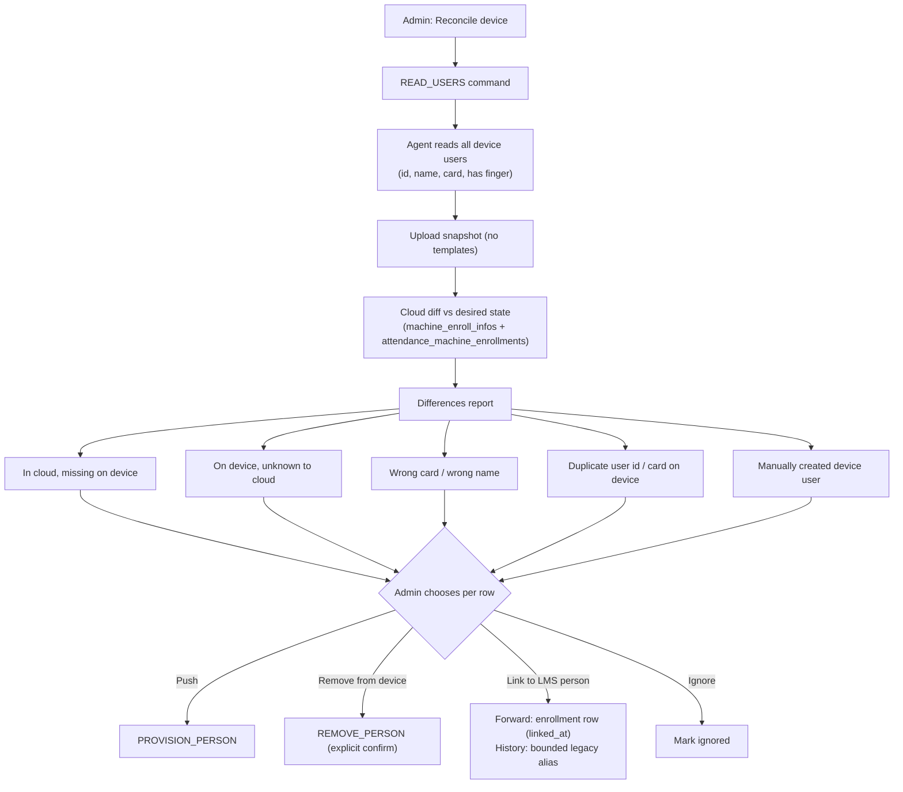

Nothing destructive happens automatically. Removal of device users always requires explicit confirmation listing the users affected.

### 17.2 Existing-machine import

A School may install the Agent next to a K40 already populated by the legacy desktop app. Flow: probe → `READ_USERS` (cards if `CanReadRfid`) → compare with LMS by card number first (exact match), then by name (suggestion only) → reconciliation screen → admin confirms links. **The system never creates LMS students or employees from device users.**

The Agent uploads **every** punch it reads, including punches by device users the cloud does not know; they are stored in `attendance_events` (unprocessed) and are never lost, whatever the admin later decides.

Linking an existing device user to an LMS person has two independent parts:

1. **Forward (from now on).**
   - Device user ID equals the person's `unique_id`: the admin confirms, and a new `attendance_machine_enrollments` episode is created with `linked_at` = confirmation time.
   - Device user ID differs (the usual legacy case): the person is provisioned under their `unique_id` (a new pending episode; `linked_at` is set on the first verified sync), and the old device user is removed only on explicit confirmation.
2. **History (before the link).** Punches recorded under the legacy device ID are attributed only through a **bounded alias** row (PROPOSED, REQUIRES MIGRATION):

```text
attendance_machine_user_aliases
  id                       uuid pk
  school_id                uuid not null → schools
  machine_id               uuid not null → attendance_machines (on delete restrict)
  legacy_machine_user_id   text not null           -- exactly as the device reports it
  entity_type              text not null check in ('student','employee')
  student_id / employee_id uuid, school-scoped composite FKs (same shape as machine_enroll_infos)
  enroll_info_id           uuid null → machine_enroll_infos (on delete set null; informational)
  valid_from               timestamptz not null
  valid_until              timestamptz not null    -- always bounded; check valid_until > valid_from
  created_by               uuid → profiles, created_at, note
  no two aliases for the same (machine_id, legacy_machine_user_id) may overlap in time
    (exclusion constraint on tstzrange(valid_from, valid_until); needs btree_gist — if the
     extension is unavailable, enforced by the definer RPC that writes aliases)
  an alias window may not overlap any enrollment episode's link window for the same (machine_id, ID)
```

Rules:

- Aliases resolve **only** punches from the same `machine_id`, only inside `[valid_from, valid_until)`, and only after no enrollment link window matched ([§15.2](#152-is-attendance_events-suitable-as-the-raw-machine-store)).
- `valid_until` is normally the moment the old device user was removed (or the link confirmation time when the old user is kept until a later removal); `valid_from` is bounded by the School's chosen look-back limit (REQUIRES OWNER DECISION OD-10).
- Creating, changing or deleting an alias is audited (`record_audit`) and queues re-reconciliation of the affected `attendance_date`s; existing merge semantics (`least`/`greatest`) apply, so a day already marked manually is widened, not replaced (see the risk on historic re-reconciliation).
- Delivered in Phase 11. Until then, legacy-ID punches simply stay unprocessed.

### 17.3 K40 replacement

```mermaid
sequenceDiagram
  actor Admin
  participant Cloud
  participant Agent
  participant Old as Old K40
  participant New as New K40
  Admin->>Cloud: Replace device (choose old device, enter new serial/IP)
  opt old device still readable
    Cloud->>Agent: PULL_ATTENDANCE_NOW (old)
    Agent->>Old: read remaining logs
    Agent->>Cloud: upload (idempotent, machine_id = old row)
  end
  Cloud->>Cloud: register NEW attendance_machines row<br/>(new serial, same location/shift, replaces_machine_id = old)
  Cloud->>Cloud: ARCHIVE old row (archived_at, enabled=false);<br/>close old open episodes: unlinked_at = archived_at; pending commands cancelled
  Cloud->>Agent: PROBE_DEVICE (new row)
  Agent->>New: probe, verify serial
  Cloud->>Cloud: create NEW pending episodes on the new row<br/>for everyone desired=present on the old one
  Cloud->>Agent: PROVISION_PERSON × N (same machine_user_ids)
  Agent->>New: upsert users + cards
  Note over Cloud: Old punches keep machine_id = old row forever.<br/>Event keys include machine_id → old and new logs never collide.<br/>New device = new enrollment episodes; old episodes stay closed.<br/>Fingerprints must be re-enrolled (no cloud templates in MVP).
```

The old row's serial, model and identity are never rewritten to describe the new hardware.

### 17.4 Physical device lifecycle

An `attendance_machines` row represents **one physical device for its whole life**.

```mermaid
stateDiagram-v2
  [*] --> Registered: admin adds device
  Registered --> Active: first successful probe (serial verified)
  Registered --> [*]: hard delete (only while never used)
  Active --> Disabled: enabled = false (temporary; Agent skips it)
  Disabled --> Active: enabled = true
  Active --> Archived: archive / replace
  Disabled --> Archived: archive / replace
  Archived --> Active: restore (same machine_id; new enrollment episodes)
```

- **Hard delete** is allowed only for a device row that was never used: no `attendance_events`, no linked enrollment rows, no aliases, no succeeded commands (failed probes do not count). This mirrors the repository's Class Offering rule, "archive, not delete, once used" (ADR `docs/adr/0024-class-offering-archive-not-delete-once-used.md`). FKs from `attendance_events`, `attendance_machine_enrollments` and `attendance_machine_user_aliases` use `on delete restrict` to back this up in the database; the delete RPC first removes the device's never-linked (`linked_at is null`) enrollment rows and its commands (`machine_commands.machine_id … on delete cascade`) after checking none succeeded.
- **Disable** (`enabled = false`): temporary (e.g. device under repair); Agent stops pulling and provisioning; enrollment episodes and link windows untouched.
- **Archive** (`archived_at`, `archived_by`): permanent retirement. The device leaves the Agent config and its pending commands are cancelled. Every open episode is closed: active ones get `unlinked_at = archived_at`, so punches recorded before archival and uploaded late still resolve, and pending ones are closed as `cancelled`. The device disappears from enrollment pickers but stays visible in an "Archived devices" list and on historic attendance.
- **Restore** is how the same physical device comes back (the per-School serial uniqueness `attendance_machines_serial_unique` includes archived rows, so re-registering the same serial as a new row is refused with a "restore instead" hint). The device keeps its `machine_id`, and therefore its event keys. Closed episodes are **not** reopened: restore creates new pending episodes for everyone still desired on the device, each linked on its next verified sync (a read-back that finds the user already present links immediately). Punches recorded while the device was archived fall outside every window and stay unresolved unless an admin covers that gap with a bounded alias ([§17.2](#172-existing-machine-import)).
- **Serial is immutable after the first verified probe**; IP, port, location, shift scope and note stay editable.
- The EXISTING `deleteMachineAction` / `deleteMachine` (`web/app/school/attendance/machine/actions.ts`, `web/lib/machine-enrollment-store.ts`) becomes "Delete" only for never-used rows and "Archive" otherwise.

---

## 18. Security

### 18.1 Agent activation

```mermaid
sequenceDiagram
  actor Admin as Institute admin
  participant UI as Machine Setup
  participant Cloud as Backend
  participant DB as Postgres
  participant Tool as Local config tool (elevated, school PC)
  participant Inst as Agent service (school PC)
  Admin->>UI: Download generic Agent
  Admin->>UI: Generate activation code
  UI->>Cloud: createActivationCodeAction
  Cloud->>DB: store sha256(code), school_id, expires_at (e.g. 24 h), created_by
  UI-->>Admin: code shown once (e.g. 12 chars, grouped)
  Admin->>Tool: install, open config tool, enter code
  Tool->>Inst: local admin channel (Administrators-only ACL): activate(code)
  Inst->>Inst: first time only: generate installId, credential prefix and<br/>256-bit secret (CSPRNG); protect with DPAPI; persist BEFORE any network call
  Inst->>Cloud: POST /api/agent/v1/activate {code, installId, credentialPrefix,<br/>credentialVerifier = sha256(secret), hostname, os, agentVersion}
  Cloud->>DB: activate_attendance_agent()
  alt agent already exists for (installId, verifier) — retry after lost response
    DB-->>Cloud: existing agent identity (no change)
  else code valid, unexpired, unconsumed
    DB->>DB: consume code; create attendance_agents row<br/>(install_id, credential_prefix, credential_hash = verifier)
  end
  Cloud-->>Inst: {agentId, school, config (no device secrets)} — never a credential
  Inst-->>Tool: activated (secret never shown)
  Inst->>Cloud: heartbeat (Bearer agt_prefix_secret)
  Cloud-->>UI: Agent online
```

Rules:

- One-time, short-lived, rate-limited activation codes; stored hashed; consumption is atomic (`update … where consumed_at is null returning`).
- **The permanent Agent credential is generated on the Agent PC, never in the cloud.** Before the first activation call the service generates `installId` (random UUID), a non-secret `credentialPrefix` and a 256-bit secret from the OS CSPRNG. It protects the secret with DPAPI and persists all three, so a crash or lost response can never leave the PC without its secret. The request carries only `credentialVerifier = sha256(secret)`; a plain SHA-256 is adequate because the secret is 256 bits of random data, not a password. The backend stores only that hash, never receives the raw secret during activation, and never generates or returns a credential. The Agent later authenticates with `Authorization: Bearer agt_<prefix>_<secret>`, which the backend hashes and compares by prefix.
- **Retry-safe activation.** The Agent keeps its stored `installId`/prefix/secret and repeats the identical request until it gets an answer.
  - If an `attendance_agents` row already exists with the same `install_id`, the same `credential_hash` **and** the same activation code (`activation_code_id`), the RPC returns that Agent's identity (200, no new row, code not re-consumed), even after the code has expired or been consumed. That consumption was this Agent's own.
  - The same `installId` with a different verifier, or a code consumed by a different `installId`, is refused (409 / 401).
  - A prefix collision (unique constraint) is refused **before** the code is consumed, so the Agent can regenerate its prefix and retry. This is the only moment a prefix may change, because no Agent row exists for it yet.
- The credential is scoped to one School and one Agent. It is revocable (Super Admin / School admin "Revoke Agent"). The **prefix is stable for the lifetime of the installation**: it is chosen once before activation and never changes. Rotation (`ROTATE_CREDENTIAL`, authenticated with the current credential) generates only a new 256-bit secret locally, DPAPI-protects it, and sends its new verifier. The backend moves the current `credential_hash` to `previous_credential_hash`, sets `previous_valid_until` for a short overlap and stores the new hash. During the overlap a Bearer `agt_<prefix>_<secret>` is accepted when the secret hashes to either value, and both are looked up by the same prefix, so no `previous_credential_prefix` is needed. It is never embedded in the installer, never logged and never shared across institutes.
- Stored in the database only as the hash plus the non-secret prefix for lookup.
- The Agent **never** receives a Supabase service-role key, the anon key with any privileged secret, the reconcile job secret, or the School's `ingest_token`. All Agent writes go through `SECURITY DEFINER` RPCs that verify the credential hash and derive `school_id` from the Agent row — never from the request body.
- Every RPC checks the referenced `machine_id` belongs to that Agent's School **and** is assigned to that Agent.

### 18.2 Two unrelated secret classes

| Secret | Purpose | Where stored |
|---|---|---|
| **Device credential** (ZKTeco communication key / password; Timmy equivalent) | Agent → device on LAN | **Agent PC only** (decision for MVP, formerly OD-11): entered in the local config tool, protected with DPAPI by the service, stored in local SQLite. **Cloud: never stored, never transmitted** — the cloud holds only `credential_configured` (bool, reported by the Agent) and `credential_reported_at`. The Agent cloud config contract carries no device secret. |
| **Agent cloud credential** | Agent → backend HTTPS | **Generated on the Agent PC** (256-bit CSPRNG) before activation. Cloud: hash (verifier) + prefix only; never generates, receives during activation, or returns the raw secret. Agent: DPAPI-protected file in `%ProgramData%\<Agent>\` with ACL limited to the service account and Administrators, together with `installId` and prefix. |

Consequences of local-only device credentials (accepted):

- Changing a device's key, or reinstalling Windows / moving the Agent to another PC, means re-entering the key locally on the Agent PC. The UI shows `credential_required` until it is.
- A cloud administrator cannot read or recover the key, and a cloud breach cannot leak device keys.
- Centralized, encrypted secret management for device keys would need a deliberate later ADR; nothing in this plan assumes it.

### 18.3 Windows protection

- Run the service as a **virtual service account** (`NT SERVICE\<AgentServiceName>`), not LocalSystem, unless the SDK bridge proves it needs more (REQUIRES K40 TEST).
- DPAPI (`ProtectedData`) with the service account's user scope (preferred over `LocalMachine` scope, which any local process can unprotect). Both the locally generated Agent cloud credential and every device communication key are protected this way, by the service itself.
- Secrets reach the service only through a **local admin channel** (a named pipe whose ACL allows only `BUILTIN\Administrators`, opened by the elevated local config tool). It accepts only `activate`, `set_device_credential`, `clear_device_credential` and status queries, never returns secrets, and is separate from the bridge stdin/stdout channel.
- Bridge processes inherit the service account; no elevated rights at runtime. Device keys are passed to a bridge per connection over its stdin channel, never via command-line arguments or environment variables (visible to other processes). Admin rights only during install (service registration, optional COM registration) and in the config tool.

### 18.4 Network

- **TCP 4370 (and any device port) must stay inside the School LAN. Never port-forward it, never expose it to the Internet.** The Agent is the security boundary between LAN hardware and the cloud.
- The Agent only connects outbound to the configured cloud HTTPS host (TLS 1.2+), with certificate validation always on.
- Vercel Firewall must allow Agent traffic to `/api/agent/*` without browser challenges (#674) while keeping rate limits.

---

## 19. Recovery behavior

| Situation | Behavior | Duplicates prevented by |
|---|---|---|
| Windows restart | Service auto-starts (delayed); resumes queues from SQLite | SQLite + `event_key` |
| Agent crash | Windows SCM recovery restarts the service; claimed commands in SQLite are resumed or reported; expired cloud leases return to pending | Desired-state commands, lease + idempotency key |
| Driver bridge crash / vendor DLL crash | Supervisor restarts bridge with exponential backoff; device marked `degraded`; reads retried; after N consecutive crashes device marked `failed` and alert surfaced in Machine Setup | Same |
| K40 / Timmy offline | Per-device backoff; other devices unaffected; health shows `unreachable` with last-seen time | Nothing lost: the device keeps its own log |
| Internet offline | Devices keep being read into SQLite; uploads back off; heartbeat resumes when online | `event_key` |
| Backend unavailable (5xx/429) | Same as Internet offline; honour `Retry-After` | Same |
| Database unavailable | Backend returns 5xx; Agent retries | DB unique index |
| Cron missed / reconcile run fails midway | Pairs stay `pending` (or a stale `processing` claim expires) in `attendance_reconcile_dates`; the next drain picks them up — nothing depends on "today" | Pair pk + merge-safe per-pair reconcile |
| Late upload days after the event | Ingest enqueues each affected past `(school, date)` pair; next drain reconciles it | Same |
| Stale Agent config (machine zone changed) | Events rejected `TIME_MISMATCH`; Agent refreshes `GET config` and resends; nothing stored with a wrong UTC time | `event_key` on resend |
| Disk full on Agent PC | Stop reading devices (device retains logs), alert via heartbeat | — |
| Device clock wrong | Health shows drift; `SYNC_TIME` command optional/automatic per School setting (OD-16). Attendance date follows the device's recorded local time, so a wrong clock produces a wrong day — drift is surfaced, not silently corrected | — |
| Device key missing or changed on the device | Probe/connect fails with `AuthFailed`; device status `credential_required`; no fallback driver tried for writes | — |
| Agent PC reinstalled / replaced | Re-activate (new Agent row, old one revoked); reassign the School's devices to the new Agent (device rows unchanged — same physical devices); re-enter device keys locally; re-reading device logs is harmless | `event_key` (built on the unchanged `machine_id`) |
| Activation HTTP response lost / Agent crashes mid-activation | Agent still holds its DPAPI-protected `installId`, prefix and secret (persisted before the call) and retries the identical request; the backend returns the already-created Agent identity | `install_id` + `credential_hash` match; code consumed once |

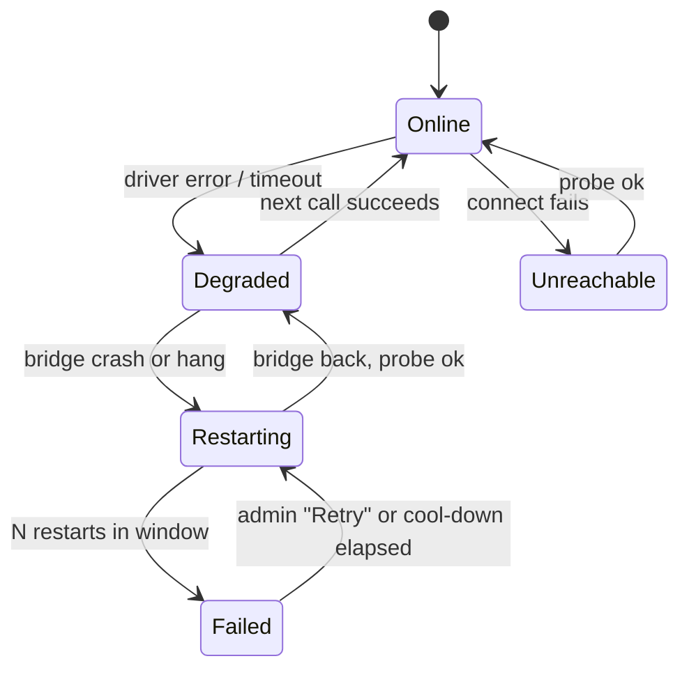

---

## 20. Logging and observability

- Structured log fields: `agentId`, `agentVersion`, `deviceId`, `driverKey`, `driverVersion`, `model`, `firmware`, `commandId`, `operation`, `durationMs`, `errorClass`, `vendorDetail`, `attempt`, `batchId`.
- Never log: Agent credential, activation code, device comm key, plaintext passwords, fingerprint/face templates, full raw device user dumps at info level. Person names only at debug level.
- Heartbeat (every 60 s) reports: Agent version, OS, uptime, queue depth, oldest un-uploaded event age, per-device health/last pull/last error/clock drift/capacity. Cloud stores the latest snapshot (not a time series) for the UI.
- Cloud-side: Agent activation, revocation, device add/change/disable/archive/restore/delete (never-used only), replacement, driver pin changes, `credential_configured` changes, enrollment removals, legacy alias create/change/delete → `record_audit` (EXISTING audit engine).

---

## 21. Database migration plan

**No migration was created. All rows below are PROPOSED and REQUIRES MIGRATION.** Every new table follows the existing conventions: `school_id uuid not null references schools(id) on delete cascade default app_current_school_id()`, RLS enabled, policy "school members … " with `school_id = app_current_school_id() and app_module_granted('attendance')`, and a "super admin manages …" policy (pattern from `0211`/`0213`). Agent writes go through `SECURITY DEFINER` RPCs only; no table grants the Agent direct access.

### 21.1 Existing tables

| Existing table | Current purpose | Issue | Change needed | Migration | Risk |
|---|---|---|---|---|---|
| `attendance_machines` (0213) | Device configuration list | No agent, network, driver, identity, capability or lifecycle fields; rows hard-deletable | Add `agent_id uuid null → attendance_agents(id) on delete restrict`; `host text`, `port int default 4370 check 1..65535`; `driver_key text not null default 'auto'`; `time_zone text not null` (default from `schools.time_zone`); `credential_configured bool not null default false`, `credential_reported_at timestamptz null` (**no communication-key column** — keys are local-only on the Agent PC); `firmware_version`, `platform`, `device_name`, `mac` text null; `pin_width smallint null`; `capabilities jsonb not null default '{}'`; `probed_serial text null`, `serial_verified_at timestamptz null` (serial immutable once set — trigger); `enabled bool not null default true`; `archived_at timestamptz null`, `archived_by uuid null → profiles`; `replaces_machine_id uuid null → attendance_machines(id)`. Indexes `(agent_id)`, `(school_id) where archived_at is null`. Keep `machine_type` as manufacturer label; keep `attendance_machines_serial_unique` covering archived rows (restore, don't re-register). Delete restricted to never-used rows (FKs `on delete restrict` from events/enrollments/aliases; a delete RPC checks commands and never-linked enrollments, [§17.4](#174-physical-device-lifecycle)). | Additive | Low-medium: EXISTING `deleteMachine` must switch to archive for used rows; existing tests `machine-attendance.test.ts` updated. |
| `schools` | Tenant | No time zone column; `Asia/Dhaka` is a TS constant (`web/lib/school-time.ts`) | Add `time_zone text not null default 'Asia/Dhaka'` (validated IANA name). | Additive | Low. |
| `machine_enroll_infos` (0211) | Person-level machine identity + card | One row per person ⇒ no per-device state; student card clear deletes the row | No column change required. Optional `updated_at` + trigger to version desired state. Change delete semantics in app code: deleting ⇒ per-device rows go `desired_state='absent'` (trigger or server action). | Additive (`updated_at`) | Medium: delete-path behavior change must be covered by tests (`machine-enroll-infos.test.ts`). |
| `attendance_events` (0017) | Raw taps (card only) | No idempotency, no device, no machine user id, card required, UTC-day only | Columns and constraints in [§15.2](#152-is-attendance_events-suitable-as-the-raw-machine-store) (`machine_id`, `machine_user_id text`, `device_serial`, `agent_id`, `source`, `event_key`, `device_local_time`, `device_time_zone`, `attendance_date`, …); `card_number` drop not null (still required for `source='ingest_token'`); unique partial index `(school_id, event_key)`; index `(school_id, attendance_date) where not processed`. | Expand: add nullable columns, backfill `attendance_date = (tapped_at at time zone schools.time_zone)::date` and `source = 'ingest_token'` for existing rows, then set `attendance_date not null` | Medium: the legacy `ingest_attendance_events` must also set `attendance_date` (same migration replaces it; card behavior otherwise unchanged). |
| `ingest_attendance_events` (fn, 0020 body) | Legacy device-push / bridge ingest | Writes no `attendance_date` | Replace: also compute `attendance_date` in the School time zone and idempotently enqueue every affected `(school_id, attendance_date)` into `attendance_reconcile_dates`; still card-only | Function replace | Low; covered by `attendance-ingest-route.test.ts`. |
| `reconcile_attendance` (fn, 0211 body) | Daily collapse | Resolves by card only; UTC day range | Becomes per-pair: `reconcile_attendance(job_secret, school, attendance_date)` selects that School's events by `attendance_date`. It resolves Agent events through `(machine_id, machine_user_id)` → the `attendance_machine_enrollments` episode → person, then the same-machine legacy alias, and uses the card join only for `source = 'ingest_token'`. It is invoked by the new `drain_attendance_reconcile_queue(job_secret, max_pairs)`, not for a global date | Function replace + new drain function | Medium-high: high-value function and a behavior change for the legacy path's day boundary; pin current behavior with existing tests (`rfid-attendance.test.ts`, `attendance-ingest-route.test.ts`) first, then add School-local-day tests (e.g. a 05:30 Asia/Dhaka punch). |
| `web/app/api/attendance/reconcile/route.ts` (code, not table) | Cron caller | Reconciles one global date, default UTC today | Call `drain_attendance_reconcile_queue`; `?date=` (optional `&school=`) only enqueues pairs for manual backfill | Code change | Low; `vercel.json` schedule may stay as is or run more often. |
| `schools.ingest_token` (0017) | Device-push token | Shared, plaintext, no rotation | No change for Agent. Separately consider rotation UI (out of scope). | — | — |
| `attendance_records` | Final attendance | — | **No change.** Agent never writes it. | — | — |

### 21.2 New tables

| Table | Key columns | Constraints / indexes | RLS / access | Deletion | Backfill |
|---|---|---|---|---|---|
| `attendance_agents` | `id uuid pk`, `school_id`, `name text`, `hostname text`, `install_id uuid unique` (Agent-generated), `credential_prefix text unique` (Agent-generated, **immutable for the installation's lifetime** — trigger), `credential_hash text` (sha256 verifier sent by the Agent; the raw secret never exists in the cloud), `previous_credential_hash text null` + `previous_valid_until timestamptz null` (rotation overlap under the same prefix), `activation_code_id uuid → attendance_agent_activation_codes`, `status text check in ('active','revoked')`, `agent_version text`, `os_info text`, `last_heartbeat_at timestamptz`, `last_health jsonb`, `created_by uuid → profiles`, `created_at`, `revoked_at`, `revoked_by` | unique `credential_prefix`; unique `install_id`; index `(school_id)` | School members (attendance grant) **select** non-secret columns via a view (hash never exposed); activation/rotation/revoke via definer RPCs; super admin all | Revoke, never hard-delete (audit) | None |
| `attendance_agent_activation_codes` | `id`, `school_id`, `code_hash text unique`, `expires_at`, `consumed_at`, `consumed_by_agent_id`, `created_by`, `created_at` | partial index unconsumed | Create via server action (attendance grant); consume via definer RPC only | Expired rows pruned | None |
| `attendance_machine_enrollments` | `id`, `school_id`, `machine_id → attendance_machines on delete restrict`, `enroll_info_id → machine_enroll_infos(id) on delete set null`, `machine_user_id text not null` (ID as held on the device; normally `unique_id::text`), `entity_type text`, `student_id`/`employee_id uuid` (school-scoped composite FKs, **retained** after the `machine_enroll_infos` row is gone so history keeps resolving), `desired_state text check in ('present','absent')`, `sync_state text check in ('pending','in_progress','synced','failed','drift','removed','cancelled')`, `linked_at timestamptz null` (set once, on the episode's first verified sync or admin-confirmed import link; immutable afterwards), `unlinked_at timestamptz null` (set once, when removal is confirmed or the device is archived; **never cleared** — re-enrolling creates a new episode row), `machine_internal_uid int null`, `last_synced_card text null`, `last_synced_name text null`, `has_fingerprint bool null`, `last_command_id uuid null`, `last_error text null`, `desired_version int`, `synced_at`, `updated_at`. **One row per enrollment episode**; a `(machine_id, machine_user_id)` pair may have any number of closed historical episodes. | No unconditional unique on `(machine_id, machine_user_id)`. Instead: partial unique index `(machine_id, machine_user_id) where unlinked_at is null` (at most one open — pending or active — assignment per device user ID); exclusion constraint `exclude using gist (machine_id with =, machine_user_id with =, tstzrange(linked_at, coalesce(unlinked_at, 'infinity')) with &&) where (linked_at is not null)` so link windows never overlap (needs `btree_gist`; otherwise a trigger enforces it); check `unlinked_at is null or linked_at is null or unlinked_at > linked_at`; trigger refusing any update of `linked_at` once set, any update of `unlinked_at` once set, and any change to `machine_id`/`machine_user_id`/person columns; index `(machine_id, machine_user_id, linked_at)` for resolution; index `(school_id, sync_state)` | School + attendance grant; Agent updates only through definer RPC | Never deleted once linked (closed episodes are permanent history). Open episode kept with `desired_state='absent'` until the device confirms removal, then closed (`sync_state='removed'`, `unlinked_at`). Never-linked episodes may be closed as `cancelled`, or deleted only by the never-used-device delete RPC | None (no device has been provisioned yet) |
| `attendance_machine_user_aliases` | As in [§17.2](#172-existing-machine-import): `machine_id`, `legacy_machine_user_id text`, `entity_type`, `student_id`/`employee_id`, `enroll_info_id`, `valid_from`, `valid_until` (both not null), `created_by`, `note` | `valid_until > valid_from`; no overlapping windows per `(machine_id, legacy_machine_user_id)` (exclusion constraint with `btree_gist`, or RPC-enforced); no overlap with an enrollment link window for the same `(machine_id, ID)` (RPC-enforced); index `(machine_id, legacy_machine_user_id)` | School + attendance grant, writes through a definer RPC that validates windows and queues re-reconciliation; audited | Deleting an alias un-resolves nothing already reconciled automatically — it queues re-reconciliation of affected dates | None; created only by admins during import (Phase 11) |
| `machine_commands` | `id uuid pk`, `school_id`, `agent_id → attendance_agents (on delete restrict)`, `machine_id null → attendance_machines (on delete cascade; only reachable for never-used devices)`, `type text`, `payload jsonb`, `status text`, `idempotency_key text`, `priority smallint`, `attempts int`, `max_attempts int`, `claim_token uuid`, `lease_expires_at`, `result jsonb`, `error_class text`, `error_detail text`, `created_by`, `created_at`, `claimed_at`, `completed_at` | unique `(school_id, idempotency_key)`; index `(agent_id, status, priority, created_at)` for claim | School members select (status display) + insert only via server actions/definer RPC; Agent claims/completes via definer RPCs (`for update skip locked`) | Prune completed after N days | None |
| `attendance_machine_health` (optional; could be columns on `attendance_machines`) | `machine_id pk`, `school_id`, `status` (incl. `credential_required`, `serial_mismatch`), `last_seen_at`, `last_pull_at`, `last_error_class`, `last_error`, `device_time_offset_s`, `user_count`, `record_count`, `capacity jsonb`, `updated_at` | — | Read: school + grant; write: definer RPC | Cascade with machine (only reachable for never-used rows) | None |
| `attendance_reconcile_dates` — **the reconciliation schedule's source of truth** | `school_id`, `attendance_date`, `status text check in ('pending','processing','done','skipped')`, `requested_at timestamptz` (bumped on every enqueue), `claimed_at timestamptz null`, `attempts int`, `last_run_at`, `last_error text null` | pk `(school_id, attendance_date)` (idempotent upsert target); partial index `(requested_at) where status = 'pending'` | Definer RPCs only (ingest RPCs enqueue; the drain RPC claims and completes); School members may read status for diagnostics | Kept (small: one row per School per active day) as the audit of what was reconciled when; optional pruning of `done` rows older than N months | Phase 3: enqueue every `(school_id, attendance_date)` that has unprocessed `attendance_events` |
| `device_driver_compatibility` | — | — | **Not proposed for MVP** (catalog ships in Agent, §11.1) | — | — |
| `machine_sync_state` | — | — | **Not proposed** — lives in Agent SQLite; cloud keeps `last_pull_at` in health | — | — |

### 21.3 New RPCs (definer, Agent-facing; anon-callable but credential-gated)

`activate_attendance_agent(code, install_id, credential_prefix, credential_hash, hostname, os_info, agent_version) → (agent_id, school)` — idempotent on `(install_id, credential_hash)`, never returns a credential; `rotate_agent_credential(credential, new_hash)` — prefix unchanged; `agent_heartbeat(credential, health jsonb)`; `claim_machine_commands(credential, max int)`; `complete_machine_command(credential, command_id, claim_token, status, result, error_class)`; `ingest_agent_attendance_events(credential, machine_id, events jsonb) → (accepted, duplicates)`; `report_device_probe(credential, machine_id, info jsonb, capabilities jsonb, credential_configured bool)`; `report_device_users(credential, machine_id, snapshot jsonb)` (reconciliation). Each derives `school_id` from the credential, verifies machine ownership (and that the machine is not archived — except that `ingest_agent_attendance_events` accepts late events recorded before `archived_at`), bounds payload size, and records Agent id on writes. `ingest_agent_attendance_events` computes `tapped_at` server-side from `device_local_time` + `attendance_machines.time_zone` (Agent `eventTimeUtc`/`deviceTimeZone` are validated, never stored as authoritative), computes `attendance_date`, and idempotently enqueues every affected `(school_id, attendance_date)` into `attendance_reconcile_dates`. Cron-side: `drain_attendance_reconcile_queue(job_secret, max_pairs)` (secret-gated like the EXISTING `reconcile_attendance`). No RPC accepts or returns a device communication key.

Admin-side definer RPCs / server-side store functions (PROPOSED): `archive_attendance_machine`, `restore_attendance_machine`, `replace_attendance_machine(old_id, new_serial, …)` (atomic: create new row, create new pending episodes there for everyone desired on the old row, archive old and close its episodes), `upsert_machine_user_alias` / `delete_machine_user_alias` (window validation + re-reconcile queue).

---

## 22. API plan

Conventions mapped from the repository: admin operations are **server actions** next to the screen (`web/app/school/attendance/machine/actions.ts` pattern; validate shape, call a `lib/*-store.ts` function with the caller's own Supabase client, RLS decides); hardware/Agent callers use **route handlers** (`web/app/api/attendance/ingest/[schoolId]/route.ts` pattern: anon client, definer RPC, UUID/shape checks, JSON errors). Business logic goes to `web/lib/` (domain/application), not route handlers (`web/AGENTS.md`).

### 22.1 Agent-facing (PROPOSED, `web/app/api/agent/v1/...`)

| Endpoint | Auth | Payload → Response | Idempotency | DB effects | Errors |
|---|---|---|---|---|---|
| `POST activate` | Activation code (body) + locally generated credential verifier | `{code, installId, credentialPrefix, credentialVerifier (sha256 of the Agent-generated 256-bit secret), hostname, osInfo, agentVersion}` → `{agentId, school:{id,name}, config}` — **no credential in the response** | Retry with the same `installId` + `credentialVerifier` returns the existing Agent identity (200), even if the code has since expired; no second row, code consumed once | consume code, insert agent (`install_id`, `credential_prefix`, `credential_hash`), audit | 400 shape, 401 invalid/expired/consumed-by-another-install, 409 same `installId` with different verifier or prefix taken (code not consumed), 429 rate limit |
| `POST credential/rotate` | Bearer (current credential) | `{newVerifier}` only — the prefix never changes (new secret generated and DPAPI-protected locally first) → `{ok, oldValidUntil}` | Repeat with the same `newVerifier` = no-op | `previous_credential_hash` ← current hash, `previous_valid_until` set, `credential_hash` ← new verifier; audit | 401, 409 rotation already in progress with a different verifier |
| `POST heartbeat` | `Authorization: Bearer agt_…` | `{agentVersion, uptime, queue, devices:[health]}` → `{configVersion, serverTime, pollIntervalS, minAgentVersion}` | Naturally idempotent | update agent + health | 401 revoked/unknown, 426 Agent too old |
| `GET config` | Bearer | → `{devices:[{id, manufacturer, model, serial, host, port, driverKey, timeZone, enabled}]}` — enabled, non-archived devices assigned to this Agent only; **no communication key or any other device secret** (keys are local-only) | Read | — | 401 |
| `POST commands/claim` | Bearer | `{max}` → `{commands:[{id, claimToken, type, machineId, payload, leaseExpiresAt}]}` | Lease-based | status → claimed | 401 |
| `POST commands/{id}/progress` | Bearer | `{claimToken, stage}` (fingerprint enrollment) | Last write wins | update result.progress | 404, 409 stale claim |
| `POST commands/{id}/result` | Bearer | `{claimToken, status, result, errorClass, errorDetail}` → `{ok}` | Once per claim; repeat = 200 no-op | status, enrollment state | 404, 409 stale claim |
| `POST attendance/batch` | Bearer | `{machineId, batchId, events:[{eventKey, machineUserId (string as on device), card?, deviceLocalTime (authoritative), deviceTimeZone? (check only), eventTimeUtc? (check only), punch?, verify?, raw?}]}` (≤1000) → `{accepted, duplicates, rejected:[{eventKey, reason}]}` | `event_key` unique; enqueue is an upsert | insert `attendance_events` (`source='agent'`, `machine_id`, `tapped_at` computed server-side from `deviceLocalTime` + `attendance_machines.time_zone`, `attendance_date`, received time = `created_at`); upsert every affected `(school_id, attendance_date)` into `attendance_reconcile_dates` as `pending`, including for all-duplicate batches | 400, 401, 403 machine not this Agent's (or event after the machine's `archived_at`), 413; per-event `TIME_MISMATCH` when the Agent's `deviceTimeZone`/`eventTimeUtc` disagree with the server conversion |
| `POST devices/{id}/probe-result` | Bearer | normalized `DeviceInfo` + capabilities + `credentialConfigured` (bool only) | Overwrite | update machine identity/capabilities/`credential_configured`, serial check (immutable once verified) | 401, 403 |
| `POST devices/{id}/credential-status` | Bearer | `{credentialConfigured}` — sent when the operator sets/clears a key in the local config tool | Overwrite | `credential_configured`, `credential_reported_at`, audit | 401, 403 |
| `POST devices/{id}/users-snapshot` | Bearer | `{users:[{machineUserId, name, card, hasFingerprint, internalUid}]}` | Overwrite latest snapshot | store snapshot for reconciliation screen | 401, 403, 413 |

Rate limiting per Agent; payload size caps; all timestamps ISO-8601 with offset.

### 22.2 Admin-facing (PROPOSED server actions)

| Operation | Caller / auth | Authorization | Payload | Response | Idempotency | DB effects | Errors |
|---|---|---|---|---|---|---|---|
| Register / update device | School session | RLS: attendance grant | existing machine fields + host, port, time zone, driver, agent (**no communication key** — entered on the Agent PC) | `{error?}` | serial unique per School incl. archived rows (EXISTING constraint) | upsert `attendance_machines`, queue `PROBE_DEVICE` | `errSerialTaken` (with "restore archived device" hint when the holder is archived), `errSerialLocked` (serial already verified), `errHost`, `errPort` |
| Disable / enable device | School session | grant | `{machineId, enabled}` | `{error?}` | repeat = no-op | `enabled`; Agent config refreshed; audit | `errNotFound` |
| Archive device | School session | grant + confirm | `{machineId}` | `{error?}` | repeat = no-op | `archived_at`, `enabled=false`, cancel pending commands, close every open episode (`unlinked_at = archived_at`; never-linked ones `cancelled`), audit | `errNotFound` |
| Restore device | School session | grant | `{machineId}` | `{error?}` | repeat = no-op | clear `archived_at` (same `machine_id`); re-probe; create **new** pending episodes for everyone still desired — closed episodes are not reopened | `errNotFound` |
| Delete device | School session | grant + confirm | `{machineId}` | `{error?}` | — | hard delete **only if never used**; otherwise refused with "archive instead" | `errInUse` |
| Replace device | School session | grant + confirm | `{oldMachineId, newSerial, host, port, model?}` | `{newMachineId}` | one open replacement per old device | `replace_attendance_machine`: new row (`replaces_machine_id`, new `machine_id`), new pending episodes there for everyone desired on the old row, optional final pull of old, archive old (its episodes closed) | `errSerialTaken`, `errNotFound` |
| Manage legacy aliases | School session | grant + confirm | `{machineId, legacyMachineUserId, personId, kind, validFrom, validUntil}` | `{aliasId}` | per (machine, legacy id, window) | insert/update/delete alias, queue re-reconciliation, audit | `errAliasOverlap`, `errWindowUnbounded`, `errBeyondLookback` |
| Generate activation code | School session | attendance grant (REQUIRES OWNER DECISION OD-5: Owner only?) | `{}` | `{code, expiresAt}` shown once | new code each call | insert code hash, audit | — |
| Revoke Agent | School session / Super Admin | grant (+ confirm) | `{agentId}` | `{error?}` | repeat = no-op | status revoked, devices unassigned, pending commands cancelled, audit | `errNotFound` |
| Test connection | School session | grant | `{machineId}` | `{commandId}` | 1 open TEST per device | insert command | `errNoAgent` |
| Enroll students / employees | School session | grant + roster reach (Academic Year/Shift filters are view filters only) | `{kind, personIds | scope, machineIds}` | `{queued, skipped:[{personId, reason}]}` | per (enrollment episode, version) | bump the open episode or insert a new pending episode; insert commands | `errMachineIdTooWide`, `errNoCard`, `errNotEligible` |
| Retry enrollment | School session | grant | `{enrollmentIds}` | `{queued}` | new version | commands | — |
| Replace RFID | Existing `saveRfidEntriesAction` | EXISTING | EXISTING | EXISTING | EXISTING | + bump version, mark enrolled devices `pending` | EXISTING `duplicate` |
| Remove enrollment | School session | grant + explicit confirm | `{personId, machineIds | all}` | `{queued}` | per row | desired absent + `REMOVE_PERSON` | — |
| Reconcile device | School session | grant | `{machineId}` | `{commandId}`; later diff view | 1 open per device | `READ_USERS` command | — |
| Apply reconciliation decisions | School session | grant + confirm for removals | `{decisions:[…]}` | `{queued}` | per decision | commands; import links (new `attendance_machine_enrollments` episodes with `linked_at`); legacy aliases | — |

---

## 23. UI plan

The target navigation **already exists** (VERIFIED BY REPOSITORY): `web/lib/attendance-nav.ts` `ATTENDANCE_MACHINE_TABS` and the sidebar entry in `web/lib/school-nav.ts`. No navigation change is needed for the three tabs; a fourth "Agents" tab is optional (could live inside Machine Setup).

| Area | Existing file(s) to modify later | Future change |
|---|---|---|
| Machine Setup | `web/app/school/attendance/machine/page.tsx`, `machine-setup.tsx`, `machine-ui.tsx` (`DownloadServiceButton`), `actions.ts`, `web/lib/machine-attendance.ts` (`parseMachineInput`), `web/lib/machine-enrollment-store.ts` (`MACHINE_COLUMNS`, create/update) | Replace "Upcoming" download with real download link + "Generate Activation Code"; Agent status panel (online/last heartbeat/version/revoke); device form gains IP, Port, Time zone, Driver (Auto/explicit), Agent — and a read-only "Communication key: configured on Agent PC / not configured" indicator with instructions (the key itself is never entered in the browser); per-device status: online/degraded/unreachable/serial mismatch/credential required, firmware, serial (typed vs probed; locked once verified), capabilities, last sync, last error, capacity, device time + drift; "Test Connection" button showing command progress; Disable/Enable, Archive, Restore, Replace actions; "Delete" only for never-used devices; an "Archived devices" list. |
| Student RFID Enrollment | `web/app/school/attendance/machine/students/page.tsx`, `machine-ui.tsx` (`EnrollButton`), `rfid-entry-table.tsx` | "Enroll Students" picker becomes real: select device(s), queue, then per-row device status chips (pending/synced/failed + Retry). Existing fast RFID entry unchanged. |
| Employee Enrollment | `web/app/school/attendance/machine/employees/page.tsx`, same components | Same, plus "Enroll fingerprint" action when the device reports `CanStartFingerprintEnrollment`. |
| Reconciliation | New route under `web/app/school/attendance/machine/` (e.g. `devices/[id]/reconcile/page.tsx`) | Diff table and per-row decisions, including "unknown device users" with unprocessed punch counts and the legacy alias editor (bounded windows). |
| Agent PC (not web) | New: Agent local config tool | Activation code entry; per-device communication key set/clear; shows `credential_configured` per device; never displays stored secrets. |
| Strings | `web/lib/i18n.ts` (`machine.*`) | Bangla + English for all new states; remove `machine.serviceUpcomingBody`, `machine.studentsUpcomingBody`, `machine.employeesUpcomingBody` when replaced. |
| Glossary | `CONTEXT.md` "Attendance Machine", "Machine Enrollment", "Attendance Event" | Update wording ("Configuration only: nothing talks to a device yet") when behavior changes; add "Attendance Agent", "Device Driver", "Machine Command", "Device Enrollment Episode (per device, one link window, permanent history)", "Legacy Machine User Alias", "Attendance Date (School-local)"; Attendance Machine gains the disable/archive/restore lifecycle. |
| Docs | `docs/PRD.md` §3, `docs/ARCHITECTURE.md` §5, new ADR | After OD-1. |

UI rules: capability-driven (hide or disable unsupported actions with a reason), never ask for or show a device communication key in the browser, never call a LAN address from the browser, enrollment pickers list only enabled non-archived devices, historic attendance shows the original (possibly archived) device.

---

## 24. Device compatibility matrix

Proposed living document (later `docs/machine_attendance_device_compatibility.md` or a section of this file). A model is **"Supported"** only after physical testing with a named firmware, or with reliable vendor documentation explicitly covering the operation.

| Manufacturer | Model | Firmware | Platform | Driver | Connect | Read users | Write users | RFID | Attendance | Fingerprint enroll | Live events | Known issues | Tested date |
|---|---|---|---|---|---|---|---|---|---|---|---|---|---|
| ZKTeco | K40 (/ID) | *tbd* | *tbd* (pyzk lists `JZ4725_TFT` for Ver 6.60 May 25 2018) | zkteco-sdk (candidate) | REQUIRES K40 TEST | REQUIRES K40 TEST | REQUIRES K40 TEST | REQUIRES K40 TEST | REQUIRES K40 TEST | REQUIRES K40 TEST | REQUIRES K40 TEST | — | — |
| ZKTeco | K40 (/ID) | *tbd* | *tbd* | zk-protocol (fallback) | REQUIRES K40 TEST | … | … | … | … | … | … | — | — |
| TIMY | TM52GPRS (bench unit) | unknown / pending | unknown | pending TIMY SDK validation (classic ZK: FAIL on tested unit/config; ZKTeco SDK: FAIL on tested unit/config; TIMY SDK: NOT TESTED) | configured TCP port 5005; connect through a supported SDK NOT TESTED | NOT TESTED | NOT TESTED | NOT TESTED | NOT TESTED through a supported SDK | NOT TESTED | NOT TESTED | TCP 4370 answered pyzk with `5a a5 01 00 00 00 00 01`; UDP 4370 timed out. **Status: PARTIAL / POC IN PROGRESS — not supported yet** | 2026-10-05 |
| Timmy | *further models tbd* | — | — | *tbd* | REQUIRES TIMMY MODEL TEST | … | … | … | … | … | … | — | — |

---

## 25. K40 hardware validation plan

Bench setup: one K40 on an isolated LAN segment, a Windows 10/11 x64 test PC, the Standalone SDK in a throwaway x86 console harness, pyzk on a laptop. Never test on a School's production device. Record every result (firmware string, exact SDK version, outcome, oddities) into the matrix.

| # | Test | SDK path | pyzk path | Pass criterion |
|---|---|---|---|---|
| 1 | Connect TCP 4370 (and UDP if TCP fails) | ✓ | ✓ | Connects within timeout; note protocol |
| 2 | Communication password set / wrong / unset | ✓ | ✓ | Wrong key rejected with distinguishable error |
| 3 | Serial number, firmware, platform, device name, MAC, PIN width | ✓ | ✓ | Values identical across paths |
| 4 | Read users (empty, 10, 1000+) | ✓ | ✓ | Same users; duration recorded |
| 5 | Create user with 8-digit user ID | ✓ | ✓ | Accepted, read back unchanged |
| 6 | 9- and 10-digit user IDs | ✓ | ✓ | Record the limit; matches PIN width |
| 7 | Update name / privilege | ✓ | ✓ | Read-back matches; UID slot unchanged |
| 8 | Assign RFID; card with leading zeros; 10-digit card; >2^32 card | ✓ | ✓ | Card verifies by physical tap; record numeric range/format |
| 9 | RFID physical verification | ✓ | — | Tap produces attendance for the right user ID |
| 10 | Attendance retrieval | ✓ | ✓ | Fields available: user id, time, status, punch, verify mode, any record id |
| 11 | Re-read attendance twice | ✓ | ✓ | Identical records ⇒ deterministic `event_key` stable |
| 12 | Attendance after device reboot / power loss | ✓ | ✓ | No loss; ordering stable |
| 13 | Delete user (present / absent) | ✓ | ✓ | Absent delete distinguishable or harmless |
| 14 | Device time get/set; drift over 24 h | ✓ | ✓ | Set accurate to ±2 s |
| 15 | Capacity / counts | ✓ | ✓ | Users, cards, fingers, records vs. limits |
| 16 | Fingerprint remote enrollment start + status | ✓ | ✓ (`enroll_user`) | Enrollment completes; failure/timeout states observable |
| 17 | Unicode names: Latin, **Bangla**, long names (24/32/64 chars) | ✓ | ✓ | Record what the screen shows; decide transliteration/truncation rule |
| 18 | Large batch: provision 1000 users | ✓ | ✓ | Time, need for disable/enable around batch, failure isolation |
| 19 | Disconnect mid-batch / mid-read | ✓ | ✓ | Device re-enabled; partial state readable; re-run converges |
| 20 | Concurrent access (legacy desktop software also connected) | ✓ | ✓ | Behavior documented; decide on exclusivity rule |
| 21 | Agent-PC restart / bridge kill during write | ✓ | — | Device not left disabled after reconnect; state converges |
| 22 | x86 vs x64 SDK build, regsvr32 vs registration-free COM, non-admin service account | ✓ | — | Chosen deployment works under virtual service account |
| 23 | Antivirus / Defender with SDK DLLs and unsigned bridge | ✓ | (PyInstaller) | No quarantine with signed build |
| 24 | Real-time events (optional) | ✓ | `live_capture` | Documented, not used in MVP |
| 25 | Device local time semantics: punches at 23:59, 00:01 and 05:30 local; time zone setting on device (if any) | ✓ | ✓ | Stored time is local wall-clock as expected; server-side UTC conversion and School-local `attendance_date` correct |
| 26 | Communication key entered only in the local config tool; service restart; key change on device | ✓ | ✓ | Key survives restart (DPAPI); wrong/changed key ⇒ `credential_required`; key never appears in logs or cloud |
| 27 | Keypad-created user whose ID equals an enrolled person's Machine ID on a device where that person is not linked | ✓ | — | Punch stays unresolved ("unknown device user"), not attributed |

Exit: a written K40 POC report; choice of primary vs fallback driver confirmed or swapped; matrix row filled.

---

## 26. Timmy validation plan

The first concrete model is the **TIMY TM52GPRS** (Phase 1A). Its read-only ZK-path probes are recorded in [§10.1](#101-tm52gprs-bench-evidence); steps 1–2 below (official SDK package, protocol/SDK family) are still open for it.

For each concrete Timmy model (chosen by the owner from models Schools actually own):

1. Collect: model, hardware revision, firmware, vendor documentation, available SDK packages.
2. Determine: protocol (ZK-compatible? proprietary TCP? HTTP push/cloud?), SDK family, SDK architecture (COM/native/.NET/HTTP), bitness, runtime dependencies, license.
3. Safe read-only probe on a bench device using **only** catalog-approved candidate drivers.
4. Run the K40 test list adapted to the model (users, cards, attendance, time, deletes, fingerprint/face).
5. Record capabilities; implement or reuse a driver; add catalog + matrix rows.

No claim of Timmy-wide compatibility is made at any point.

---

## Known Integration Risks

| Risk | Impact | Mitigation |
|---|---|---|
| **K40 firmware variations** | Same model, different command support / encoding | Probe records firmware/platform; catalog entries carry tested firmware; unknown firmware ⇒ read-only until verified |
| **ZKTeco SDK version differences** | Behavior changes between SDK releases | Pin one SDK version per bridge release; record it in heartbeat; regression-test on bench before upgrading |
| **32-bit COM dependencies** | Forces x86 host | x86 bridge process; x64 Agent |
| **zkemkeeper registration/deployment** | Needs admin, machine-wide registration, conflicts with other ZK software on the same PC | Installer-managed registration or registration-free COM (REQUIRES K40 TEST); detect conflicting installs |
| **pyzk unofficial support** | No vendor backing; README lists a non-working device | POC/oracle only; not a production dependency |
| **pyzk licensing (GPL-2.0)** | Distribution obligations; derivative-work risk if ported | Do not ship or port line-by-line without legal review (OD-4) |
| **Vendor SDK quality** | Hangs, crashes, leaks | Process isolation, per-call timeouts, bridge restart, periodic bridge recycle |
| **Timmy model fragmentation** | Multiple incompatible families | Per-family drivers; per-model validation |
| **Protocol incompatibility** | Probing wrong protocol can hang or confuse device | Catalog-driven, read-only probe; no protocol sweeps |
| **Biometric enrollment differences** | Different flows per device | Capability + normalized progress states |
| <a id="rfid-format-differences"></a>**RFID format differences** | Reader-typed card (keyboard wedge, e.g. 10-digit decimal with leading zeros) vs device-stored number (may be stored as an integer, possibly different byte order / facility-code format) | Keep cloud card as string (EXISTING); driver normalizes both directions; bench test #8/#9; per-model card format rule in catalog |
| **Attendance field differences** | Status/punch/verify semantics differ | Normalized optional fields; raw metadata kept |
| <a id="clock-and-timezone-differences"></a>**Clock/timezone differences** | Devices store local wall-clock; repo today reconciles by UTC day (`target_date::timestamptz`), route default UTC today, cron 12:30 UTC — a 05:30 Asia/Dhaka punch belongs to the previous UTC day | **Required fix (not deferred):** keep device local time, the zone used, UTC time and received time. The server computes UTC from device local time + `attendance_machines.time_zone` (Agent UTC is validation-only). Derive `attendance_date` in the School/device time zone (`schools.time_zone`, `attendance_machines.time_zone`), and reconcile per `(school_id, attendance_date)` pair from the `attendance_reconcile_dates` queue, which covers late uploads ([§15.2.1](#1521-school-local-attendance-day)). Residual risk: a device with a wrong clock or a wrongly configured machine zone yields a wrong time/date — health reports drift, optional `SYNC_TIME` (OD-16) |
| **Untrusted Agent clock math** | A buggy or stale Agent could store wrong UTC times | Server-authoritative conversion; Agent `eventTimeUtc`/`deviceTimeZone` only validated, mismatches rejected (`TIME_MISMATCH`) |
| **Missed reconciliation** | A School/date never reconciled because the cron only looked at one global date | Queue-driven: every ingest enqueues its pairs; the drain is idempotent and re-claims pairs re-requested mid-run |
| **Legacy-path day-boundary change** | Moving `reconcile_attendance` to `attendance_date` also changes the day of existing card-path events near local midnight | Backfill `attendance_date` for existing rows; pin current behavior with tests before the change; document in the ADR |
| **Bypassing per-device mapping** | A bare `(school_id, unique_id)` lookup would attribute a keypad-created or foreign device user that reuses a number | Resolution only through `(machine_id, machine_user_id)` enrollment link windows or same-machine aliases; bench test #27 |
| **Historic re-reconciliation** | Creating a legacy alias or uploading late events re-reconciles past days, possibly widening manually marked days | Merge semantics (`least`/`greatest`) never shrink a day; alias changes require confirmation and are audited; look-back limit (OD-10) |
| **Local-only device keys** | Key lost when the Agent PC is rebuilt; nobody in the cloud can recover it | Accepted; `credential_required` status and re-entry flow; key is also known on the device itself / to the installer |
| **Device row misuse (editing serial to describe new hardware)** | Old punches would appear to come from the new device; the new device's fallback event keys would share the old `machine_id` | Serial immutable once verified; replacement creates a new row (new `machine_id`) and archives the old; FKs `on delete restrict` |
| **Lost activation response** | Code consumed but the Agent never learned its identity, leaving the install unusable | Agent-generated credential persisted (DPAPI) before the call; activation idempotent on `(install_id, credential_hash)` |
| **Rewriting enrollment history** | Reopening or editing a closed link window would re-attribute past punches | Episodes are append-only: `linked_at`/`unlinked_at` immutable once set, re-enrollment = new row, non-overlap exclusion constraint, at most one open episode per `(machine_id, machine_user_id)` |
| **Duplicate fallback keys across hardware** | Two physical devices sharing one `machine_id` would merge their logs | Only possible if a row were reused for new hardware — prevented by the serial lock and replacement-creates-new-row rule |
| **Unicode/Bangla names** | Device may not render Bangla; may corrupt bytes | Bench test #17; per-model name policy (transliterated/ASCII fallback, truncation) |
| **Duplicate attendance** | Re-reads, retries, replays | `event_key` unique in SQLite + Postgres |
| **Device factory reset** | Users and slots gone; logs lost if not yet read | Frequent pulls; reconciliation detects empty device; one-click re-provision |
| **School network configuration** | DHCP-changed IPs, VLANs, Wi-Fi isolation | Static IP guidance; serial verification on every connect; probe shows clear errors |
| **Antivirus/Windows Defender** | Quarantine of vendor DLLs / unsigned EXEs | Authenticode-sign all Agent binaries; documented exclusions as last resort |
| **Windows Service permissions** | COM or file access fails under restricted account | Test under virtual account (test #22); least privilege |
| **Auto-update safety** | Bad update stops attendance at all Schools | Signed manifests, staged rollout, health-gated rollback, drain before update |
| **Vercel edge challenge / rate limiting** | Agent calls blocked with 429 (#674) | Firewall rule for `/api/agent/*`, backoff honoring `Retry-After` |
| **Serverless polling cost** | Many Agents polling every 15 s | Adaptive interval (fast only while commands pending/UI open), heartbeat-piggybacked "has commands" flag |
| **Legacy desktop app contention** | Two programs writing the same device | Detect via reconciliation; owner guidance to retire legacy sync on activated devices |
| **PRD non-goal conflict** | Work contradicts PRD §3 | OD-1 before Phase 2 |
| **TIMY SDK availability / quality (TM52GPRS)** | The official SDK for this model may be hard to obtain, poorly documented, or have unknown bitness/runtime/licence; the tested unit did not speak classic ZK or the ZKTeco SDK | Phase 1A read-only POC before any write; bridge process isolation as for any vendor SDK; OD-17 licence check; fall back to `timmy-http`/`timmy-cloud` evaluation if no LAN SDK works |
| **Contract shaped by one vendor** | Phase 2 now starts from TIMY evidence only; K40 evidence arrives later | Keep the contract to normalized operations; extend (not redesign) it with Phase 1B evidence |

---

## 28. Implementation phases

Order adjusted to the repository's dependencies: the cloud fixes (G1 per-device resolution, G2 idempotency, G3 device lifecycle, G8 School-local attendance day) can land early and independently because they are pure database/route work. Since v1.1, the generic Agent phases depend on **at least one accepted real-device POC** (currently Phase 1A, TIMY TM52GPRS), not on the K40 specifically. K40-specific driver work still depends on Phase 1B.

### Phase 0 — Repository analysis (this document)
- Prerequisites: none. Files affected: none except this document. Exit: owner reviews. Only the owner decisions needed by the next active phase must be answered: Phase 2 needs an accepted Phase 1A POC, OD-1 and OD-13; OD-2/OD-3/OD-4 gate the ZKTeco/K40 path (Phase 1B, Phase 13); OD-17 must be resolved before the TIMY runtime/installer ships; every other decision is gated by the phase that uses it. Not all of OD-1…OD-17 are needed before Phase 1A or Phase 2. Risks: stale analysis — re-verify cited files at each phase start.

### Phase 1A — TIMY TM52GPRS hardware / TIMY SDK POC (current active Phase 1 work)
- Prerequisites: the TM52GPRS bench unit (available); the official TIMY SDK/API package that applies to the TM52GPRS (to be obtained); owner approval before any write test.
- Existing files affected: none. New: throwaway POC outside the production tree (the existing POC workspace): a disposable harness against the official TIMY SDK/API. Names stay PROPOSED until the package is known.
- Done so far: read-only classic-ZK (pyzk) and ZKTeco Standalone SDK probes — both failed on the tested unit/configuration ([§10.1](#101-tm52gprs-bench-evidence)).
- Tests: §26 steps 1–5 for this model; the §25 list adapted to the TM52GPRS (identity, time, capacity, users, attendance, then — after approval — disposable-user create/update/delete in the reserved ID range, RFID, physical punch, fingerprint attendance, remote fingerprint enrollment as a separate test, attendance re-read stability for the event key).
- **Acceptance gate (minimum evidence from the official TIMY mechanism before Phase 2 may be declared cleared):**
  1. connect and disconnect successfully;
  2. read device identity, including serial and firmware where exposed;
  3. enumerate users and identify the stable machine-user identifier;
  4. read attendance records carrying machine-user identity and device-local event time;
  5. read device time;
  6. re-read attendance and determine whether record identity/fields are stable enough for deterministic deduplication;
  7. if the SDK exposes user writes: create a reserved disposable test user (99990001–99990099), read it back, update it, delete it, and verify the deletion;
  8. if this TM52GPRS hardware includes RFID: RFID read/write plus a physical card punch.

  Fingerprint attendance and remote fingerprint enrollment are separate capabilities. **Remote fingerprint enrollment is not required to clear Phase 2**; if the SDK does not support it, record `CanStartFingerprintEnrollment = false` / `NotSupported`. A POC that only connects and reads model information is **not** sufficient.
- Exit: accepted TM52GPRS POC report meeting the gate above; compatibility matrix row updated; driver family and adapter placement (in-process vs bridge) decided. Risks: SDK unavailable for this model; SDK licence (OD-17); model needs an HTTP/cloud path instead.

### Phase 1B — ZKTeco K40 hardware / SDK POC (when a K40 bench unit is available)
- Prerequisites: OD-1 (direction approved), OD-2 (K40 bench unit), OD-3 (SDK license check).
- Existing files affected: none. New: throwaway POC outside the production tree (separate repo or `tools/` folder agreed with owner): SDK x86 console harness, pyzk scripts (both already prepared in the POC workspace).
- Migrations/API/UI: none. Tests: §25 list (unchanged). Exit: K40 POC report, primary/fallback ZKTeco driver chosen, matrix row. Risks: firmware unlike pyzk's tested one; SDK license blocks redistribution.
- Does **not** block Phase 2 when Phase 1A has been accepted. It does block the K40 production driver (Phase 13).

### Phase 2 — Normalized Device Driver contract
- Prerequisites: **at least one accepted real-device POC** — currently Phase 1A (TM52GPRS) meeting its acceptance gate — plus OD-1 and OD-13. It does not have to wait for Phase 1B; the contract is extended, not redesigned, when the K40 evidence arrives. New: Agent solution skeleton (separate repository recommended, e.g. `attendance-agent/` — REQUIRES OWNER DECISION OD-13) with `Agent.Drivers.Abstractions` (contract, models, error classes), fake driver for tests, JSON-RPC bridge protocol spec.
- Existing files: none. Tests: contract tests runnable against any driver (fake, SDK, protocol). Exit: contract reviewed; fake driver passes. Risks: over-generalizing — keep to operations proven in an accepted Phase 1 POC (1A now; 1B adds K40 evidence later); avoid shaping the contract around one vendor's quirks.

### Phase 3 — Database/domain migration design (then migrations)
- Prerequisites: Phase 2 contract (payload shapes).
- Existing files affected: new migrations after `0213` (`0214_…` onward); `reconcile_attendance` replacement; tests `web/tests/integration/rfid-attendance.test.ts`, `attendance-ingest-route.test.ts`, `machine-enroll-infos.test.ts`, `machine-attendance.test.ts`.
- New: §21 tables/RPCs — including `attendance_machine_enrollments` as permanent episodes (partial unique open-episode index, non-overlap exclusion constraint, immutability trigger), `attendance_agents` with `install_id` and Agent-supplied `credential_hash`, `schools.time_zone`, `attendance_events.attendance_date` (+ backfill), the `attendance_machines` lifecycle columns (`enabled`, `archived_at`, serial lock, `credential_configured`, no key column) with `on delete restrict` FKs, and the replaced `ingest_attendance_events` / `reconcile_attendance`; `web/lib/machine-agent-*.ts` domain helpers. ADR "Windows Attendance Agent with device drivers" (also recording: per-device resolution, School-local attendance day, local-only device keys, archive-not-delete devices); `CONTEXT.md` glossary entries.
- Existing code changed in this phase: `web/app/api/attendance/reconcile/route.ts` (drains `attendance_reconcile_dates` instead of reconciling one global date; `?date=` only enqueues), `web/lib/machine-enrollment-store.ts` / `web/app/school/attendance/machine/actions.ts` (`deleteMachine` refuses used devices; archive/restore added).
- Tests: existing reconcile tests green (adapted to enqueue + drain); new tests for the reconcile queue (ingest enqueues every distinct `(school_id, attendance_date)` exactly once per pair, re-enqueue of a `done` pair flips it to `pending`, a punch arriving mid-drain leaves its pair `pending`, a disabled School's pair is `skipped`, `?date=` only enqueues, the Phase 3 backfill enqueues every pair with unprocessed events); server-side UTC (`tapped_at` computed from `device_local_time` + machine zone; mismatching Agent `eventTimeUtc`/`deviceTimeZone` rejected); idempotency (fallback key over `machine_id`), School-local day (05:30 Asia/Dhaka punch, 23:59 punch), resolution only through enrollment episodes (keypad-user test), episode history (remove then re-enroll ⇒ two episodes; a punch in the gap stays unresolved; `unlinked_at`/`linked_at` cannot be changed once set; a second open episode or overlapping window is refused), archive vs delete-restrict.
- Exit: migrations applied on staging (expand-only first, per the repository's expand/contract practice in 0211/0212); all of the above green. Risks: shared staging/main database (0211 comment) — every migration must be safe for currently deployed code; the legacy card path's day boundary changes.

### Phase 4 — .NET Worker Service Agent core
- Prerequisites: Phase 2. New: `Agent.Service` (host, DI, logging, config), `Agent.Core` (scheduler, per-device queues, SQLite store, uploader, command processor, health), `Agent.Cloud` (HTTP client), `Agent.Secrets` (DPAPI protection under the service account), the Administrators-only local admin channel, and the local config tool (activation code + device communication keys). Tests: unit + integration with fake driver and a fake cloud. Exit: Agent runs as a service against fake driver, survives restarts with no duplicates. Risks: scope creep into installer — keep manual install.

### Phase 5 — First production hardware driver
- Current candidate: **TIMY TM52GPRS via the official TIMY SDK/API driver/adapter**, if the Phase 1A POC passes. It implements the same `IAttendanceDeviceDriver` contract as a `timmy-sdk-<family>` driver. Phase 1A determines whether the production adapter is **managed in-process** or an **isolated bridge process** (behind `BridgeDriverProxy`), based on the SDK's actual runtime, bitness, dependency and stability characteristics. SDK family, DLL, API and any bridge names stay PROPOSED until the SDK package is known; none are invented here.
- Prerequisites: Phase 1A accepted, Phases 2, 4; OD-17 (TIMY SDK licence) before the production installer ships.
- Tests: contract tests on the bench TM52GPRS; crash/hang injection. Exit: the Phase 1A test list passes through the production driver. Risks: SDK runtime/bitness unknown until the package is inspected.
- The **K40 production driver** (`ZktecoSdkBridge` (x86) + `BridgeDriverProxy`, optional managed `ZkProtocolDriver` fallback; contract tests on a bench K40; all §25 tests pass for the chosen path; risks: COM threading, registration) remains planned. It becomes a later vendor-specific milestone after its own Phase 1B validation (Phase 13).

### Phase 6 — Agent activation and device setup
- Prerequisites: Phase 3 migrations, Phase 4/5, Vercel firewall change (G10).
- Existing files: `web/app/school/attendance/machine/{page.tsx,machine-setup.tsx,machine-ui.tsx,actions.ts}`, `web/lib/machine-attendance.ts`, `web/lib/machine-enrollment-store.ts`, `web/lib/i18n.ts`. New: `web/app/api/agent/v1/{activate,heartbeat,config,commands/claim,commands/[id]/result,devices/[id]/probe-result,devices/[id]/credential-status}/route.ts`, `web/lib/agent-auth.ts` (credential parsing; verification stays in SQL). Machine Setup gains host/port/time zone/driver/Agent fields (no key field), the `credential_configured` indicator, and Disable/Archive/Restore/Delete-if-unused actions.
- Tests: route tests in the style of `attendance-ingest-route.test.ts`; activation retry after a lost response (same `installId` + verifier ⇒ same Agent, one row, code consumed once), same `installId` with different verifier refused, code reuse by another install refused, response never contains a credential, credential rotation (new verifier under the **unchanged prefix**; old secret accepted until `previous_valid_until`, refused after; a rotate request carrying a prefix is rejected), revoked credential, cross-School machine id, archived machine excluded from config, config payload contains no secret. Exit: an admin activates an Agent from the local config tool, adds the first supported device in the cloud, enters its communication key on the Agent PC (if the device uses one), and Test Connection shows the device's identity and capabilities. Risks: credential leakage in logs.

### Phase 7 — Attendance download + SQLite
- Prerequisites: Phase 5/6. Agent-side only. Tests: re-read stability, offline queue, restart mid-upload, device local time captured exactly as stored (bench test #25); the optional Agent-side UTC/zone check values agree with the server. Exit: days of offline punches upload exactly once with their device local time; the server derives UTC.

### Phase 8 — Cloud attendance ingestion
- Prerequisites: Phase 3 (`attendance_events` extension, `attendance_date`, per-device resolution in `reconcile_attendance`, `attendance_reconcile_dates` + drain). New route `attendance/batch`. Existing: `reconcile_attendance`, `web/app/api/attendance/reconcile/route.ts` (queue drain). Tests: duplicate batches (still enqueue their pairs, insert nothing); `tapped_at` equals the server conversion of `deviceLocalTime` in the machine zone; an event with a mismatching `eventTimeUtc` or `deviceTimeZone` is rejected `TIME_MISMATCH` and the rest of the batch accepted; fingerprint-only punches resolve through `(machine_id, machine_user_id)` → enrollment episode; punch before `linked_at` or after `unlinked_at` stays unprocessed; same ID on an unlinked device stays unprocessed; card path unchanged for `source='ingest_token'`; an offline upload spanning several past days enqueues each `(school, date)` pair and the next drain reconciles all of them; a School's first punch of the day enqueues the current-date pair. Exit: the first supported device's punches appear in `attendance_records` on the correct School-local day via the queue drain. Risks: device clock or machine-zone misconfiguration.

### Phase 9 — Student RFID enrollment
- Existing: `students/page.tsx`, `machine-ui.tsx`, `rfid-entry-table.tsx`, `machine-enrollment-store.ts` (delete-path change), `actions.ts`. New: provisioning engine in `web/lib/` (shared), enrollment status UI. Tests: provision, verify, retry, card change re-provision, clear card ⇒ removal queued. Exit: 1000 students provisioned to the first production-supported bench device and verified by tap (repeated on the K40 after Phase 13).

### Phase 10 — Employee enrollment
- Existing: `employees/page.tsx`. Reuses Phase 9 engine (no device code duplicated). Exit: same as Phase 9 for employees; card-less employees provisioned.

### Phase 11 — Reconciliation, import and recovery
- New: users-snapshot route, reconciliation page, decisions action (import links create new episodes with `linked_at`), `attendance_machine_user_aliases` migration + alias editor + re-reconciliation of affected dates, replacement flow (`replace_attendance_machine`: new row and `machine_id`, new episodes, archive old and close its episodes), restore flow (new episodes, closed ones untouched). Tests: restore after archive leaves earlier episodes closed and creates new ones; every diff category; destructive actions require confirmation; alias windows bounded, non-overlapping and same-machine only; historic legacy punches resolve only inside the window; replacement keeps old punches on the archived row. Exit: import of a pre-populated device (the first supported device; the K40 when available) without creating LMS people, with bounded historic attendance where the School chose it.

### Phase 12 — Fingerprint enrollment (capability-gated)
- Capability-gated command with progress, part of the normalized driver architecture — not tied to one vendor. No templates leave the device.
- First implementation: the TM52GPRS, **if** the official TIMY SDK proves remote enrollment in Phase 1A. Exit: remote-started enrollment works on that device.
- K40 fingerprint enrollment stays a separate later validation (Phase 1B + Phase 13): it is enabled only once verified on the K40.

### Phase 13 — ZKTeco K40 production driver, then further ZKTeco models
- Prerequisites: Phase 1B accepted (OD-2 bench unit), OD-3 and OD-4 resolved before shipping. Scope: the K40 driver described in Phase 5's last bullet, K40 fingerprint validation, then the next ZKTeco model (OD-14). Exit: §25 passes on the K40; matrix rows; catalog entries; **no cloud/database change required** (architecture acceptance test).

### Phase 14 — Additional TIMY models
- Prerequisites: owner chooses further TIMY models (OD-14) + their SDKs. Exit: §26 complete per model; driver reused or new family added in an Agent release; **no cloud/database change required** (architecture acceptance test).

### Phase 15 — Production installer, update and hardening
- New: signed MSI/EXE (one generic installer), download hosting (OD-15), auto-update manifest, staged rollout, crash telemetry. Exit: clean install/upgrade/uninstall on Windows 10/11 with Defender on; rollback tested.

---

## 29. Owner decisions required

| ID | Decision | Why it matters |
|---|---|---|
| OD-1 | Approve direct device integration via a Windows Agent, superseding PRD §3 non-goal "Live SDK integration with attendance hardware" and `docs/ARCHITECTURE.md` §5 wording | **RESOLVED 2026-10-06:** direct device integration through the Windows Agent approved |
| OD-2 | Provide a bench K40 (and record its exact variant: fingerprint-only or /ID with RFID) | Phase 1B and the K40 driver (Phase 13). Since v1.1 it no longer blocks the generic Phase 2 once the TM52GPRS POC (Phase 1A) is accepted |
| OD-3 | Confirm ZKTeco Standalone SDK license permits redistribution inside our installer | Primary ZKTeco driver candidate; required before the ZKTeco driver ships |
| OD-4 | Legal position on pyzk (GPL-2.0): test-only vs. reference vs. shipped bridge | ZKTeco fallback driver strategy; required before the ZKTeco driver ships |
| OD-5 | Who may generate activation codes / revoke Agents: School Owner only, or any Attendance-grant Staff User | Security |
| OD-6 | On clearing a student's card: remove from devices automatically (after confirm) or keep? May students be fingerprint-only? | Delete semantics of `machine_enroll_infos` |
| OD-7 | Archived students/employees: auto-remove from devices? | Device capacity, security |
| OD-8 | Accept `unique_id` as machine user ID (Option A) and per-device alias only if a device's PIN width forces it | Identity |
| OD-9 | Catalog in Agent release only (recommended) vs. Super Admin–editable DB table | Operations |
| OD-10 | Existing-machine import: maximum look-back for legacy-ID aliases (`valid_from` bound), and whether re-reconciling past days may widen manually marked attendance | Data migration (persistence model is fixed: `attendance_machine_user_aliases`, Phase 11) |
| OD-11 | **Resolved for MVP:** device communication keys are local-only on the Agent PC (DPAPI); the cloud stores only `credential_configured`. Revisit only through a new ADR for encrypted centralized secret management | — |
| OD-12 | **Resolved:** School-local attendance day is required (`attendance_date` from `schools.time_zone` / `attendance_machines.time_zone`); UTC-day reconciliation is replaced | — |
| OD-13 | Agent source location: separate repository vs. folder in this monorepo | **RESOLVED 2026-10-06:** separate `attendance-agent` repository |
| OD-14 | **First TIMY model selected (v1.1): TIMY TM52GPRS.** Still open: the next ZKTeco model after the K40, and additional TIMY models | Phases 13–14 |
| OD-15 | Installer hosting and code-signing certificate procurement | Phase 15 |
| OD-16 | Automatic device time sync (Agent sets device time) on/off by default | Clock accuracy vs. device control |
| OD-17 | Verify the TIMY SDK's redistribution / runtime licence for the TM52GPRS SDK package | **Still OPEN.** Required before the production installer containing the TIMY driver ships (Phase 5 / 15) |

---

## 30. Non-goals

- ADMS-only architecture (ADR 0001's device-push path stays available but is not the Agent design).
- Assuming TCP 4370 works on every device; assuming `zkemkeeper` or pyzk works on every ZKTeco; assuming ZK protocol or one SDK works on every Timmy.
- Exposing device ports to the Internet.
- One EXE per School.
- Storing cloud service-role credentials (or any platform-wide secret) on a School PC.
- Uploading fingerprint/face templates to the cloud in MVP.
- Clearing device attendance logs as part of normal sync.
- Creating LMS students/employees from device users.
- Resolving Agent punches by a bare `(school_id, unique_id)` lookup that skips the per-device enrollment mapping.
- Storing or transmitting device communication keys through the cloud (MVP).
- Hard-deleting a device that has been used, or rewriting an existing device row to describe different hardware.

---

## 31. Final review checklist

| # | Check | Result |
|---|---|---|
| 1 | Document re-read completely | Done |
| 2 | Every EXISTING statement verified against repository files | Done — §3/§4 cite exact migrations, functions, routes, components; re-checked at commit `4e6f955` |
| 3 | K40/SDK claims verified where possible | pyzk API, license (GPL-2.0), K40/ID tested entry (Ver 6.60, JZ4725_TFT) and caveats from the pyzk repository; SDK registration practice from community documentation; everything else marked REQUIRES K40 TEST |
| 4 | Tested facts vs assumptions distinguished | Labels throughout; nothing about K40 behavior is marked tested |
| 5 | No universal ZKTeco compatibility claimed | Confirmed |
| 6 | No universal Timmy compatibility claimed | Confirmed |
| 7 | Production not committed to pyzk | Confirmed — POC/oracle/fallback reference only |
| 8 | Production not committed to `zkemkeeper` | Confirmed — primary candidate behind the driver contract |
| 9 | Driver abstraction first-class | §8, Driver Architecture Decision |
| 10 | Process isolation decision | Needed now for COM/native SDK drivers only (one bridge per SDK family, stdin/stdout JSON-RPC); managed drivers in-process |
| 11 | One generic Agent installer | Confirmed (§12.1) |
| 12 | No inbound Internet access at Schools | Confirmed (§16, §18.4) |
| 13 | Local offline queue | Confirmed (§12.5, §15.5) |
| 14 | Database idempotency | Confirmed (§15.3, §21) — currently **missing** in the repository, proposed |
| 15 | No production file changed | Confirmed |
| 16 | No migration created | Confirmed |
| 17 | Only this file created | `docs/machine_attendance_device_agent_implementation_plan.md` |
| 18 | Agent punches resolve only through `(machine_id, machine_user_id)` → enrollment link window → person (or same-machine bounded alias); card only for the legacy path | §9.4, §15.2, §21 |
| 19 | School-local attendance day required; device local, UTC and received times kept | §15.2.1, §21, Phase 3/8 |
| 20 | Device communication keys local-only (DPAPI); not in cloud config | §12.1, §18.2, §18.3, §22.1 |
| 21 | Legacy-ID history has a persistence model | `attendance_machine_user_aliases`, §17.2, Phase 11 |
| 22 | Used devices archived/disabled, never hard-deleted; replacement = new row + archive old | §17.3, §17.4, §21, §22.2 |
| 23 | Enrollment links are permanent episodes: `unlinked_at` never cleared, re-enrollment/restore = new episode, one open episode per device user ID, no overlapping windows | §4.3, §9.4, §14.2, §17.4, §21.2, §22.2 |
| 24 | Agent credential generated locally (256-bit, DPAPI) before activation; cloud stores only the hash and never returns a credential; activation retry-safe on `(installId, verifier)` | §18.1, §18.2, §19, §21.2, §21.3, §22.1 |
| 25 | Fallback event key uses immutable `machine_id`; `device_serial` diagnostic only | §15.2, §15.3, §17.3, §19 |
| 26 | One Windows Service per Agent installation/PC; an Agent manages many LAN devices; a School may have several Agents | §12.3 |
| 27 | Credential prefix stable for the installation; rotation sends only a new verifier; overlap via `previous_credential_hash`/`previous_valid_until` | §18.1, §21.2, §21.3, §22.1, Phase 6 |
| 28 | Server-authoritative UTC: `tapped_at` from `device_local_time` + `attendance_machines.time_zone`; Agent UTC only validated | §8.3, §15.1, §15.2, §15.2.1, §21.3, §22.1, Phase 8 |
| 29 | `attendance_reconcile_dates` is the reconciliation schedule; every ingest enqueues its pairs; the cron drains pairs (current date enqueued by that day's first punch) | §15.1, §15.2.1, §15.5, §19, §21, §22.1, Phase 3/8 |
| 30 | v1.1: first active target TIMY TM52GPRS (Phase 1A); K40 kept as next ZKTeco target (Phase 1B, §9, §25 unchanged); Phase 2 depends on at least one accepted real-device POC; TM52GPRS evidence stated for the tested unit only | Status, First Hardware Target, §2, §10.1, §24, §28, §29 |

---

## 32. Sources

Repository (commit `4e6f955`, branch `staging`):

- `web/supabase/migrations/0017_rfid_attendance.sql`, `0018_reconcile_keep_unresolved.sql`, `0020_rfid_card_same_school.sql`, `0047_attendance_employee_book.sql`, `0077_domain_events.sql`, `0078_audit_log.sql`, `0136_staff_screen_grants_rls.sql`, `0170_attendance_says_who_marked_it.sql`, `0173_a_person_has_one_machine_id_and_an_rfid_number.sql`, `0211_machine_enroll_infos.sql`, `0212_retire_legacy_rfid_sources.sql`, `0213_attendance_machines.sql`
- `web/app/api/attendance/ingest/[schoolId]/route.ts`, `web/app/api/attendance/reconcile/route.ts`, `web/vercel.json`
- `web/app/school/attendance/machine/*`, `web/lib/machine-attendance.ts`, `web/lib/machine-enrollment-store.ts`, `web/lib/rfid-save-queue.ts`, `web/lib/attendance-nav.ts`, `web/lib/school-nav.ts`, `web/lib/i18n.ts`, `web/lib/attendance.ts`, `web/lib/school-time.ts`, `web/lib/engines/audit/engine.ts`, `web/proxy.ts`, `web/AGENTS.md`
- `web/tests/integration/attendance-ingest-route.test.ts` and other tests listed in §3.4
- `CONTEXT.md`, `docs/PRD.md`, `docs/ARCHITECTURE.md`, `docs/adr/0001-dual-path-attendance-machine-ingest.md`, `docs/adr/0008-layered-ddd-engines.md`

External:

- pyzk repository and README — https://github.com/fananimi/pyzk (API list, tested devices incl. K40/ID Ver 6.60 / JZ4725_TFT, enroll caveat, non-working iClock260)
- pyzk license (GNU GPL v2) — https://github.com/fananimi/pyzk/blob/master/LICENSE.txt
- ZKTeco Standalone SDK registration practice (community documentation, CodeProject Q&A) — https://www.codeproject.com/Articles/1104538/WebControls ; to be superseded by the official SDK manual obtained in Phase 1
- Timmy/TIMY vendor pages — https://timyteco.net/ , https://www.timyteco.net/downloads/attendance-access-control-software-2 , https://sztimmy.net/products/tm-f661-140
