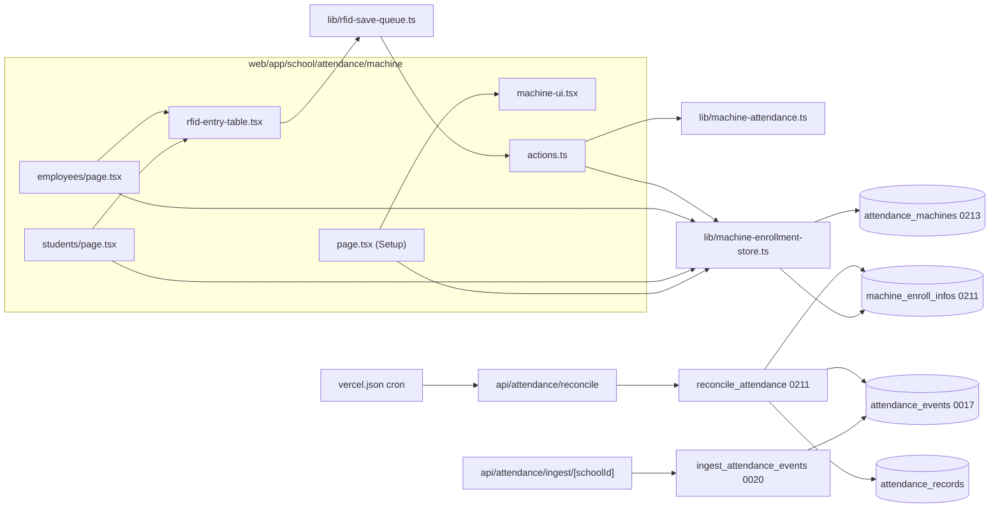
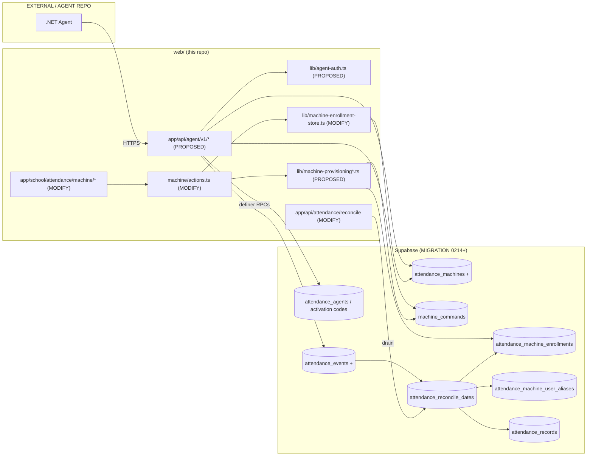
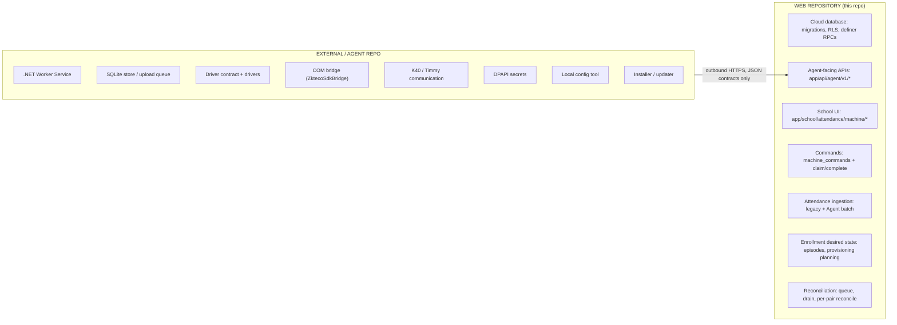

# Machine Attendance — Wayfinder Map

**What this is:** a repository map that answers *"where exactly in this repository will each part of the approved machine-attendance architecture be implemented?"*

**Architecture source of truth:** [`docs/machine_attendance_device_agent_implementation_plan.md`](machine_attendance_device_agent_implementation_plan.md) (Architecture Baseline v1.1, frozen). v1.1 changes only the hardware execution order: the TIMY TM52GPRS is the first active target and the ZKTeco K40 follows when a bench unit exists. No mapped web path changed. Section references like "Baseline §15.2.1" point there. This map does not change any decision in it. Where the repository disagrees with the baseline, the conflict is labelled **CONFLICT**.

**Mapped at:** branch `staging`, commit `4e6f955`. Planning only. No production code, migration or Agent code was created.

**Status (2026-10-06, status update only):**

- Phase 1A (TM52GPRS): **ACCEPTED BY OWNER**.
- Phase 2 (driver contract): **ACCEPTED**, in the separate `attendance-agent` repository.
- OD-1: **RESOLVED** (direct device integration through the Windows Agent approved).
- OD-13: **RESOLVED** (separate `attendance-agent` repository).
- OD-17: **OPEN** (TIMY SDK licence needed before the TIMY production runtime ships).
- Phase 3 first slice (reconciliation / School-local day) in progress.

The mapping below is unchanged.

### Labels

| Label | Meaning |
|---|---|
| **EXISTING** | Path, symbol or object verified in the repository at the commit above |
| **MODIFY** | Existing path that a future phase changes |
| **PROPOSED** | New path or object. The name is a suggestion unless repository convention fixes it |
| **TEST** | Test file (existing or proposed) |
| **MIGRATION** | Supabase migration under `web/supabase/migrations/` |
| **BLOCKER** | Must be resolved before the named phase |
| **CONFLICT** | Repository reality differs from a convention or from the baseline |
| **EXTERNAL / AGENT REPO** | Lives in the future Windows Agent repository, not here |

All web paths below are relative to the repository root. The web app lives under `web/`.

---

## 1. Repository orientation

```
docs/
  machine_attendance_device_agent_implementation_plan.md   EXISTING  baseline v1.1
  adr/0001-dual-path-attendance-machine-ingest.md           EXISTING  ingest ADR
  adr/0008-layered-ddd-engines.md                           EXISTING  layering rules
  adr/0017, 0020                                            EXISTING  grants / screen registry
  adr/0024-class-offering-archive-not-delete-once-used.md   EXISTING  precedent for device archive
  adr/0030-office-time-retired-not-replaced.md              EXISTING  why employees show 'present'
  PRD.md §3, ARCHITECTURE.md §5                              EXISTING  non-goal to supersede (OD-1)
CONTEXT.md                                                  EXISTING  glossary (Machine ID, Machine Enrollment, Attendance Machine, Attendance Event)
web/
  AGENTS.md                                                 EXISTING  layering + done-bar commands
  vercel.json                                               EXISTING  crons
  proxy.ts                                                  EXISTING  route gate / CSP
  app/school/attendance/**                                  EXISTING  Attendance screens
  app/api/attendance/{ingest/[schoolId],reconcile}/route.ts EXISTING  hardware + cron entry points
  lib/                                                      EXISTING  domain + store helpers
  lib/engines/{audit,events,...}                            EXISTING  platform engines
  supabase/migrations/0001…0213                             EXISTING  schema history
  tests/{unit,integration,helpers}                          EXISTING  vitest suites
```

**CONFLICT (convention vs. reality):** `web/AGENTS.md` says domain modules live in `web/modules/<domain>/{domain,application,infrastructure}`, but `web/modules/` does not exist. Machine attendance today lives in `web/lib/machine-attendance.ts` (pure domain) and `web/lib/machine-enrollment-store.ts` (persistence). Recommendation: keep new machine-attendance code next to those files in `web/lib/` (the established local pattern) unless the owner starts the `modules/` migration as a separate decision. All PROPOSED paths below follow `web/lib/`.

---

## 2. Existing system map

### 2.1 Attendance navigation

```
Attendance navigation
  ↳ web/lib/attendance-nav.ts                                   EXISTING
      ↳ ATTENDANCE_STUDENT_TABS / ATTENDANCE_EMPLOYEE_TABS
      ↳ ATTENDANCE_MACHINE_TABS                                 Machine Setup / Student RFID / Employee Enrollment
      ↳ ATTENDANCE_GROUPS (id 'machine', labelKey 'attendance.groupMachine')
      ↳ attendanceGroupHref(), attendanceGroupTabHrefs()
  ↳ web/lib/school-nav.ts                                       EXISTING  sidebar entry using attendanceGroupHref('machine')
  ↳ web/app/school/attendance/attendance-tabs.tsx               EXISTING  AttendanceTabs (in-page tab bar)
  ↳ web/lib/auth/screens.ts                                     EXISTING  screen 'attendance' (gate: 'grant')
  ↳ web/proxy.ts                                                EXISTING  canOpenScreen / screenKeyForPath gate
  ↳ TEST web/tests/unit/feature-nav.test.ts, back-nav.test.ts   EXISTING
```

### 2.2 Machine Setup UI

```
Machine Setup  (/school/attendance/machine)
  ↳ web/app/school/attendance/machine/page.tsx                  EXISTING
      ↳ getSchoolContext()           web/lib/school/context.ts
      ↳ listMachines()               web/lib/machine-enrollment-store.ts
      ↳ <MachineSetup>               ./machine-setup.tsx
      ↳ <DownloadServiceButton>      ./machine-ui.tsx           shows "Upcoming"
      ↳ <MachinePageHeader>          ./page-header.tsx
  ↳ web/app/school/attendance/machine/machine-setup.tsx         EXISTING  MachineSetup form, errorMessage()
  ↳ web/app/school/attendance/machine/actions.ts                EXISTING
      ↳ saveMachineAction(id, formData)  → parseMachineInput() → createMachine()/updateMachine()
      ↳ deleteMachineAction(id)          → deleteMachine()       (hard delete today)
  ↳ web/lib/machine-attendance.ts                               EXISTING  MACHINE_TYPES, parseMachineInput, machineShiftChoice
  ↳ table attendance_machines (MIGRATION 0213)
```

### 2.3 Student RFID Enrollment UI

```
Student RFID Enrollment  (/school/attendance/machine/students)
  ↳ web/app/school/attendance/machine/students/page.tsx         EXISTING
      ↳ schoolRoster()               web/lib/school/roster-source.ts  (Academic Year / Shift narrowed roster)
      ↳ enrollmentInfo(), listMachines()   web/lib/machine-enrollment-store.ts
      ↳ <RfidEntryTable>             ../rfid-entry-table.tsx
      ↳ <EnrollButton kind="student">  ../machine-ui.tsx         picker → "Upcoming"
  ↳ web/app/school/attendance/machine/rfid-entry-table.tsx      EXISTING  RfidEntryTable, RowStatus
  ↳ web/app/school/attendance/machine/rfid-queue-client.ts      EXISTING  rfidQueue() singleton
  ↳ web/lib/rfid-save-queue.ts                                  EXISTING  createRfidSaveQueue (coalesce, retry, snapshot)
```

### 2.4 Employee Enrollment UI

```
Employee Enrollment  (/school/attendance/machine/employees)
  ↳ web/app/school/attendance/machine/employees/page.tsx        EXISTING
      ↳ employee_card view (unique_id added in 0213)
      ↳ employeeShifts(), enrollmentInfo(), listMachines()   web/lib/machine-enrollment-store.ts
      ↳ filterEmployeesByShift(), NO_SHIFT_FILTER            web/lib/machine-attendance.ts
      ↳ <RfidEntryTable>, <EnrollButton kind="employee">
```

### 2.5 RFID saving

```
RFID save
  ↳ RfidEntryTable (Enter on a row)
  ↳ rfidQueue() → createRfidSaveQueue()                         web/lib/rfid-save-queue.ts
  ↳ saveRfidEntriesAction(entries)                              web/app/school/attendance/machine/actions.ts  (≤50 per batch)
  ↳ saveRfidEntries() → saveOne()                               web/lib/machine-enrollment-store.ts
      ↳ upsert machine_enroll_infos on unique_id
      ↳ card null: student → DELETE row; employee → rfid_card_number = null
      ↳ 23505 on machine_enroll_infos_rfid_card_number_key → 'duplicate' + cardHolderName()
  ↳ parseRfid()                                                 web/lib/machine-attendance.ts
```

### 2.6 `machine_enroll_infos` / Machine ID

```
machine_enroll_infos                         MIGRATION 0211 (create, backfill, RLS, reconcile body), 0212 (retire rfid_cards)
  ↳ students.unique_id / employees.unique_id   bigint, shared sequence machine_unique_id_seq, triggers
      assign_student_unique_id / assign_employee_unique_id / *_unique_id_immutable
  ↳ RLS "school members manage machine enrollments" → app_current_school_id() + app_module_granted('attendance')
  ↳ readers: enrollmentInfo(), cardHolderName(), reconcile_attendance (card join)
  ↳ TEST web/tests/integration/machine-enroll-infos.test.ts, web/tests/helpers/machine-enroll.ts
```

### 2.7 `attendance_machines`

```
attendance_machines                          MIGRATION 0213
  ↳ columns: machine_type (zkteco|timmy), model, serial_number (unique per School), location, shift_scope, shift, note
  ↳ RLS: School + attendance grant; super admin all
  ↳ store: listMachines / createMachine / updateMachine / deleteMachine (MACHINE_COLUMNS)  web/lib/machine-enrollment-store.ts
  ↳ TEST web/tests/integration/machine-attendance.test.ts ('machine setup')
```

### 2.8 Current attendance ingest

```
Device push / bridge batch
  ↳ POST web/app/api/attendance/ingest/[schoolId]/route.ts      EXISTING  header x-ingest-token, UUID checks, anon client
  ↳ RPC ingest_attendance_events(school, token, events)         MIGRATION 0017, redefined 0020 (safe_timestamptz)
      ↳ checks schools.ingest_token (0017)
      ↳ inserts attendance_events(card_number, tapped_at)       no dedupe, no device, no machine user id
  ↳ TEST web/tests/integration/attendance-ingest-route.test.ts, rfid-attendance.test.ts
```

### 2.9 `reconcile_attendance` and cron

```
Vercel cron "30 12 * * *"                                       web/vercel.json
  ↳ GET web/app/api/attendance/reconcile/route.ts               EXISTING
      ↳ own CRON_SECRET check; date = ?date or UTC today
      ↳ RPC reconcile_attendance(job_secret, target_date)       MIGRATION 0017 → 0018 (keep unresolved) → 0019 → 0020 → 0047 (automatic_attendance_enabled) → … 0208/0210 (grace) → 0211 (current body: card join via machine_enroll_infos)
          ↳ reads attendance_events, machine_enroll_infos, standing_grace_rules, ad_hoc_grace_exemptions, office_times
          ↳ upserts attendance_records; marks resolved events processed
  ↳ web/lib/cron/job.ts                                          EXISTING  isCronAuthorized, cronClient, reconcileSecret, cronTargetDate
      (used by events/drain, sms/absence, subscription sweeps — NOT by the reconcile route)
  ↳ TS mirrors: web/lib/attendance.ts (collapseTaps, employeeStatus, resolveEmployeeDisplayStatus), web/lib/grace.ts
  ↳ toggle: setAutomaticAttendance() web/app/school/attendance/actions.ts → RPC set_automatic_attendance_enabled (0047)
           AutomaticAttendanceToggle web/app/school/attendance/card-controls.tsx (no importer found under app/)
  ↳ monitor: web/app/super-admin/attendance-job-monitor/page.tsx counts unprocessed attendance_events
             web/lib/super-admin/job-monitor.ts, TEST web/tests/integration/job-monitor.test.ts
```

**CONFLICT (minor):** the reconcile route does its own cron auth and client set-up instead of `web/lib/cron/job.ts`. Aligning it is in scope for Phase 3 when the route changes anyway (Baseline §21.1).

### 2.10 `attendance_records` consumers

```
attendance_records                           MIGRATION 0017, 0046 (manual), 0170 (marked_by/marked_at)
  ↳ writers: reconcile_attendance; saveStudentAttendance()  web/app/school/attendance/manual-actions.ts
  ↳ readers: web/app/school/attendance/book/page.tsx
             web/app/school/attendance/employee/page.tsx
             web/app/school/attendance/student-log/[studentId]/page.tsx
             web/app/school/page.tsx (dashboard)
             web/app/student/attendance/page.tsx
             web/lib/progress-report-data.ts, web/lib/school/roster-source.ts, web/lib/school/roster.ts,
             web/lib/attendance-manual.ts, web/lib/student/attendance.ts
```

Baseline rule: the Agent never writes `attendance_records`. None of these readers change; only how rows arrive changes.

### 2.11 School / tenant / auth / RLS

```
Tenant + auth
  ↳ public.schools; app_current_school_id(), app_current_role()        MIGRATION 0001, 0131
  ↳ app_module_granted(p_module)                                       MIGRATION 0136
  ↳ web/lib/school/context.ts      getSchoolContext()  (configuredShifts etc.)
  ↳ web/lib/supabase/server.ts     createClient()      (caller's session client; RLS decides)
  ↳ web/lib/auth/screens.ts, web/lib/auth/routing.ts, web/proxy.ts
  ↳ no service-role key anywhere in web/ — privileged writes = SECURITY DEFINER RPC + secret/token
  ↳ TEST web/tests/helpers/{auth,school-fixture,staff,seed}.ts
```

### 2.12 Audit and domain events

```
Audit
  ↳ web/lib/engines/audit/engine.ts   recordAudit(client, entry, {dedupeKey, jobSecret}), createAuditEngine()
  ↳ RPC record_audit, table audit_log                                  MIGRATION 0078
  ↳ TEST web/tests/integration/audit-log.test.ts
Domain events
  ↳ web/lib/engines/events/{engine,consumers,registry,index}.ts        createEventEngine(), systemEventEngine()
  ↳ table domain_events                                                MIGRATION 0077
  ↳ cron GET web/app/api/events/drain/route.ts
  ↳ TEST web/tests/integration/domain-events.test.ts
```

### 2.13 Existing dependency diagram



---

## 3. Dependency chains (real names)

```
Machine Setup
  → web/app/school/attendance/machine/page.tsx + machine-setup.tsx
  → saveMachineAction / deleteMachineAction            (machine/actions.ts)
  → parseMachineInput                                  (lib/machine-attendance.ts)
  → createMachine / updateMachine / deleteMachine      (lib/machine-enrollment-store.ts)
  → createClient() session client → RLS
  → attendance_machines (0213)
  → TEST tests/unit/machine-attendance.test.ts, tests/unit/machine-ui.test.tsx, tests/integration/machine-attendance.test.ts

Student RFID Enrollment
  → machine/students/page.tsx → schoolRoster (lib/school/roster-source.ts)
  → RfidEntryTable → rfidQueue → createRfidSaveQueue (lib/rfid-save-queue.ts)
  → saveRfidEntriesAction (machine/actions.ts)
  → saveRfidEntries → saveOne (lib/machine-enrollment-store.ts)
  → machine_enroll_infos (0211)
  → reconcile_attendance card join (0211 §7) → attendance_records
  → TEST tests/unit/rfid-save-queue.test.ts, tests/integration/machine-attendance.test.ts ('student RFID')

Employee Enrollment
  → machine/employees/page.tsx → employee_card (0136, 0213) + employeeShifts
  → same RFID chain as above (employee clear keeps the row)

Device tap (legacy path)
  → POST api/attendance/ingest/[schoolId]/route.ts
  → ingest_attendance_events (0020) → attendance_events (0017)
  → cron → api/attendance/reconcile/route.ts → reconcile_attendance (0211) → attendance_records
  → TEST tests/integration/attendance-ingest-route.test.ts, tests/integration/rfid-attendance.test.ts

Automatic attendance switch
  → setAutomaticAttendance (app/school/attendance/actions.ts)
  → set_automatic_attendance_enabled (0047) → schools.automatic_attendance_enabled
  → read by reconcile_attendance
  → TEST tests/integration/attendance-employee-book.test.ts
```

---

## 4. Target change map

One block per approved area. Phase numbers are the baseline's §28 phases.

### 4.1 `attendance_agents` + activation codes + Agent authentication (Phase 3 schema, Phase 6 wiring)

```
MIGRATION  PROPOSED web/supabase/migrations/02xx_attendance_agents.sql
             tables attendance_agents (install_id, credential_prefix immutable, credential_hash,
                    previous_credential_hash, previous_valid_until, activation_code_id, status…)
                    attendance_agent_activation_codes (code_hash, expires_at, consumed_at…)
             RPCs   activate_attendance_agent, rotate_agent_credential, agent_heartbeat
             view   non-secret agent columns for School members
PROPOSED   web/lib/agent-auth.ts            parse "Bearer agt_<prefix>_<secret>" (verification stays in SQL)
PROPOSED   web/app/api/agent/v1/activate/route.ts
PROPOSED   web/app/api/agent/v1/credential/rotate/route.ts
PROPOSED   web/app/api/agent/v1/heartbeat/route.ts
MODIFY     web/app/school/attendance/machine/actions.ts  + createActivationCodeAction, revokeAgentAction
MODIFY     web/lib/machine-enrollment-store.ts (or PROPOSED web/lib/attendance-agent-store.ts) agent list/revoke
USES       web/lib/engines/audit/engine.ts (activation, rotation, revocation)
TEST       PROPOSED web/tests/integration/agent-activation.test.ts (retry-safe activation, verifier mismatch,
           code reuse, no credential in response, rotation overlap, revoke)
BLOCKER    G10 Vercel firewall for /api/agent/* (#674) before production use
```

### 4.2 `attendance_machines` extension + device health + archive/restore/replace (Phase 3, 6, 11)

```
MIGRATION  PROPOSED 02xx_attendance_machines_agent_fields.sql
             + agent_id, host, port, driver_key, time_zone, credential_configured, credential_reported_at,
               firmware/platform/device_name/mac, pin_width, capabilities, probed_serial, serial_verified_at
               (+ immutability trigger), enabled, archived_at, archived_by, replaces_machine_id
             + optional attendance_machine_health
             + RPCs archive_attendance_machine, restore_attendance_machine, replace_attendance_machine,
               report_device_probe, delete-if-never-used
MODIFY     web/lib/machine-attendance.ts     MachineInput / parseMachineInput (+host, port, time zone, driver, agent)
MODIFY     web/lib/machine-enrollment-store.ts  MACHINE_COLUMNS, createMachine, updateMachine,
                                                deleteMachine → refuse used rows; + archive/restore/replace
MODIFY     web/app/school/attendance/machine/actions.ts  saveMachineAction, deleteMachineAction (+ disable,
                                                archive, restore, replace actions)
MODIFY     web/app/school/attendance/machine/machine-setup.tsx, machine-ui.tsx (MachineIdentity, status, actions)
PROPOSED   web/app/api/agent/v1/devices/[id]/probe-result/route.ts
PROPOSED   web/app/api/agent/v1/devices/[id]/credential-status/route.ts
TEST       MODIFY tests/integration/machine-attendance.test.ts ('machine setup' — delete now restricted)
           MODIFY tests/unit/machine-attendance.test.ts (parseMachineInput fields)
           PROPOSED tests/integration/attendance-machine-lifecycle.test.ts (archive/restore/replace, serial lock)
```

### 4.3 School time zone (Phase 3)

```
MIGRATION  PROPOSED schools.time_zone text not null default 'Asia/Dhaka'
MODIFY     web/lib/school-time.ts   SCHOOL_TIME_ZONE stays the default/fallback; schoolToday() unchanged for portal use
TEST       PROPOSED cases inside the reconcile-queue / ingest tests (05:30 and 23:59 Asia/Dhaka punches)
```

### 4.4 `attendance_events` extension (Phase 3)

```
MIGRATION  PROPOSED 02xx_attendance_events_machine_columns.sql
             + machine_id, machine_user_id text, device_serial, agent_id, source, event_key, device_local_time,
               device_time_zone, attendance_date, verify_mode, punch_state, raw
             card_number nullable (still required for source='ingest_token'); source-conditional checks
             unique (school_id, event_key) where event_key is not null; index (school_id, attendance_date) where not processed
             backfill attendance_date + source for existing rows
             replace ingest_attendance_events (0020 body) → also attendance_date + enqueue pairs
MODIFY     web/app/api/attendance/ingest/[schoolId]/route.ts   (response shape unchanged; behaviour via RPC)
MODIFY     web/app/super-admin/attendance-job-monitor/page.tsx (optional: split pending taps by source / unknown users)
TEST       MODIFY tests/integration/attendance-ingest-route.test.ts (duplicate expectation changes only for Agent path;
           legacy path keeps inserting duplicates unless the baseline adds a legacy key — it does not)
```

### 4.5 `attendance_reconcile_dates` + reconciliation (Phase 3, 8)

```
MIGRATION  PROPOSED 02xx_attendance_reconcile_queue.sql
             table attendance_reconcile_dates (pk school_id, attendance_date; status, requested_at, claimed_at…)
             replace reconcile_attendance → per-pair (job_secret, school, attendance_date)
               resolution: agent → attendance_machine_enrollments episode → person; else same-machine alias;
                           ingest_token → card join (unchanged)
             drain_attendance_reconcile_queue(job_secret, max_pairs)
             enqueue on set_automatic_attendance_enabled re-enable (0047 function replaced)
MODIFY     web/app/api/attendance/reconcile/route.ts  drain queue; ?date[&school] only enqueues;
                                                      move to lib/cron/job.ts helpers
MODIFY     web/vercel.json   schedule may stay or run more often (baseline §21.1)
MODIFY     web/lib/attendance.ts  only comments that say "Devices must send UTC timestamps" (doc accuracy)
TEST       MODIFY tests/integration/rfid-attendance.test.ts (reconcile now via enqueue + drain)
           MODIFY tests/integration/attendance-employee-book.test.ts, ad-hoc-grace-exemptions.test.ts,
                  absent-working-days-range.test.ts (they call reconcile); helper tests/helpers/machine-enroll.ts
           PROPOSED tests/integration/attendance-reconcile-queue.test.ts
```

### 4.6 `attendance_machine_enrollments` (episodes) + provisioning (Phase 3 schema, Phase 9/10 flows)

```
MIGRATION  PROPOSED 02xx_attendance_machine_enrollments.sql
             episode table, partial unique open-episode index, btree_gist exclusion (or trigger), immutability trigger
PROPOSED   web/lib/machine-provisioning.ts         pure planning: who to (re)provision/remove per device (episode rules)
PROPOSED   web/lib/machine-provisioning-store.ts   bump open episode / insert new episode / enqueue commands
MODIFY     web/lib/machine-enrollment-store.ts      saveOne(): clearing a student card no longer just deletes —
                                                    queues removal on devices (OD-6 decides final behaviour)
MODIFY     web/app/school/attendance/machine/actions.ts   + enrollPeopleAction, retryEnrollmentAction, removeEnrollmentAction
MODIFY     web/app/school/attendance/machine/machine-ui.tsx   EnrollButton: picker → real enqueue, no "Upcoming"
MODIFY     web/app/school/attendance/machine/rfid-entry-table.tsx  per-device status chips
MODIFY     web/app/school/attendance/machine/students/page.tsx, employees/page.tsx  load episode status
TEST       PROPOSED tests/unit/machine-provisioning.test.ts
           PROPOSED tests/integration/machine-enrollment-episodes.test.ts
           MODIFY tests/integration/machine-enroll-infos.test.ts (delete-path change)
           MODIFY tests/unit/machine-ui.test.tsx ('upcoming placeholders' / "never calls a server action" must be rewritten)
```

### 4.7 `machine_commands` + command APIs (Phase 3 schema, Phase 6)

```
MIGRATION  PROPOSED 02xx_machine_commands.sql   table + claim_machine_commands, complete_machine_command
PROPOSED   web/app/api/agent/v1/commands/claim/route.ts
PROPOSED   web/app/api/agent/v1/commands/[id]/result/route.ts
PROPOSED   web/app/api/agent/v1/commands/[id]/progress/route.ts
PROPOSED   web/app/api/agent/v1/config/route.ts   (no device secrets)
MODIFY     machine/actions.ts  testConnectionAction (TEST_CONNECTION command)
TEST       PROPOSED tests/integration/machine-commands.test.ts (lease, stale claim, idempotency key)
```

### 4.8 Agent attendance batch ingest (Phase 8)

```
MIGRATION  PROPOSED ingest_agent_attendance_events(credential, machine_id, events) — server-side UTC from
           device_local_time + attendance_machines.time_zone; TIME_MISMATCH; event_key recompute; enqueue pairs
PROPOSED   web/app/api/agent/v1/attendance/batch/route.ts
TEST       PROPOSED tests/integration/agent-attendance-batch.test.ts
```

### 4.9 `attendance_machine_user_aliases` + legacy-device import (Phase 11)

```
MIGRATION  PROPOSED 02xx_attendance_machine_user_aliases.sql + upsert/delete alias RPCs, report_device_users
PROPOSED   web/app/api/agent/v1/devices/[id]/users-snapshot/route.ts
PROPOSED   web/app/school/attendance/machine/devices/[id]/reconcile/page.tsx   (diff + decisions + alias editor)
PROPOSED   web/lib/machine-reconciliation.ts   pure diff of device snapshot vs desired state
MODIFY     machine/actions.ts  applyReconciliationDecisionsAction, alias actions
TEST       PROPOSED tests/unit/machine-reconciliation.test.ts, tests/integration/machine-user-aliases.test.ts
```

### 4.10 Agent download / activation UI (Phase 6, hosting Phase 15)

```
MODIFY     web/app/school/attendance/machine/machine-ui.tsx   DownloadServiceButton → real link + activation code panel
MODIFY     web/app/school/attendance/machine/page.tsx          Agent status panel
MODIFY     web/lib/i18n.ts   remove machine.serviceUpcomingBody / studentsUpcomingBody / employeesUpcomingBody;
                             add agent, device-status, lifecycle, episode strings (bn + en)
EXTERNAL / AGENT REPO  installer binary; hosting location is OD-15
```

### 4.11 Docs / glossary (Phase 3)

```
MODIFY     CONTEXT.md   Attendance Machine, Machine Enrollment, Attendance Event + new terms (baseline §23)
PROPOSED   docs/adr/0033-windows-attendance-agent-with-device-drivers.md   (next free ADR number is 0033)
MODIFY     docs/PRD.md §3, docs/ARCHITECTURE.md §5   after OD-1
```

### 4.12 Target dependency diagram



---

## 5. Phase map

### Phase 0 — Repository analysis
```
Existing files touched   none (docs only)
New files                docs/machine_attendance_device_agent_implementation_plan.md (done), this file
Exit                     owner reviews; only decisions needed by the next active phase must be answered (baseline Phase 0):
                         Phase 2 needs accepted Phase 1A + OD-1 + OD-13; OD-2/OD-3/OD-4 gate the ZKTeco/K40 path
                         (Phase 1B / 13); OD-17 before the TIMY runtime/installer ships; other ODs gated by their phases
```

### Phase 1A — TIMY TM52GPRS hardware / TIMY SDK POC (current active Phase 1)
```
Existing files touched   none
New files                EXTERNAL / POC workspace (outside this repo): disposable harness against the official TIMY SDK/API
                         (names PROPOSED until the SDK package is known)
Database / APIs / UI     none
Tests                    baseline §26 + §25 list adapted to the TM52GPRS; read-only first, writes only after owner approval
Done so far              classic ZK (pyzk) + ZKTeco Standalone SDK read-only probes: FAIL on the tested unit/config (baseline §10.1)
Depends on               TM52GPRS bench unit (available); official TIMY SDK/API package (to obtain); OD-17 before shipping
Acceptance gate          minimum evidence from the official TIMY mechanism before Phase 2 may be declared cleared:
                         1 connect + disconnect
                         2 device identity (serial / firmware where exposed)
                         3 enumerate users; identify the stable machine-user identifier
                         4 attendance records with machine-user identity + device-local event time
                         5 device time
                         6 attendance re-read: are record identity/fields stable enough for deterministic dedup?
                         7 if user writes exist: reserved disposable user create, read back, update, delete, verify deletion
                         8 if this unit has RFID: RFID read/write + physical card punch
                         Not required: remote fingerprint enrollment (else record CanStartFingerprintEnrollment=false /
                         NotSupported). Fingerprint attendance and remote enrollment are separate capabilities.
                         Connect + model info alone is NOT sufficient.
Exit                     accepted TM52GPRS POC report meeting the gate; adapter placement (in-process vs bridge) decided
```

### Phase 1B — ZKTeco K40 hardware / SDK POC (when a K40 bench unit is available)
```
Existing files touched   none
New files                EXTERNAL / AGENT REPO (or throwaway tools/ folder per owner): SDK x86 harness, pyzk scripts (already prepared)
Database / APIs / UI     none
Tests                    baseline §25 bench list (unchanged)
Depends on               OD-1, OD-2, OD-3
Exit                     K40 POC report; primary/fallback ZKTeco driver confirmed; compatibility matrix row
Blocks                   K40 production driver (Phase 13) only — not Phase 2 once Phase 1A is accepted
```

### Phase 2 — Normalized driver contract
```
Existing files touched   none in this repo
New files                EXTERNAL / AGENT REPO: Agent.Drivers.Abstractions, fake driver, bridge JSON-RPC spec
Web impact               payload shapes inform Phase 3 RPC signatures
Depends on               at least one accepted real-device POC (currently Phase 1A, TM52GPRS — not Phase 1B), OD-1, OD-13 (repo location)
Exit                     contract + fake driver pass contract tests
```

### Phase 3 — Database / domain migrations (first web phase)
```
Existing files touched   MODIFY web/app/api/attendance/reconcile/route.ts
                         MODIFY web/lib/machine-enrollment-store.ts (deleteMachine restrict; archive/restore)
                         MODIFY web/app/school/attendance/machine/actions.ts (deleteMachineAction → archive when used)
                         MODIFY web/lib/school-time.ts (fallback role only), CONTEXT.md
New files                MIGRATION 0214… (agents, activation codes, machines extension, schools.time_zone,
                         attendance_events extension, enrollment episodes, commands, reconcile queue,
                         per-pair reconcile + drain, replaced ingest_attendance_events)
                         PROPOSED docs/adr/0033-…md
                         PROPOSED web/lib/machine-agent-*.ts domain helpers
Database objects         baseline §21 (all except aliases, which are Phase 11)
APIs                     none new; reconcile route changes to drain
UI                       delete → archive wording only
Tests                    MODIFY rfid-attendance, attendance-ingest-route, machine-enroll-infos, machine-attendance,
                         attendance-employee-book, ad-hoc-grace-exemptions, absent-working-days-range, helpers/machine-enroll.ts
                         PROPOSED attendance-reconcile-queue, machine-enrollment-episodes, attendance-machine-lifecycle
Depends on               Phase 2 payload shapes; OD-1 governance
Exit                     expand-only migrations on staging (shared DB with main); all tests green
```

### Phase 4 — .NET Worker Service Agent core
```
Existing files touched   none
New files                EXTERNAL / AGENT REPO: Agent.Service, Agent.Core, Agent.Cloud, Agent.Secrets, local config tool
Depends on               Phase 2
Exit                     Agent runs against fake driver + fake cloud, restart-safe
```

### Phase 5 — First production hardware driver
```
Existing files touched   none
New files                EXTERNAL / AGENT REPO: PROPOSED timmy-sdk-<family> driver/adapter — managed in-process, or an
                         isolated bridge behind BridgeDriverProxy, as decided in Phase 1A from the SDK's actual runtime,
                         bitness, dependencies and stability (SDK family/DLL/API/bridge names unknown until inspected)
Current candidate        TIMY TM52GPRS via the official TIMY SDK/API driver/adapter, if Phase 1A passes
Depends on               Phase 1A, Phases 2, 4; OD-17 before the installer ships
Exit                     Phase 1A test list passes through the production driver
Later (Phase 13)         K40 driver: ZktecoSdkBridge (x86), BridgeDriverProxy, optional ZkProtocolDriver; §25 passes
```

### Phase 6 — Agent activation and device setup
```
Existing files touched   MODIFY machine/page.tsx, machine-setup.tsx, machine-ui.tsx, actions.ts
                         MODIFY web/lib/machine-attendance.ts, web/lib/machine-enrollment-store.ts, web/lib/i18n.ts
New files                PROPOSED web/app/api/agent/v1/{activate,credential/rotate,heartbeat,config,
                         commands/claim,commands/[id]/result,commands/[id]/progress,
                         devices/[id]/probe-result,devices/[id]/credential-status}/route.ts
                         PROPOSED web/lib/agent-auth.ts
Database objects         Phase 3 objects (no new schema expected)
UI                       activation code panel, Agent status, device form (host/port/time zone/driver/Agent,
                         credential_configured indicator), lifecycle actions, Test Connection
Tests                    PROPOSED agent-activation.test.ts, machine-commands.test.ts; MODIFY machine-ui.test.tsx
Depends on               Phase 3, Phase 4/5, BLOCKER G10 (Vercel firewall)
Exit                     Agent activates, first supported device added, Test Connection shows identity/capabilities
```

### Phase 7 — Attendance download + SQLite
```
Existing files touched   none
New files                EXTERNAL / AGENT REPO only
Depends on               Phases 5, 6 (the first production driver, whichever vendor)
Exit                     offline punches upload exactly once with device local time
```

### Phase 8 — Cloud attendance ingestion
```
Existing files touched   MODIFY web/app/api/attendance/reconcile/route.ts (if not finished in Phase 3)
New files                PROPOSED web/app/api/agent/v1/attendance/batch/route.ts
Database objects         ingest_agent_attendance_events (Phase 3 migration or a follow-up MIGRATION)
Tests                    PROPOSED agent-attendance-batch.test.ts; extend attendance-reconcile-queue.test.ts
Depends on               Phase 3, Phase 7
Exit                     first supported device's punches land in attendance_records on the School-local day via the queue drain
```

### Phase 9 — Student RFID enrollment
```
Existing files touched   MODIFY machine/students/page.tsx, machine-ui.tsx (EnrollButton), rfid-entry-table.tsx,
                         machine/actions.ts, web/lib/machine-enrollment-store.ts (clear-card path)
New files                PROPOSED web/lib/machine-provisioning.ts, web/lib/machine-provisioning-store.ts
Tests                    PROPOSED machine-provisioning.test.ts (unit); extend machine-enrollment-episodes.test.ts
Depends on               Phases 3, 6, OD-6
Exit                     1000 students provisioned to the first production-supported bench device and verified by tap
```

### Phase 10 — Employee enrollment
```
Existing files touched   MODIFY machine/employees/page.tsx (reuse Phase 9 engine)
New files                none expected
Tests                    extend Phase 9 tests with employee cases (card-less employees)
Depends on               Phase 9, OD-7
Exit                     same as Phase 9 for employees
```

### Phase 11 — Reconciliation, import, recovery, replacement
```
Existing files touched   MODIFY machine/actions.ts, machine-ui.tsx, web/lib/i18n.ts
New files                MIGRATION aliases + report_device_users; PROPOSED users-snapshot route,
                         machine/devices/[id]/reconcile/page.tsx, web/lib/machine-reconciliation.ts
Tests                    PROPOSED machine-reconciliation.test.ts, machine-user-aliases.test.ts;
                         extend attendance-machine-lifecycle.test.ts (replace/restore episodes)
Depends on               Phases 3, 6, 8; OD-10
Exit                     pre-populated device (first supported device; K40 when available) imported without creating LMS people
```

### Phase 12 — Fingerprint enrollment (capability-gated, vendor-neutral)
```
Existing files touched   MODIFY machine/employees/page.tsx (and students if allowed), machine-ui.tsx, actions.ts
New files                none in web beyond command type handling; EXTERNAL / AGENT REPO driver support
Depends on               Phase 10; first implementation on the TM52GPRS only if the TIMY SDK proves remote enrollment (Phase 1A);
                         K40 fingerprint is a separate later validation (Phase 1B + Phase 13)
Exit                     capability-gated remote enrollment works on the first device that proves it; no templates leave the device
```

### Phase 13 — ZKTeco K40 production driver, then further ZKTeco models
```
Existing files touched   none expected in web (architecture acceptance test: no cloud/DB change)
New files                EXTERNAL / AGENT REPO: K40 driver (ZktecoSdkBridge (x86), BridgeDriverProxy, optional ZkProtocolDriver),
                         catalog entries; docs compatibility matrix update
Depends on               accepted Phase 1B, OD-2, OD-3, OD-4
Exit                     §25 passes on the K40; matrix rows; Agent release
```

### Phase 14 — Additional TIMY models
```
Existing files touched   none expected in web (architecture acceptance test: no cloud/DB change)
New files                EXTERNAL / AGENT REPO: catalog entries; adapter reused or new timmy-* family (placement per isolation rule)
Depends on               the selected additional TIMY model(s), the relevant OD-14 choice, model-specific SDK/licence evidence
Exit                     §26 complete per model; matrix rows; Agent release
```

### Phase 15 — Installer, update, hardening
```
Existing files touched   MODIFY machine-ui.tsx (download link target), possibly web/vercel.json if a manifest route is added
New files                EXTERNAL / AGENT REPO installer, signing; PROPOSED update-manifest route only if hosted here (OD-15)
Exit                     signed install/upgrade/rollback on Windows 10/11
```

---

## 6. Hotspot map

| Hotspot | Why it is risky | Phases |
|---|---|---|
| `web/app/school/attendance/machine/actions.ts` | Every admin operation lands here (device CRUD, lifecycle, activation codes, enrollment, retry, removal, reconciliation decisions). Easy to grow into business logic, which `web/AGENTS.md` forbids in actions | 3, 6, 9, 10, 11, 12 |
| `web/lib/machine-enrollment-store.ts` | Holds both device and RFID persistence; `saveOne()` delete semantics change (OD-6); `deleteMachine` changes to archive; `MACHINE_COLUMNS` must never select secrets. Candidate to split (device store vs. enrollment store) when touched | 3, 6, 9, 10, 11 |
| `reconcile_attendance` (current body in MIGRATION 0211) | High-value function shared with grace logic (0208/0210) and absence SMS; becomes per-pair, gains episode/alias resolution and a new day boundary that also changes the legacy card path | 3, 8, 11 |
| `attendance_events` (0017) + `ingest_attendance_events` (0020) | Live table with existing rows; nullable card, backfill of `attendance_date`, new unique index; the legacy route must keep working throughout (shared staging/main DB) | 3, 8 |
| `web/app/api/attendance/reconcile/route.ts` + `web/vercel.json` | Changes from one global date to queue drain; cron auth duplicated vs. `web/lib/cron/job.ts` | 3, 8 |
| `web/app/school/attendance/machine/machine-ui.tsx` | `EnrollButton`, `DownloadServiceButton`, `UpcomingNotice` all switch from placeholders to live flows; `tests/unit/machine-ui.test.tsx` asserts they never call an action | 6, 9, 10, 11, 12, 15 |
| `web/lib/i18n.ts` | Single large bilingual dictionary (49 `machine.*` keys today); every UI phase adds bn + en strings | 6, 9, 10, 11, 12 |
| `web/lib/machine-attendance.ts` | `MachineInput`/`parseMachineInput` grow new fields; must stay framework-free | 6, 9 |
| `CONTEXT.md` | Glossary entries must change in lockstep with behavior (repo convention) | 3, 6, 9, 11 |
| Reconcile-calling integration tests (`rfid-attendance`, `attendance-employee-book`, `ad-hoc-grace-exemptions`, `absent-working-days-range`, `attendance-ingest-route`) | All call `reconcile_attendance(job_secret, date)` today; the per-pair/drain change touches them all at once | 3, 8 |

---

## 7. Database evolution map

```
0001_foundation.sql  /  0131_student_foundation.sql
    schools, app_current_school_id(), app_current_role()
    ↓ future: schools.time_zone (Phase 3)

0017_rfid_attendance.sql
    attendance_events, attendance_records, vendor_secrets, schools.ingest_token,
    ingest_attendance_events, reconcile_attendance (first versions)
    ↓ future: attendance_events machine columns + event_key + attendance_date (Phase 3)

0018_reconcile_keep_unresolved.sql → 0019_reconcile_merge_backfill.sql → 0020_rfid_card_same_school.sql
    unresolved taps stay unprocessed; merge semantics; safe_timestamptz; current ingest body (0020)
    ↓ future: replaced ingest_attendance_events (+attendance_date, +enqueue) (Phase 3)

0047_attendance_employee_book.sql
    schools.automatic_attendance_enabled, set_automatic_attendance_enabled
    ↓ future: re-enable enqueues pending pairs (Phase 3)

0077_domain_events.sql / 0078_audit_log.sql
    outbox + record_audit
    ↓ future: reused unchanged (audit of agent/device/alias actions)

0136_staff_screen_grants_rls.sql
    app_module_granted, employee_card view
    ↓ future: new tables reuse the same RLS predicate

0170_attendance_says_who_marked_it.sql
    attendance_records.marked_by / marked_at
    ↓ future: unchanged (machine rows keep marked_by null)

0173 → 0211_machine_enroll_infos.sql → 0212_retire_legacy_rfid_sources.sql
    numeric Machine ID, machine_enroll_infos, current reconcile_attendance body
    ↓ future: attendance_machine_enrollments episodes (FK to machine_enroll_infos), aliases (Phase 11),
              per-pair reconcile_attendance + drain_attendance_reconcile_queue (Phase 3)

0208_grace_time_redesign.sql / 0210_standing_grace_rules.sql
    grace CTE inside reconcile_attendance
    ↓ future: copied unchanged into the per-pair function

0213_attendance_machines.sql
    attendance_machines, employee_card + unique_id
    ↓ future: agent/network/driver/lifecycle columns, health, archive/restore/replace RPCs (Phase 3)

NEW (MIGRATION 0214+, Phase 3 unless noted)
    attendance_agents, attendance_agent_activation_codes
    attendance_machine_enrollments
    machine_commands
    attendance_reconcile_dates
    attendance_machine_user_aliases (Phase 11)
```

Rule from the repository (0211/0212 comments): staging and main share one database, so every migration ships expand-first and must be safe for the currently deployed code.

---

## 8. Test map

### 8.1 Existing tests → future responsibility

| Test file | Protects today | Affected by | Action |
|---|---|---|---|
| `web/tests/integration/rfid-attendance.test.ts` | Legacy ingest + reconcile: collapse, idempotent re-run, unresolved replay, late widen, cross-tenant, bad secret, malformed time | Per-pair reconcile, queue drain, `attendance_date` | **Extend**: call enqueue + drain; keep every assertion |
| `web/tests/integration/attendance-ingest-route.test.ts` | Route auth, malformed ids, single/batch, duplicates stored, unknown card, student/employee resolution | `attendance_date` + enqueue in legacy RPC | **Extend**: assert pairs enqueued; duplicates still stored on legacy path |
| `web/tests/integration/machine-enroll-infos.test.ts` | Machine ID sequence/immutability, enrollment constraints, legacy RFID retirement | Clear-card → device removal (OD-6), episode FK | **Extend** |
| `web/tests/integration/machine-attendance.test.ts` | Machine CRUD + RLS, `employee_card.unique_id`, student/employee RFID, roster | Delete → archive, new device fields | **Extend**; lifecycle in a new file |
| `web/tests/unit/machine-attendance.test.ts` | `parseMachineInput`, `machineShiftChoice`, `parseRfid`, `nextRfidFocusIndex`, `filterEmployeesByShift` | New machine fields | **Extend** |
| `web/tests/unit/machine-ui.test.tsx` | Identity, picker, **Upcoming placeholders "never call a server action"**, RFID table, setup form | Phase 6/9 make these live | **Rewrite** the placeholder cases |
| `web/tests/unit/rfid-save-queue.test.ts` | Queue coalescing, retry, snapshot | Unchanged unless status chips reuse it | Keep |
| `web/tests/integration/attendance-employee-book.test.ts`, `ad-hoc-grace-exemptions.test.ts`, `absent-working-days-range.test.ts` | Grace/status/working-day maths through reconcile | Per-pair reconcile signature | **Adapt call sites** only |
| `web/tests/integration/job-monitor.test.ts` | Super Admin job monitor | Optional queue/unknown-user metrics | Extend if the monitor changes |
| `web/tests/integration/audit-log.test.ts`, `domain-events.test.ts` | Engines | Reused | Keep |
| `web/tests/unit/feature-nav.test.ts`, `back-nav.test.ts` | Navigation | Only if a reconcile sub-route or Agents tab is added | Extend if nav changes |

### 8.2 Missing test categories (from the baseline)

```
PROPOSED TEST tests/integration/agent-activation.test.ts          retry-safe activation, verifier mismatch, rotation overlap, revoke
PROPOSED TEST tests/integration/machine-commands.test.ts          claim lease, stale claim, idempotency key, cross-School machine
PROPOSED TEST tests/integration/agent-attendance-batch.test.ts    server UTC, TIME_MISMATCH, event_key, archived machine, enqueue
PROPOSED TEST tests/integration/attendance-reconcile-queue.test.ts enqueue/drain, mid-drain re-request, skipped, ?date enqueue, backfill
PROPOSED TEST tests/integration/machine-enrollment-episodes.test.ts open-episode uniqueness, no overlap, immutability, gap punch
PROPOSED TEST tests/integration/attendance-machine-lifecycle.test.ts archive/restore/replace, serial lock, delete-if-unused
PROPOSED TEST tests/integration/machine-user-aliases.test.ts      bounded windows, same machine only, re-reconcile
PROPOSED TEST tests/unit/machine-provisioning.test.ts             episode planning rules
PROPOSED TEST tests/unit/machine-reconciliation.test.ts           snapshot diff categories
PROPOSED TEST web route tests for every /api/agent/v1/* handler (style of attendance-ingest-route.test.ts)
EXTERNAL / AGENT REPO  driver contract tests, bench TM52GPRS suite (Phase 1A), bench K40 suite (baseline §25, Phase 1B), SQLite durability, DPAPI, bridge crash
```

Done-bar commands (from `web/AGENTS.md`): `npm run typecheck`, `npm test`, `npm run test:unit`, `npm run test:integration`.

---

## 9. Boundary map



| Concern | Web repo | Agent repo |
|---|---|---|
| Agent credential | stores hash + prefix, verifies in SQL | generates secret, DPAPI-protects, sends verifier |
| Device communication key | **never** stored; only `credential_configured` | entered in config tool, DPAPI, passed to bridge |
| UTC of a punch | **computed server-side** from `device_local_time` + `attendance_machines.time_zone` | sends device local time; optional check values |
| Event key | recomputed and enforced (unique index) | computed for local dedup |
| Who a punch belongs to | resolved by `reconcile_attendance` via episodes/aliases | never resolves people |
| Driver choice | stores pinned `driver_key` + capabilities reported | compatibility catalog + selection |

The only shared artefacts are the HTTP JSON contracts under `/api/agent/v1/*` (baseline §22.1). A shared contract document or JSON schema can live in the web repo next to the routes (PROPOSED `docs/` or `web/lib/agent-contract.ts`); the Agent repo consumes it.

---

## 10. Repository risks

| Risk | Where | Note |
|---|---|---|
| **BLOCKER** Vercel edge challenge returns 429 to non-browser callers | commit `bb09e9e`, issue #674 | Firewall rule for `/api/agent/*` before Phase 6 production |
| **BLOCKER** PRD non-goal "Live SDK integration" | `docs/PRD.md` §3, `docs/ARCHITECTURE.md` §5 | OD-1 + ADR 0033 before Phase 2 |
| Shared staging/main database | 0211/0212 comments | expand-only migrations; deployed code must keep working |
| `web/modules/` convention unused | `web/AGENTS.md` vs. tree | keep `web/lib/` placement (CONFLICT noted in §1) |
| Placeholder tests that forbid actions | `tests/unit/machine-ui.test.tsx` | will fail on purpose when flows go live |
| Reconcile signature used by many tests | §8.1 | one coordinated change in Phase 3 |
| `AutomaticAttendanceToggle` has no importer under `web/app` | `web/app/school/attendance/card-controls.tsx` | re-enable path for the queue must not depend on this UI being mounted |
| UTC assumptions in comments | `web/lib/attendance.ts` ("Devices must send UTC timestamps") | update when server-side conversion lands |

---

# Recommended Navigation Order for Implementation

1. `docs/machine_attendance_device_agent_implementation_plan.md` — baseline v1.1 (especially §5 gaps, §10.1, §15, §21, §22, §28).
2. `CONTEXT.md` — Machine ID, Machine Enrollment, Attendance Machine, Attendance Event.
3. `web/AGENTS.md`, `docs/adr/0001-dual-path-attendance-machine-ingest.md`, `docs/adr/0008-layered-ddd-engines.md`, `docs/adr/0024-class-offering-archive-not-delete-once-used.md`.
4. Current attendance migrations, in order: `web/supabase/migrations/0017_rfid_attendance.sql`, `0018_reconcile_keep_unresolved.sql`, `0020_rfid_card_same_school.sql`, `0047_attendance_employee_book.sql`, `0136_staff_screen_grants_rls.sql`, `0211_machine_enroll_infos.sql`, `0212_retire_legacy_rfid_sources.sql`, `0213_attendance_machines.sql`.
5. Domain helpers: `web/lib/machine-attendance.ts`, `web/lib/attendance.ts`, `web/lib/grace.ts`, `web/lib/school-time.ts`.
6. Persistence: `web/lib/machine-enrollment-store.ts`, `web/lib/rfid-save-queue.ts`.
7. UI and actions: `web/app/school/attendance/machine/{page.tsx,machine-setup.tsx,machine-ui.tsx,actions.ts,rfid-entry-table.tsx,students/page.tsx,employees/page.tsx}`, `web/lib/attendance-nav.ts`.
8. Ingest: `web/app/api/attendance/ingest/[schoolId]/route.ts`.
9. Reconciliation and cron: `web/app/api/attendance/reconcile/route.ts`, `web/lib/cron/job.ts`, `web/vercel.json`, `web/app/super-admin/attendance-job-monitor/page.tsx`.
10. Tenant/auth/engines: `web/lib/school/context.ts`, `web/lib/supabase/server.ts`, `web/lib/auth/screens.ts`, `web/lib/engines/audit/engine.ts`, `web/lib/engines/events/engine.ts`.
11. Tests: `web/tests/integration/{rfid-attendance,attendance-ingest-route,machine-enroll-infos,machine-attendance}.test.ts`, `web/tests/unit/{machine-attendance.test.ts,machine-ui.test.tsx,rfid-save-queue.test.ts}`, `web/tests/helpers/{machine-enroll,school-fixture,auth}.ts`.

# First Implementation Starting Point

Phase 2 may start after the **TIMY TM52GPRS hardware POC (Phase 1A) is accepted against its acceptance gate** (see Phase 1A above) and OD-1 and OD-13 are answered. It does not wait for the K40 POC (Phase 1B); OD-2/OD-3/OD-4 remain required for the K40 driver, not for the generic contract. **Editing the planning documents does not clear Phase 2** — only an accepted Phase 1A POC does.

- **Phase 2 starts outside this repository** (EXTERNAL / AGENT REPO, location per OD-13): the driver contract, normalized models and the bridge JSON-RPC spec. The only web-side output is the agreed payload shapes for `/api/agent/v1/*`.
- **Phase 3 remains the first web-repository implementation phase** (no mapped web path changed in v1.1) and should begin with the reconciliation core, because every later phase depends on it and it touches the most existing tests:
  1. Write ADR `docs/adr/0033-windows-attendance-agent-with-device-drivers.md` and update `CONTEXT.md`.
  2. Pin current behavior: run and, where needed, extend `web/tests/integration/rfid-attendance.test.ts` and `attendance-ingest-route.test.ts` before changing SQL.
  3. MIGRATION 0214: `schools.time_zone`, `attendance_events` expand + `attendance_date` backfill, `attendance_reconcile_dates`, per-pair `reconcile_attendance`, `drain_attendance_reconcile_queue`, replaced `ingest_attendance_events`. Switch `web/app/api/attendance/reconcile/route.ts` to the drain (using `web/lib/cron/job.ts`).
  4. Following migrations: `attendance_machines` extension + lifecycle (and the `deleteMachine` → archive change in `web/lib/machine-enrollment-store.ts`), `attendance_machine_enrollments` episodes, `attendance_agents` + activation codes, `machine_commands`.
- Agent-facing routes (`web/app/api/agent/v1/*`) wait for Phase 6, after the schema is stable and the Vercel firewall BLOCKER is cleared.
