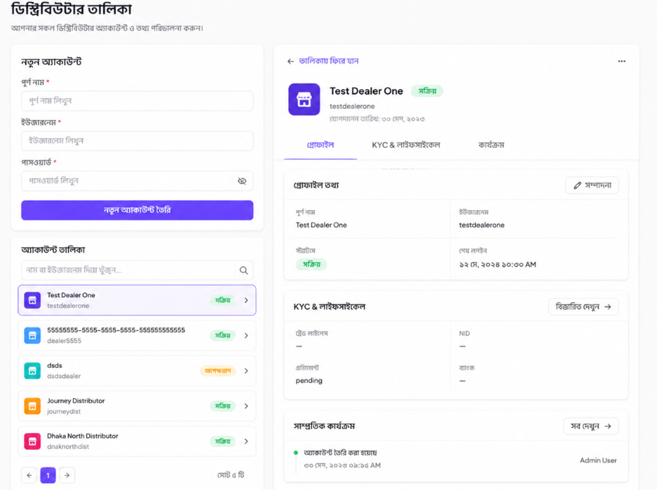
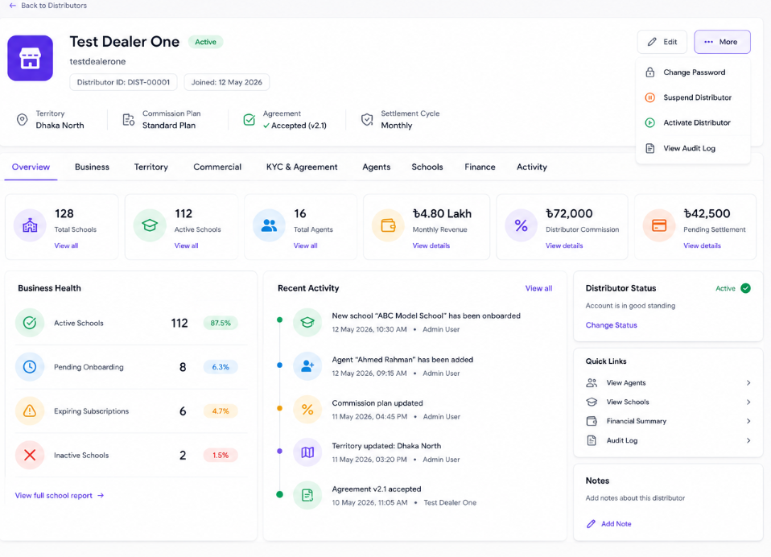
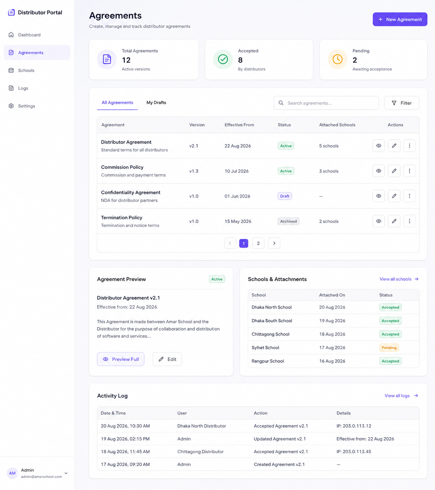

follow the super admin panel ui simplification changes 

## School :
- Reduce visual density — remove unnecessary borders, separators, and repeated labels.
- Separate primary vs. advanced actions — show only essential actions initially; move technical controls like subscription/code management into “অ্যাকশন” or an expandable section.
- Simplify “নতুন স্কুল তৈরি” — keep only the 5 core fields and use a clear primary CTA.
- School cards instead of long sections — each school becomes a compact card with:
    - School name
    - Subdomain
    - Active/Expired status
    - Expiry date
    - Student count
    - Subscription
- Progressive disclosure — clicking “বিস্তারিত” expands configuration, credits, - subscription settings, and generated codes.
- Group related actions — “কোড প্রয়োগ”, “সাবস্ক্রিপশন”, “মেয়াদ”, etc. should live inside one action menu rather than appearing simultaneously.
- Clear status indicators — use small badges such as সক্রিয়, মেয়াদ শেষ, সাসপেন্ডেড.
- Better hierarchy — page title → primary action → school list → individual school details.
- Responsive layout — cards and forms should automatically stack on tablet/mobile.
- Consistent Bengali UX — use simpler labels such as “স্কুল তৈরি করুন”, “বিস্তারিত”, “পরিবর্তন”, “অ্যাকশন” instead of technical wording.

## ditributor
distrbutor page reference :

distrbutor profile page reference : 

## agreement
follow this eggrement page structure

- 