# School Owner — UI Journey Map + PRD Gap Analysis

Every screen a School Owner can reach from the dashboard, as navigable flows, deep-dived per section, each compared to `docs/master_prd.md` (+ the `00X` docs) to surface gaps. Routes are the real `app/school/*` pages.

## 0. Top-level journey (dashboard → modules)

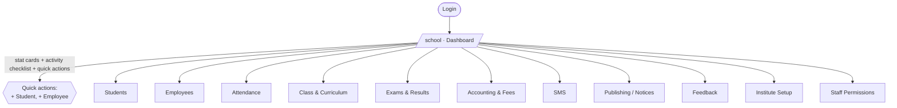

PRD note: master_prd lists these "mature, production-ready" modules — Student, Teacher/Employee, Attendance, Examination, Fee, Accounting, **Library, Inventory**, SMS, Dashboard, **Reports**, Notifications. **Library, Inventory, and a dedicated Reports module do not exist** (see §12).

---

## 1. Exams & Results  (deepest module — requested first)

```mermaid
flowchart TD
  EX[/school/exams · list + tabs/] --> EXt{{Tabs}}
  EXt --> T1[Exams]
  EXt --> T2[Grading schemes]
  EXt --> T3[Subject combinations]
  EXt --> T4[Co-curricular items]
  EXt --> T5[Result inquiry]
  EXt --> T6[Mark-sheet preview]
  T1 -->|open an exam| P[/exams/&#91;id&#93; · Exam profile/]
  P --> R[Routine] --> Rp[Print routine]
  P --> SP[Seat plan] --> SPp[Print seat plan]
  P --> ME[Marks entry]
  P --> AS[Attendance sheet]
  P --> AC[Admit cards] --> ACs[Per-student admit card]
  P --> RB[Result book]
  P --> MS[Mark sheet &#40;per student&#41;]
  P --> PR[Progress report &#40;per student&#41;]
  P --> CO[Co-curricular marks]
  P --> PM[Promotion]
  P --> PA[Printables / Print all]
```

**Options at each stop:** exam list → create/edit exam, open. Exam profile → configure, then branch to routine (schedule subjects), seat plan (auto/manual + print), marks entry (per class/subject), attendance sheet, admit cards (print), result book, per-student mark sheet / progress report (3 template styles), co-curricular grading, promotion (advance students), bulk printables.
**End-to-end:** create exam → routine → seat plan → marks entry → result book → publish → admit cards / mark sheets / progress reports → promotion. Complete.
**PRD (doc 006 Examination):** setup, routine, mark entry, grading, result publication, transcript, **online examination**, analytics. ✅ everything except 🔴 **online exam** and 🔴 **result analytics**. Also 🟡 examination is a hardcoded flow — not yet on the generic Workflow engine (publication approval).

---

## 2. Students

```mermaid
flowchart TD
  ST[/school/students · list/] --> STn[+ New admission]
  ST --> STa[Archive]
  ST --> STsub[Subject assignment]
  ST -->|open| SD[/students/&#91;id&#93; · profile/]
  SD --> SDe[Edit profile]
  SD --> SDt[Class/section transfer]
  SD --> SDar[Archive]
  SD --> SDp1[Print admission form]
  SD --> SDp2[Print ID card]
  STn --> SD
```

**Options:** list (search/filter) → admit (sectioned form) → profile (edit, transfer, archive, print admission, print ID card, photo upload), subject assignment, archive view.
**PRD (Student Management):** ✅ admission, profile, transfer, archive, ID card, subject assignment. 🔴 no guardian/parent portal linkage; 🟡 no bulk import from the UI (mockup existed, not wired); 🟡 RFID card assignment out of scope (per maps).

---

## 3. Attendance

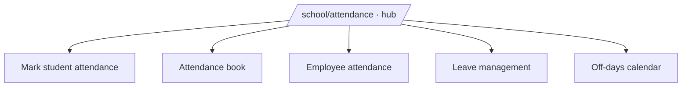

**Options:** mark (per class/date), book (view/report), employee attendance, leave requests (approve/reject — now routable through the Workflow engine, #271), off-day calendar.
**PRD (Attendance):** ✅ manual mark, book, employee, leave, off-days, absence-SMS. 🟡 device/RFID ingest exists server-side (ADR 0001) but no owner UI; 🟡 leave approval only just gained Workflow-engine backing (UI still direct).

---

## 4. Class & Curriculum

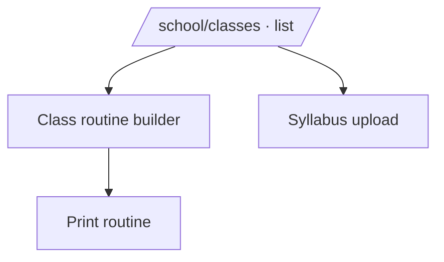

**Options:** classes/sections list, routine builder (+ print), syllabus files.
**PRD:** ✅ class/section, routine, syllabus. 🟡 attendance nested under class in nav only. 🔴 no timetable-conflict detection / teacher-load view.

---

## 5. Employees

```mermaid
flowchart TD
  EM[/school/employees · list/] --> EMn[+ New employee]
  EM --> EMa[Archive]
  EM -->|open| ED[/employees/&#91;id&#93; · profile/]
  EMn --> ED
```

**Options:** list → add → profile (edit/archive), archive.
**PRD (Teacher/Employee + HR):** ✅ employee CRUD, profile, grace/office-time. 🔴 **no Payroll / HR** (PRD's future HR/Payroll module); 🔴 no reimbursement/procurement (workflow-engine candidates).

---

## 6. Accounting & Fees

```mermaid
flowchart TD
  FE[/school/fees · tabs/] --> FEt{{Tabs}}
  FEt --> F1[Fee structures]
  FEt --> F2[Fee collection] --> F2r[Receipt &#91;id&#93;]
  FEt --> F3[Vouchers] --> F3d[Voucher &#91;id&#93;]
  FEt --> F4[Asset register]
  FEt --> F5[Bank & cash]
  FEt --> F6[Director capital]
  FEt --> F7[General ledger]
```

**Options:** fee structures, fee collection (filter class/month → per-row receipt), vouchers (income/expense), assets, bank/cash accounts, director capital, general ledger. All now mirror into the **central GL** (#271, migrations 0093/0097/0098).
**PRD (doc 005 Financial):** ✅ fees, vouchers, bank/cash, director capital, GL. 🟡 **all cash-basis** (ADR 0009 — no A/R accrual); 🔴 no financial **reporting/BI** at the school level (only the raw ledger); 🔴 no budgeting; 🟡 asset register ≠ inventory (PRD "Inventory" module absent).

---

## 7. SMS

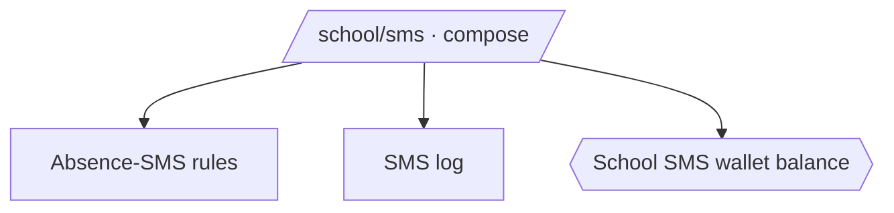

**Options:** compose/send (recipients by class/role), absence-SMS rules, delivery log, wallet balance badge.
**PRD (doc 004 SMS Commerce):** ✅ send via central gateway, dual-deduct company+school wallet, mask/non-mask routes, packages (#268). 🔴 no school-facing **buy-SMS-package / invoice / payment** screen (backend `sms_packages` + `purchaseSmsPackage` exist, no UI); 🔴 no provider reconciliation view (super-admin concern).

---

## 8. Publishing (Notices)

```mermaid
flowchart TD
  NO[/school/notices · list/] --> NOn[+ New notice] --> NOd[Notice &#91;id&#93;]
  NO --> NOg[Gallery albums] --> NOga[Album &#91;id&#93;]
```

**Options:** notices list → create → detail; photo gallery albums.
**PRD (Notifications/Publishing):** ✅ notices, gallery. 🔴 not event-driven (doc 007) — no push/in-app fan-out from a "Notice Published" domain event; the Notification engine (#267) isn't wired to this yet.

---

## 9. Feedback

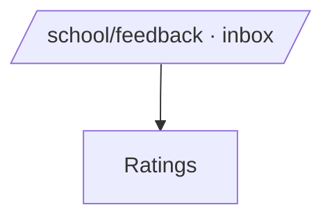

**Options:** feedback inbox (reply), ratings summary.
**PRD:** no explicit PRD requirement — additive. ✅ fine as-is.

---

## 10. Institute Setup

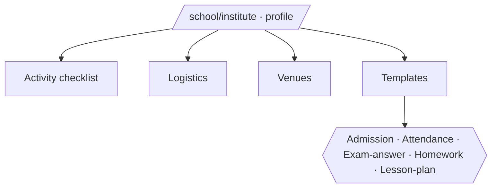

**Options:** institute profile (owner-only), onboarding activity checklist, logistics, venues, printable templates (5 types).
**PRD:** ✅ institute config, templates, onboarding checklist. 🟡 subscription status lives here + `/school/subscription`; renewal is code-redemption, not the new billing engine UI (#269 backend only).

---

## 11. Staff Permissions

```mermaid
flowchart TD
  SF[/school/staff · list/] --> SFd[/staff/&#91;id&#93; · grant screens/]
  SFd --> SFg{{Toggle screen-level grants}}
```

**Options:** staff list → per-staff screen grants (boolean per module). Enforced live (denial card, §journey).
**PRD (doc 006 Policy/Feature):** ✅ screen-level RBAC. 🔴 **only screen-level** — PRD wants sub-module/menu/API/action granularity + PBAC context; the Policy+Feature engines (#262/#263) back finer control but the staff UI is still boolean-per-screen.

---

## 12. Gaps vs master_prd — summary

| PRD module / capability | In School Owner UI? | Gap |
|---|---|---|
| Student, Attendance, Exam, Fee, Accounting, SMS, Notices | ✅ | mature |
| **Library** | 🔴 absent | PRD lists as existing; no route |
| **Inventory** | 🔴 absent | only an asset register under fees |
| **Payroll / HR** | 🔴 absent | employees exist, no payroll |
| **Reports / BI** (school-level) | 🔴 absent | only per-doc printables + raw GL |
| **Parent/Guardian portal** | 🔴 absent | no guardian linkage or portal |
| Online examination + result analytics | 🔴 absent | exam flow otherwise complete |
| School-facing **buy-SMS-package + invoice/pay** | 🔴 absent | backend ready (#268), no UI |
| Event-driven notifications from notices | 🔴 not wired | Notification engine (#267) exists |
| Leave/exam approvals on **Workflow engine** | 🟡 partial | leave just gained backing; UI still direct |
| Sub-module/API/PBAC-level permissions | 🟡 screen-only | engines back finer (#262/#263), UI coarse |
| Financial reporting / A-R accrual | 🟡 cash-basis | ADR 0009; no school BI |

**Read:** the School Owner's **academic + daily-ops journeys are complete and deep** (exams especially). The gaps are (a) **whole PRD modules never built** (Library, Inventory, Payroll, Reports, Parent Portal), and (b) **new engines not yet surfaced** into these journeys (event-notifications, workflow approvals, SMS purchase, finer permissions, financial BI).

_Companion to `docs/ux-audit.md`. Routes verified against `app/school/*` on branch `test/258-e2e-smoke`._
